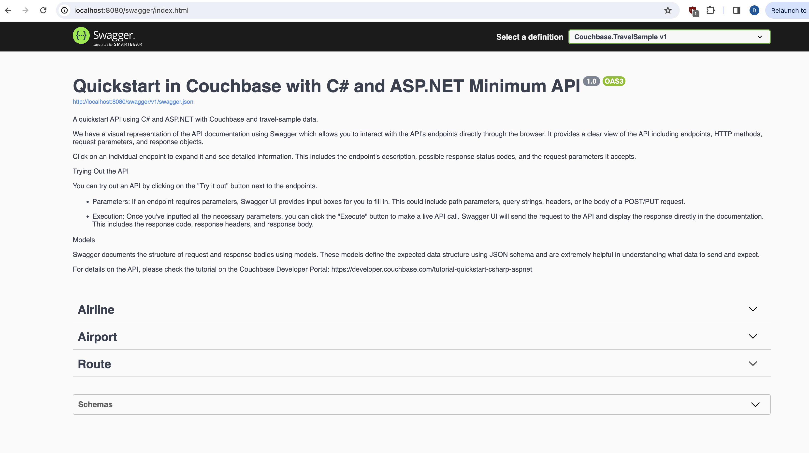

---
# frontmatter
path: "/tutorial-quickstart-csharp-aspnet-minapi-travel-sample"
title: Quickstart in Couchbase with C# and ASP.NET Minimal API 
short_title: ASP.NET Minimal API and C# 
description: 
  - Learn to build a REST API with Couchbase's C# SDK 3.4 and ASP.NET Minimal API
  - See how you can fetch data from Couchbase using SQL++ queries
  - Explore CRUD operations in action with Couchbase
content_type: quickstart
filter: sdk
technology:
  - kv
  - index
  - query
tags:
  - REST API
  - ASP.NET
sdk_language:
  - csharp
length: 30 Mins
---

<!-- [abstract] -->

In this tutorial, you will learn how to connect to a Couchbase Capella cluster to create, read, update, and delete documents and how to write simple parametrized SQL++ queries.

## Prerequisites
To run this prebuilt project, you will need:

- [Couchbase Capella](https://www.couchbase.com/products/capella/) cluster with [travel-sample](https://docs.couchbase.com/dotnet-sdk/current/ref/travel-app-data-model.html) bucket loaded.
  - To run this tutorial using a self managed Couchbase cluster, please refer to the [appendix](#running-self-managed-couchbase-cluster).
- [.NET SDK v8+](https://dotnet.microsoft.com/download/dotnet/8.0) installed.
  - Ensure that the .Net version is [compatible](https://docs.couchbase.com/dotnet-sdk/current/project-docs/compatibility.html#dotnet-version-compat) with the Couchbase SDK.
- Code Editor installed (Visual Studio Professional, Visual Studio Code, or JetBrains Rider)
- Loading Travel Sample Bucket
  - If travel-sample is not loaded in your Capella cluster, you can load it by following the instructions for your Capella Cluster:
    - [Load travel-sample bucket in Couchbase Capella](https://docs.couchbase.com/cloud/clusters/data-service/import-data-documents.html#import-sample-data)

### Couchbase Capella Configuration

When running Couchbase using [Capella](https://cloud.couchbase.com/), the following prerequisites need to be met.

- The application requires the travel-sample bucket to be [loaded](https://docs.couchbase.com/cloud/clusters/data-service/import-data-documents.html#import-sample-data) in the cluster from the Capella UI.
- Create the [database credentials](https://docs.couchbase.com/cloud/clusters/manage-database-users.html) to access the travel-sample bucket (Read and Write) used in the application.
- [Allow access](https://docs.couchbase.com/cloud/clusters/allow-ip-address.html) to the Cluster from the IP on which the application is running.

## App Setup

We will walk through the different steps required to get the application running.

### Cloning Repo

```shell
git clone https://github.com/couchbase-examples/aspnet-minapi-quickstart-travelsample.git
```

### Install Dependencies

```sh
cd src/Couchbase.TravelSample
dotnet restore
```

#### Dependency Injection Nuget package

The Couchbase SDK for .NET includes a nuget package called `Couchbase.Extensions.DependencyInjection` which is designed for environments like ASP.NET that takes in a configuration to connect to Couchbase and automatically registers interfaces that you can use in your code to perform full `CRUD (create, read, update, delete)` operations and queries against the database.

### Setup Database Configuration

To know more about connecting to your Capella cluster, please follow the [instructions](https://docs.couchbase.com/cloud/get-started/connect.html).

Specifically, you need to do the following:

- Create the [database credentials](https://docs.couchbase.com/cloud/clusters/manage-database-users.html) to access the travel-sample bucket (Read and Write) used in the application.
- [Allow access](https://docs.couchbase.com/cloud/clusters/allow-ip-address.html) to the Cluster from the IP on which the application is running.

All configuration for communication with the database is stored in the `appsettings.Development.json` file.  This includes the connection string, username, password, bucket name and scope name.  The default username is assumed to be `Administrator` and the default password is assumed to be `P@$$w0rd12`.  If these are different in your environment you will need to change them before running the application.

```json
  "Couchbase": {
    "BucketName": "travel-sample",
    "ScopeName": "inventory",
    "ConnectionString": "couchbases://yourassignedhostname.cloud.couchbase.com",
    "Username": "Administrator",
    "Password": "P@ssw0rd12",
    "IgnoreRemoteCertificateNameMismatch": true,
    "HttpIgnoreRemoteCertificateMismatch": true,
    "KvIgnoreRemoteCertificateNameMismatch": true
  }

```

> Note: The connection string expects the `couchbases://` or `couchbase://` part.

## Running The Application

### Directly on Machine

At this point, we have installed the dependencies, loaded the travel-sample data and configured the application with the credentials. The application is now ready and you can run it.

```shell 
cd src/Couchbase.TravelSample
dotnet run
```

### Using Docker

- Build the Docker image
```shell 
cd aspnet-minapi-quickstart-travelsample
docker build -t couchbase-aspnet-minapi-quickstart . 
```

- Run the docker image
```shell 
cd aspnet-minapi-quickstart-travelsample
docker run -p 8080:8080 couchbase-aspnet-minapi-quickstart
```

You can access the Application on http://localhost:8080/swagger/index.html

>**Note:** Make the configuration changes inside `appsettings.json` file while running using docker.

### Verifying the Application

Once the application starts, you can see the details of the application on the logs.


The application will run on port 8080 of your local machine (http://localhost:8080/swagger/index.html). You will find the Swagger documentation of the API if you go to the URL in your browser.
Swagger documentation is used in this demo to showcase the different API end points and how they can be invoked. More details on the Swagger documentation can be found in the [appendix](#swagger-documentation).



## Data Model

For this tutorial, we use three collections, `airport`, `airline` and `route` that contain sample airports, airlines and airline routes respectively. The route collection connects the airports and airlines as seen in the figure below. We use these connections in the quickstart to generate airports that are directly connected and airlines connecting to a destination airport. Note that these are just examples to highlight how you can use SQL++ queries to join the collections.


## Let Us Review the Code

To begin this tutorial, clone the repo and open it up in the IDE of your choice. Now you can learn about how to create, read, update and delete documents in Couchbase Server.

In order to use the `Couchbase.Extensions.DependencyInjection` framework, we must first register the service.  The Couchbase Services requires the database configuration information, which can be provided by reading the database configuration from the `appsettings.json` file.

```csharp
//register the configuration for Couchbase and Dependency Injection Framework
if (builder.Environment.EnvironmentName == "Testing")
{
    var config = builder.Configuration.GetSection("Couchbase");
    var connectionString = Environment.GetEnvironmentVariable("DB_CONN_STR");
    var username = Environment.GetEnvironmentVariable("DB_USERNAME");
    var password = Environment.GetEnvironmentVariable("DB_PASSWORD");
    config["ConnectionString"] = connectionString;
    config["Username"] = username;
    config["Password"] = password;
    
    builder.Services.Configure<CouchbaseConfig>(config);
    builder.Services.AddCouchbase(config);
}

else
{
    builder.Services.Configure<CouchbaseConfig>(builder.Configuration.GetSection("Couchbase"));
    builder.Services.AddCouchbase(builder.Configuration.GetSection("Couchbase"));
}
```

ASP.NET has an interface called `IHostApplicationLifetime` that you can add to your Configure method to help with registration of lifetime events. 
We initialise the bucket and scope during the application startup.
We check if the `inventory` scope exists in the provided `travel-sample` bucket when the application starts and print a warning if it doesn't exist.

```csharp
app.Services.GetRequiredService<IHostApplicationLifetime>().ApplicationStarted.Register(async () =>
{
    var configuration = builder.Configuration;

    // Retrieve configuration values from appsettings.json
    var bucketName = configuration["Couchbase:BucketName"];
    if (bucketName == null) return;
    bucket = await app.Services.GetRequiredService<IBucketProvider>().GetBucketAsync(bucketName);

    const string scopeName = "inventory";
    
    // get inventory scope
    try
    {
        inventoryScope = await bucket.ScopeAsync(scopeName);
    }
    catch (Exception){
        Console.WriteLine("Warning: The 'inventory' scope does not exist in 'travel-sample' bucket.");
    }
});
```

The Couchbase SDK provides the `ICouchbaseLifetimeService` interface for handling closing the database connections when the application closes. It's best practice to register for the ASP.NET `ApplicationStop` lifetime event and call the `ICouchbaseLifetimeService` Close method so that the database connection and resources are closed and removed gracefully.

```csharp
//remove couchbase from memory when ASP.NET closes
app.Lifetime.ApplicationStopped.Register(() =>
{
    var cls = app.Services.GetRequiredService<ICouchbaseLifetimeService>();
    cls.Close();
});
```

The Couchbase .NET SDK will handle all communications to the database cluster, so you shouldn't need to worry about creating a pool of connections.

### Airport Entity

For this tutorial, we will focus on the airport entity. The other entities are similar.

We will be setting up a REST API to manage airport documents.

- [POST Airport](#post-airport) – Create a new airport
- [GET Airport](#get-airport) – Read specified airport
- [PUT Airport](#put-airport) – Update specified airport
- [DELETE Airport](#delete-airport) – Delete airport
- [Airport List](#list-airport) – Get all airports. Optionally filter the list by country
- [Direct Connections](#direct-connections) - Get a list of airports directly connected to the specified airport

For CRUD operations, we will use the [Key-Value operations](https://docs.couchbase.com/dotnet-sdk/current/howtos/kv-operations.html) that are built into the Couchbase SDK to create, read, update, and delete a document. Every document will need an ID (similar to a primary key in other databases) to save it to the database. This ID is passed in the URL. For other end points, we will use [SQL++](https://docs.couchbase.com/python-sdk/current/howtos/n1ql-queries-with-sdk.html) to query for documents.

### Airport Document Structure

Our profile document will have an airportname, city, country, faa code, icao code, timezone info and the geographic coordinates. For this demo, we will store all airport information in one document in the `airport` collection in the `travel-sample` bucket.

```json
{
  "airportname": "Sample Airport",
  "city": "Sample City",
  "country": "United Kingdom",
  "faa": "SAA",
  "icao": "SAAA",
  "tz": "Europe/Paris",
  "geo": {
    "lat": 48.864716,
    "lon": 2.349014,
    "alt": 92
  }
}
```

## POST Airport

For CRUD operations we will use the [Key Value operations](https://docs.couchbase.com/dotnet-sdk/current/howtos/kv-operations.html) that are built into the Couchbase SDK to create, read, update, and delete a document.  Every document will need a ID (simlar to a primary key in other databases) in order to save it to the database.

Open the `program.cs` file and navigate to the `post` method for `airport` collection.

It first checks for the availability of the `inventory` scope, then retrieves the collection `airport` within the scope. 
Upon receiving a request containing airport details, it saves the airport document into the collection identified by the provided key(`id`). 
If the inventory scope is unavailable, it responds with an error message. 
This endpoint expects valid airport details in the request body for successful airport document creation.

```csharp
app.MapPost("/api/v1/airport/{id}", async (string id, AirportCreateRequestCommand request) =>
    {
        if (inventoryScope is not null)
        {
            //get the collection
            var collection = inventoryScope.Collection(airportCollection);

            //get airport from request
            var airport = request.GetAirport();

            //save document
            await collection.InsertAsync(id, airport);
            return Results.Created($"/api/v1/airport/{id}", airport);
        }
        else
        {
            return Results.Problem("Scope not found");
        }
    });
```

## GET Airport

Open the `program.cs` file and navigate to the `get` method for `airport` collection.

It first checks for the availability of the `inventory` scope, then retrieves the collection `airport` within the scope.
Using the given `id`, it retrieves the corresponding document from the collection. 
If the document exists, it responds with the details of the airport. 
However, if the inventory scope isn't available, it returns an error message. 
In case the document with the specified id isn't found, it returns a `Not Found` response. 
Any unexpected errors during this process result in a `Problem` response displaying the error message encountered. 
This endpoint expects a valid id parameter to retrieve airport information.

```csharp
app.MapGet("/api/v1/airport/{id}", async (string id) =>
    {
        try
        {
            if (inventoryScope is not null)
            {
                //get the collection
                var collection = inventoryScope.Collection(airportCollection);

                //get the document from the bucket using the id
                var result = await collection.GetAsync(id);

                //validate we have a document
                var resultAirports = result.ContentAs<Airport>();
                if (resultAirports != null)
                {
                    return Results.Ok(resultAirports);
                }
            }
            else
            {
                return Results.Problem("Scope not found");
            }
        }
        catch (Couchbase.Core.Exceptions.KeyValue.DocumentNotFoundException)
        {
            Results.NotFound();
        }
        catch (Exception ex)
        {
            return Results.Problem(ex.Message);
        }

        return Results.NotFound();
    });
```

## PUT Airport

Open the `program.cs` file and navigate to the `put` method for `airport` collection.

It first checks for the availability of the `inventory` scope, then retrieves the collection `airport` within the scope.
Upon receiving a request with updated airport details, it attempts to find the existing airport document using the provided `id`. 
If the document exists, it updates it with the new details and responds with an `OK` status along with the updated airport information. 
However, if the `inventory` scope isn't available, it returns an error message stating. 
If the document with the specified `id` isn't found, it responds with a `Not Found` status. 
This endpoint expects a valid `id` parameter and updated airport details in the request body for successful airport information updates.

```csharp
app.MapPut("/api/v1/airport/{id}", async (string id, AirportCreateRequestCommand request) =>
    {
        if (inventoryScope is not null)
        {
            //get the collection
            var collection = inventoryScope.Collection(airportCollection);

            //get current airport from the database and update it
            if (await collection.GetAsync(id) is { } result)
            {
                result.ContentAs<Airport>();
                await collection.ReplaceAsync(id, request.GetAirport());
                return Results.Ok(request);
            }
            else
            {
                return Results.NotFound();
            }
        }
        else
        {
            return Results.Problem("Scope not found");
        }
    })
```

## DELETE Airport

Open the `program.cs` file and navigate to the `delete` method for `airport` collection.

It first checks for the availability of the `inventory` scope, then retrieves the collection `airport` within the scope.
Using the provided `id`, it attempts to fetch the corresponding `airport` document. 
If the document exists, it deletes it from the collection and responds with an `OK` status along with the deleted `id`. 
However, if the `inventory` scope isn't available, it returns an error message.
If the document with the specified `id` isn't found, it responds with a `Not Found` status. 
This endpoint requires a valid `id` parameter to successfully remove an airport record.

```csharp
 app.MapDelete("/api/v1/airport/{id}", async(string id) => 
    {
        if (inventoryScope is not null)
        {
            //get the collection
            var collection = inventoryScope.Collection(airportCollection);

            //get the document from the bucket using the id
            var result = await collection.GetAsync(id);

            //validate we have a document
            var resultAirport = result.ContentAs<Airport>();
            if (resultAirport != null)
            {
                await collection.RemoveAsync(id);
                return Results.Ok(id);
            }
            else
            {
                return Results.NotFound();
            }
        }
        else
        {
            return Results.Problem("Scope not found");
        }
    });
```
### List Airport

This endpoint retrieves the list of airports in the database. The API has options to specify the page size for the results and country from which to fetch the airport documents.

[SQL++](https://docs.couchbase.com/dotnet-sdk/current/howtos/n1ql-queries-with-sdk.html) is a powerful query language based on SQL, but designed for structured and flexible JSON documents. We will use a SQL+ query to search for airports with Limit, Offset, and Country option.

Open the `program.cs` file and navigate to the `delete` method for `airport` collection. This endpoint is different from the others we have seen before because it makes the SQL++ query rather than a key-value operation. This usually means more overhead because the query engine is involved. For this query, we are using the predefined indices in the `travel-sample` bucket. We can create an additional [index](https://docs.couchbase.com/server/current/learn/services-and-indexes/indexes/indexing-and-query-perf.html) specific for this query to make it perform better.

We need to get the values from the query string for country, limit, and Offset that we will use in our query. These are pulled from the `queryParameters.Parameter` parameter.

This end point has two queries depending on the value for the country parameter. If a country name is specified, we retrieve the airport documents for that specific country. If it is not specified, we retrieve the list of airports across all countries. The queries are slightly different for these two scenarios.

We build our SQL++ query using the [parameters](https://docs.couchbase.com/dotnet-sdk/current/howtos/n1ql-queries-with-sdk.html#parameterized-queries) specified by `$` symbol for both these scenarios. The difference between the two queries is the presence of the `country` parameter in the query. Normally for the queries with pagination, it is advised to order the results to maintain the order of results across multiple queries.

Next, we pass that `query` to the Couchbase SDK method `QueryAsync` method. We save the results in a list, `items`.

The `QueryAsync` method in the CouchbaseClient class executes the SQL++ query using the [`QueryAsync`](https://docs.couchbase.com/sdk-api/couchbase-python-client/couchbase_api/couchbase_core.html#couchbase.scope.Scope.query) method defined in the [Scope](https://docs.couchbase.com/python-sdk/current/howtos/n1ql-queries-with-sdk.html#querying-at-scope-level) by the Couchbase SDK.

```csharp
app.MapGet("/api/v1/airline/list", async (string? country, int? limit, int? offset) =>
    {
        try
        {
            if (inventoryScope is not null)
            {
                // Set default values for limit and offset if not provided by the user
                limit ??= 10;
                offset ??= 0;

                var query = string.IsNullOrEmpty(country)
                    ? $@"SELECT airline.callsign,
                            airline.country,
                            airline.iata,
                            airline.icao,
                            airline.name
                            FROM airline AS airline
                            ORDER BY airline.name
                            LIMIT $limit
                            OFFSET $offset"
                    : $@"SELECT airline.callsign,
                            airline.country,
                            airline.iata,
                            airline.icao,
                            airline.name
                            FROM airline AS airline
                            WHERE lower(airline.country) = $country
                            ORDER BY airline.name
                            LIMIT $limit
                            OFFSET $offset";

                //setup parameters
                var queryParameters = new Couchbase.Query.QueryOptions();
                queryParameters.Parameter("country", string.IsNullOrEmpty(country) ? "" : country.ToLower());
                queryParameters.Parameter("limit", limit);
                queryParameters.Parameter("offset", offset);

                var results = await inventoryScope.QueryAsync<Airline>(query, queryParameters);
                var items = await results.Rows.ToListAsync();

                return items.Count == 0 ? Results.NotFound() : Results.Ok(items);
            }
            else
            {
                return Results.Problem("Scope not found");
            }
        }
        catch (Exception ex)
        {
            return Results.Problem(ex.Message);
        }
    })
```

### Direct Connections

This endpoint fetches the airports that can be reached directly from the specified source airport code. This also uses a SQL++ query to fetch the results similar to the List Airport endpoint.

Let us look at the query used here:

```sql
SELECT distinct (route.destinationairport)
FROM airport as airport
JOIN route as route on route.sourceairport = airport.faa
WHERE airport.faa = $airport and route.stops = 0
ORDER BY route.destinationairport
LIMIT $limit
OFFSET $offset
```

We are fetching the direct connections by joining the airport collection with the route collection and filtering based on the source airport specified by the user and by routes with no stops.

## Running The Tests

We have defined unit tests using the [xunit](https://xunit.net/) nuget package for all the API end points. The unit tests use the same database configuration as the application. For the unit tests, we perform the operation using the API and confirm the results by checking the documents in the database. For example, to check the creation of the document by the API, we would call the API to create the document and then read the same document from the database and compare them. After the tests, the documents are cleaned up by calling the DELETE endpoint

To run the standard integration tests, use the following commands:

```sh
cd ../Couchbase.TravelSample.Tests/
dotnet restore 
dotnet build
dotnet test
```

## Appendix

### Extending API by Adding New Entity

If you would like to add another entity to the APIs, these are the steps to follow:

- Create the new entity (collection) in the Couchbase bucket. You can create the collection using the [SDK](https://docs.couchbase.com/sdk-api/couchbase-net-client/api/Couchbase.Management.Collections.ICouchbaseCollectionManager.html#Couchbase_Management_Collections_ICouchbaseCollectionManager_CreateCollectionAsync_Couchbase_Management_Collections_CollectionSpec_Couchbase_Management_Collections_CreateCollectionOptions_) or via the [Couchbase Server interface](https://docs.couchbase.com/cloud/n1ql/n1ql-language-reference/createcollection.html).
- Define the routes in `program.cs` file similar to the existing routes.
- Add the tests for the new routes in a new file in the `Couchbase.TravelSample.Tests` folder similar to `AirportTests.cs`.

### Running Self Managed Couchbase Cluster

If you are running this quickstart with a self managed Couchbase cluster, you need to [load](https://docs.couchbase.com/server/current/manage/manage-settings/install-sample-buckets.html) the travel-sample data bucket in your cluster and generate the credentials for the bucket.

You need to update the connection string and the credentials in the [appsettings.Development.json](https://github.com/couchbase-examples/aspnet-minapi-quickstart-travelsample/blob/main/src/Couchbase.TravelSample/appsettings.Development.json) file in the source folder.

> **NOTE:** Couchbase must be installed and running prior to running the the ASP.NET app.

### Swagger Documentation

Swagger documentation provides a clear view of the API including endpoints, HTTP methods, request parameters, and response objects.

Click on an individual endpoint to expand it and see detailed information. This includes the endpoint's description, possible response status codes, and the request parameters it accepts.

#### Trying Out the API

You can try out an API by clicking on the "Try it out" button next to the endpoints.

- Parameters: If an endpoint requires parameters, Swagger UI provides input boxes for you to fill in. This could include path parameters, query strings, headers, or the body of a POST/PUT request.

- Execution: Once you've inputted all the necessary parameters, you can click the "Execute" button to make a live API call. Swagger UI will send the request to the API and display the response directly in the documentation. This includes the response code, response headers, and response body.

#### Models

Swagger documents the structure of request and response bodies using models. These models define the expected data structure using JSON schema and are extremely helpful in understanding what data to send and expect.

