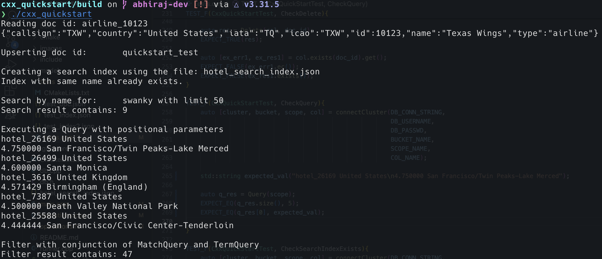

---
# frontmatter
path: "/tutorial-cxx-quickstart"
title: Quickstart in Couchbase with C++
short_title: C++ Quickstart
description:
  - Learn to to use Couchbase C++ SDK to interact with the database.
  - See how you can fetch data from Couchbase using SQL++ queries
  - Explore how you can perform search operations using Search indexes.
  - Explore CRUD operations in action with Couchbase
content_type: quickstart
filter: sdk
technology:
  - kv
  - index
  - query
  - search
tags:
  - C++
  - C++ SDK
sdk_language:
  - c++
length: 30 Mins
---

<!-- [abstract] -->
# Quickstart in Couchbase C++

- Learn to build applications in with Couchbase C++ SDK.
- See how you can fetch data from Couchbase using SQL++ queries
- Explore CRUD operations in action with Couchbase
- Learn about Search Indexes and execute search queries in C++

In this tutorial, you will learn how to connect to a Couchbase Capella cluster to create, read, update, and delete documents, how to write simple parametrized SQL++ queries and how to create, and perform simple and complex text search using Search indexes.

## Prerequisites

To run this prebuilt project, you will need:

- [Couchbase Capella](https://www.couchbase.com/products/capella/) cluster or a self managed Couchbase cluster with [travel-sample](https://docs.couchbase.com/python-sdk/current/ref/travel-app-data-model.html) bucket loaded.
  - To run this tutorial using a self managed Couchbase cluster, please refer to this [section](##Running-Self-Managed-Couchbase-Cluster).

- [CMake](https://cmake.org/) 3.9 or higher installed
- [C++17](https://en.cppreference.com/w/cpp/17) and a compatible compiler, [clang++](https://clang.llvm.org/) or [g++](https://gcc.gnu.org/)
- Loading Travel Sample Bucket
  If travel-sample is not loaded in your cluster, you can load it by following the instructions:
  - [Load travel-sample bucket in Couchbase Capella](https://docs.couchbase.com/cloud/clusters/data-service/import-data-documents.html#import-sample-data)
  - [Load travel-sample bucket in self-managed cluster](https://docs.couchbase.com/server/current/getting-started/do-a-quick-install.html#load-the-sample-dataset)

## Application Setup

We will walk through the different steps required to get the application running.

### Cloning Repo

```sh
git clone https://github.com/couchbase-examples/cxx-quickstart.git
```


### Setup Database Configuration

To know more about connecting to your Capella cluster, please follow the [instructions](https://docs.couchbase.com/cloud/get-started/connect.html).

Specifically, you need to do the following:

- Create the [database credentials](https://docs.couchbase.com/cloud/clusters/manage-database-users.html) to access the travel-sample bucket (Read and Write) used in the application.
- [Allow access](https://docs.couchbase.com/cloud/clusters/allow-ip-address.html) to the Cluster from the IP on which the application is running.

All configuration for communication with the database is read from the environment variables. We have provided a convenience feature in this quickstart to setup the required environment variables using a shell script `setup_env_vars.sh`. Change the values of the following lines:

```sh
export DB_CONN_STR=<connection_string>
export DB_USERNAME=<username>
export DB_PASSWORD=<password>
export BUCKET_NAME=<bucket_name>
export SCOPE_NAME=<inventory>
export COL_NAME=<collection_name>
```
> Note: The connection string expects the `couchbases://` or `couchbase://` part.

Run the command:
```sh
source setup_env_vars.sh
```
This will set the environment variables for that session.

### Install Dependencies and Building

This project makes use of CMake and CPM to install dependencies. 


```sh
mkdir build
cd build
cmake ..
cmake --build .
```

This will download and install all the dependencies required for the project to built. Along with that it will build the executable required to run the application.

## Running The Application

### Directly on Machine

At this point, we have installed the dependencies, loaded the travel-sample data and configured the application with the credentials. The application is now ready and you can run it by executing the following command from the build directory:

```sh
./cxx_quickstart
```


### Verifying the Application

Once you run the executable, your terminal should fill up with the results of the executed statements written in the main function of the `main.cpp` and should look something like this:


### Running Self Managed Couchbase Cluster

If you are running this quickstart with a self managed Couchbase cluster, you need to [load](https://docs.couchbase.com/server/current/manage/manage-settings/install-sample-buckets.html) the travel-sample data bucket in your cluster and generate the credentials for the bucket.

You need to update the connection string and the credentials in the `set_env_vars.sh` file in the source folder and run `source set_env_vars.sh` to set them.


### Running Tests

For running tests, a self-managed cluster is required with travel-sample bucket loaded or you need to update the connection details in the `tests/test.cpp` file. To run the tests, use the following command from the build directory:

```sh
./tests/u_tests
```

### Data Model

For this quickstart, we use one collection, `airline`  and `hotels` collection that contains sample airline and sample hotel information. For CRUD operations, we make use of the `airline` collection, whereas for Search indexes and Query execution we use the `hotel`collection.
You can find the schema for both these collections in the model folder.


## Let Us Review the Code

To begin this tutorial, clone the repo and open it up in the IDE of your choice. Now you can learn about how to create, read, update and delete documents in Couchbase Server.

### Code Layout

```
├── CMakeLists.txt
├── README.md
├── cmake
│   └── CPM.cmake
├── db.cpp
├── db.h
├── hotel_search_index.json
├── images
│   └── cli_output.png
├── include
├── main.cpp
├── model
│   ├── airline.json
│   └── hotel.json
├── operations.cpp
├── operations.h
├── runner.cpp
├── set_env_vars.sh
└── tests
    ├── CMakeLists.txt
    ├── test_doc.json
    ├── test_index.json
    ├── test_index2.json
    └── tests.cpp
```

We have separated out the SDK code and the main function. The `db.h` and `db.cpp` contain the declaration and the implementation of utility functions we will use to parse environment variables and create a connection to the cluster. `operations.h` and `operations.cpp` contain all the functions that perform operations on the db. Both `db.cpp` and `operations.cpp` are combined to make a static library. The tests are similarly separated out in the `tests` folder which utilise the library created earlier. The `main.cpp` is the executable which is also built by linking the library and contains code that demonstrates the usage of the functions we defined earlier to initeract with the db.

### Connecting to the Cluster
In `db.h`, we include the required header files to work with C++ SDK in order to for implement the functions required to initialize the DB. In the `db.cpp` we implement the functions that help us connect to the db. We begin by implementing few utility functions that will help us later. The `parseEnvironmentVariables` serves as a utility to get the values set for a list of environment variables. This enables us to get the connection parameters and credentials, set by running `source set_env_vars.sh`. Following this `checkScopeAndColExists` and `checkSearchEnabled` are implemented, used to check for existence of scope and collection of given name and to check if search service enabled respectively. Finally we have the InitCluster function which returns the connection objects as a tuple.

```c++
// db.h

...
std::vector<std::string> parseEnvironmentVariables(const std::vector<std::string>& keys);
bool checkScopeAndColExists(couchbase::bucket& bucket, const std::string& scope_name, const std::string& col_name);
bool checkSearchEnabled(couchbase::cluster& cluster, int min_nodes);
...
std::tuple<couchbase::cluster, couchbase::bucket, couchbase::scope, couchbase::collection> InitCluster();
```
We recommend creating a single Couchbase connection when your application starts up, and sharing this instance throughout your application. You should always set the default `BUCKET_NAME`, `SCOPE_NAME`, `COL_NAME` environment variables, and use the `InitCluster` function to get the instances. You should share and use these instances throughout your application.


The Couchbase connection is established in the `connectCluster` method defined in `db.h` and implemented in `db.cpp`. There, we call the ["connect"](https://docs.couchbase.com/sdk-api/couchbase-cxx-client-1.0.5/classcouchbase_1_1cluster.html#a57285fbf793227e26d88de3808f9a707) method defined in the SDK to create the Database connection. If the connection is already established, we do not do anything. Following connection to the cluster, get the reference to the bucket, scope and collection and return all the objects as a tuple.

```c++
// db.cpp
...
auto [connect_err, cluster] = couchbase::cluster::connect(DB_CONN_STRING, options).get();
...
auto bucket = cluster.bucket(BUCKET_NAME);
...
auto scope = bucket.scope(SCOPE_NAME);
auto col = scope.collection(COL_NAME);
return {cluster, bucket, scope, col};
```


## Operations
Operations for interacting with the db is defined and implemented in `operations.h` and `operations.cpp`
### Insert Document
Insert function is the equivalent of the POST request and can be used to insert new documents to the collection. We can pass the document to be inserted as a JSON string or as a JSON file path, the function takes in file_flag which is used to differentiate between the two.
- The value gets converted to the type `tao::json::value` and inserts it to the collection if `file_flag=false`
- If `file_flag=true`, it reads the content from the provided file and then converts it to `tao::json::value`.
- Performs an upsert operation on the collection using the `doc_id` and the converted document content.
- If successful, `return 1`. If an error occurs, prints an error message and `return 0`.
```c++
// operations.cpp
auto [in_error, in_res] = col.insert(doc_id, v).get();

//main.cpp
auto insert_res = Insert(col, "quickstart_test", "{ \"test\": \"hello\"}", false);
auto insert_res2 = Insert(col, "quickstart_test2", "doc.json", true);
```

### Upsert Document
Upsert function is the equivalent of the PUT request. It can be used to update any existing document or to insert a new document to the collection if the `doc_id` doesn't exist already. Similar to Insert, We can pass the document to be inserted as a JSON string or as a JSON file path, the function takes in file_flag which is used to differentiate between the two.
- The value gets converted to the type `tao::json::value` and inserts it to the collection if `file_flag=false`
- If `file_flag=true`, it reads the content from the provided file and then converts it to `tao::json::value`.
- Performs an insert operation on the collection using the `doc_id` and the converted document content.
- If successful, `return 1`. If an error occurs, prints an error message and `return 0`.
```c++
// operations.cpp
auto [up_error, up_res] = col.upsert(doc_id, v).get();

//main.cpp
auto upsert_res = Upsert(col, "quickstart_test", "{ \"test\": \"hello\"}", false);
auto upsert_res2 = Upsert(col, "quickstart_test2", "doc.json", true);
```

### Read
Read function is equivalent to GET requests and can be used fetch documents using the `doc_id`.
- First checks if the document exists using `col.exists(doc_id)`.
- If the document exists, it retrieves the document's content using `col.get(doc_id)` and returns it after converting it to `tao::json::value` for easier usage on return.
- If an error occurs (e.g., document not found), it prints an error message and returns an empty tao::json::value object.
```c++
//operations.cpp
auto [ex_err, ex_res] = col.exists(doc_id).get();
...
auto [get_err, get_res] = col.get(doc_id).get();
...
auto doc = get_res.content_as<tao::json::value>();
return doc;

//main.cpp
auto v = Read(col, "airline_10123");
std::cout << tao::json::to_string(v) << std::endl;
```

### Delete
Delete function attempts to remove a document with the given `doc_id`
- Attempts to remove the document with a given `doc_id` from the collection.
- If the deletion is successful, `return 1` and if an error occurs, it prints an error message and `return 0`.

```c++
//operations.cpp
auto [delete_err, delete_res] = col.remove(doc_id).get();

//main.cpp
auto res = Delete(col, doc_id);
```

### Query
We can use the `Query` function to execute any N1QL (SQL++) query on a scope.
- Executes the N1QL query using the provided `scope.query(query, opts)`.
- Returns the result of the query if successful. The result is returned as a `couchbase::query_results` object.
- We can pass `opts` parameter, which can be used to insert positonal parameters in the query.
- If there is an error, it prints an error message and returns an empty result object.

```c++
//operations.cpp
auto [q_err, q_res] = scope.query(query, opts).get();

//main.cpp
std::string query{ R"(        
    SELECT META(h).id, h AS doc,
            AVG(r.ratings.Overall) AS avg_rating
    FROM hotel h
    UNNEST h.reviews r
    WHERE h.country IN $1 AND h.description LIKE "%cheap%"
    GROUP BY META(h).id, h
    ORDER BY avg_rating DESC
    LIMIT 5;
)" };

auto query_res = Query(scope, query, couchbase::query_options{}.positional_parameters(std::vector<std::string>{"United States", "United Kingdom"}));
for (auto& row : query_res.rows_as()) {
    std::cout  << row["id"].as<std::string>() << " " << row["doc"]["country"].as<std::string>() << std::endl;
    std::cout << row["avg_rating"].as<double>() << " " << row["doc"]["title"].as<std::string>() <<  std::endl;
}
```

### Create Search Index
Search indexes in Couchbase are used for full-text search and efficient querying of documents based on specific fields or attributes. The `CreateSearchIndex` function helps in creating a new Search index which can then be used.
- Reads the index configuration from the `index_file`.
- Checks if an index with the same name already exists using the `searchIndexExists` function.
- If the index with same name exists, it returns the index name.
- If the index does not exist, it constructs a new search index object and upserts it into the Couchbase scope.
- Returns the name of the newly created index or an empty string if there was an error.

```c++
// operations.cpp
auto err = scope_index_manager.upsert_index(i).get();

//main.cpp
std::string index_name = CreateSearchIndex(scope, "hotel_search_index.json");
```

### Search By Name
The `SearchByName` function aims to demonstrates the usage of a search index to search for documents in a scope.
Params:
- `scope`: The Couchbase scope to search in.
- `index`: The search index name to use for the query.
- `name`: The name to search for in the documents.
- `field`: The field where the name should be searched.
- `limit`: The maximum number of results to return.

```c++
//operations.cpp
auto [s_err, s_res] = scope.search(index, searchQ, opts).get();
...
std::vector<std::string> rows_res{};
// Reference is important since the copy constructor is deleted
for(auto &row:s_res.rows()){
    rows_res.push_back(row.id());
}
return rows_res;

//main.cpp
auto search_res = SearchByName(scope, index_name, "swanky", "name", 50);
std::cout << "Search result contains:\t" << search_res.size() << std::endl;
```

### Filter
The `Filter` function aims to demo the construction and execution of a `conjuction_query` which can be described as an `AND` operation on two or more types of filters. This particular implementation performs a conjunction on `couchbase::match_query("United States").field("country")` and `couchbase::term_query("San Diego").field("city")`.

```c++
//operations.cpp
auto query = couchbase::conjunction_query{
        couchbase::match_query("United States").field("country"),
        couchbase::term_query("San Diego").field("city")
    };
...
auto [err,res] = scope.search(index_name, couchbase::search_request(query), opts).get();

//main.cpp
for(auto &row:res.rows()){
    rows_res.push_back(row.id());
}
return rows_res;
```