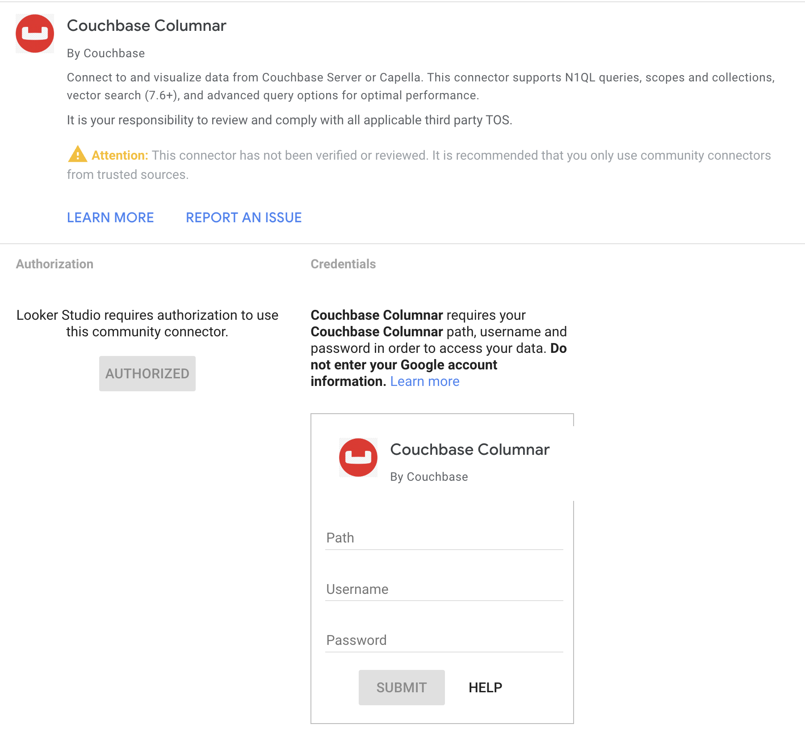

---
# frontmatter
path: "/tutorial-looker-studio-columnar"
# title and description do not need to be added to markdown, start with H2 (##)
title: Connect Looker Studio to Couchbase Columnar using Views and Custom Queries
short_title: Columnar Looker Studio Connector
description:
  - Connect Google Looker Studio to Couchbase Columnar using Tabular Analytics Views (TAVs) or custom queries
  - Create Tabular Analytics Views in Capella for stable datasets or use custom SQL++ queries for flexibility
  - Learn authentication, configuration, schema inference, and troubleshooting
content_type: tutorial
filter: connectors
technology:
  - server
  - query
tags:
  - Looker Studio
  - Couchbase Columnar
  - Connector
  - TAVs
  - Custom Queries
sdk_language:
  - nodejs
length: 20 Mins
---

<!-- [abstract] -->

## Overview

Connect Looker Studio to Couchbase Columnar for data analysis and visualization. This connector supports two modes: Tabular Analytics Views (TAVs) for stable, optimized data sources, and custom queries for flexible data exploration.

**Workflow**: Either create TAVs in Couchbase Capella for consistent reporting, or use custom SQL++ queries for ad-hoc analysis. TAVs provide a stable, schema-defined interface that's optimized for BI tools, while custom queries offer maximum flexibility for complex data operations.

The connector authenticates with Basic Auth to the Columnar API (`/api/v1/request`) and infers schema automatically using `array_infer_schema` so Looker Studio fields are created with reasonable types.

## Prerequisites

To use this connector, you need:

### Couchbase Columnar Access
- **Sign up**: Visit [Couchbase Capella](https://cloud.couchbase.com/) to create your account
- **Free Trial**: Start with a free trial to test the connector
- **Columnar Service**: Enable Columnar analytics in your Capella cluster
- **Pricing**: Columnar is billed based on compute and storage usage. See [Capella Pricing](https://www.couchbase.com/pricing/capella/) for details

### Technical Requirements
- A Couchbase Columnar deployment reachable from Looker Studio. For setup information, see [Getting Started with Couchbase Columnar](https://www.couchbase.com/products/analytics/).
- A database user with permissions to read from the target Tabular Analytics Views (TAVs) and execute queries.
- Network access from Looker Studio to your Columnar host.

## Installation

To add the Couchbase Columnar connector to your Looker Studio reports:

1. **Open Looker Studio**: Go to [Looker Studio](https://lookerstudio.google.com/)
2. **Create or Open Report**: Start a new report or open an existing one
3. **Add Data Source**: Click "Add data" or the "+" button
4. **Find Connector**: Search for "Couchbase Columnar" in the connector gallery
5. **Authorize**: Grant necessary permissions when prompted
6. **Configure**: Follow the authentication and configuration steps below

## Authentication

When adding the data source, provide:

- Path: The Columnar host. Example:
  - Capella host: `cb.<your-host>.cloud.couchbase.com`
- Username and Password: Database credentials.

The connector validates credentials by running a lightweight test query (`SELECT 1 AS test;`).

When you add the Couchbase Columnar connector in Looker Studio, you'll see the authentication screen:



## Create Tabular Analytics Views (TAVs) in Capella (Recommended)

For the "By View" mode, create Tabular Analytics Views in Capella:

1. **Open Analytics Workbench**: In your Capella cluster, go to the Analytics tab and launch the Analytics Workbench.

2. **Create your SQL++ query**: Write a query that returns the data structure you want for reporting:

```sql
-- Example airport query for TAV creation
SELECT a.airportname,
       a.city,
       a.country,
       a.faa,
       a.icao
FROM `travel-sample`.`inventory`.`airport` AS a
WHERE a.country = 'United States'
LIMIT 100;
```

3. **Test the query**: Run your query to verify it returns the expected results and data types.

4. **Create the TAV**:
   - Click **Save as View** in the Analytics Workbench
   - Select **Annotate for Tabular View**
   - **Define the schema**: Specify column names, data types (STRING, NUMBER, BOOLEAN), and mark primary key fields
   - **Name your view**: Use a descriptive name like `airports_us_flattened`
   - **Save**: The TAV will be created with enforced schema

5. **Verify creation**: Your TAV will appear in the database browser under the specified scope and can be queried like a table.

- For details, see [Tabular Analytics Views](https://docs.couchbase.com/columnar/query/views-tavs.html) and [Buckets, Scopes, and Collections](https://docs.couchbase.com/cloud/clusters/data-service/about-buckets-scopes-collections.html).

## Configuration

Choose your mode in the configuration screen:

- Configuration Mode: Choose between `By View` or `Use Custom Query`.

### Mode: By View (TAV)

- Couchbase Database, Scope, View: Selected from dropdowns that automatically discover your available databases, scopes, and views from your Columnar instance.
- Maximum Rows: Optional limit for returned rows; leave blank for no limit.

What runs:

- Data: `SELECT <requested fields or *> FROM \`database\`.\`scope\`.\`view\` [LIMIT n]`
- Schema: `SELECT array_infer_schema((SELECT VALUE t FROM \`database\`.\`scope\`.\`view\` [LIMIT n])) AS inferred_schema;`

### Mode: By Custom Query

- Custom Columnar Query: Enter your own SQL++ query directly in a text area.
- Maximum Rows: Not applicable (control limits within your query using `LIMIT`).

**Example custom query**:
```sql
SELECT airline.name AS airline_name,
       airline.iata AS iata_code,
       airline.country AS country,
       COUNT(*) AS route_count
FROM `travel-sample`.`inventory`.`airline` AS airline
JOIN `travel-sample`.`inventory`.`route` AS route 
  ON airline.iata = route.airline
WHERE airline.country = "United States"
GROUP BY airline.name, airline.iata, airline.country
LIMIT 100;
```

What runs:
- Data: Your exact custom query as entered
- Schema: `SELECT array_infer_schema((your_custom_query)) AS inferred_schema;`

After authentication, configure the connector by selecting your database, scope, and view:


## Schema and Field Types

- The connector converts inferred types to Looker types:
  - number → NUMBER (metric)
  - boolean → BOOLEAN (dimension)
  - string/objects/arrays/null → STRING/TEXT (dimension)
- Nested fields are flattened using dot and array index notation where possible (for example, `address.city`, `schedule[0].day`). Unstructured values may be stringified.

> **⚠️ Schema Inference Notes**: For TAVs, schema inference uses `array_infer_schema` on the entire dataset unless you specify Maximum Rows (which adds a LIMIT clause for sampling). Field types are inferred from the analyzed data and may miss variations (e.g., fields containing both text and numbers in different documents). If schema inference fails, ensure your TAV contains data and consider adding a Maximum Rows limit for faster sampling during testing.

Once your schema is configured, you can customize the fields in your Looker Studio dashboard:


## Data Retrieval

- Only requested fields are projected. For nested fields, the connector fetches the required base fields and extracts values server-side within the Apps Script environment.
- Row limits:
  - View mode: `Maximum Rows` controls `LIMIT` (blank = no limit).

## Tips and Best Practices

- **Prefer Tabular Analytics Views for BI tooling**: TAVs provide a stable, optimized interface with predefined schemas, making them ideal for consistent reporting and visualization. They also offer better performance than ad-hoc queries.
- **Use `LIMIT` while exploring**: Start with smaller datasets (e.g., `LIMIT 1000`) to test connectivity and schema inference quickly. Remove or increase limits once you're satisfied with the data structure.

## Troubleshooting

- **Authentication failure**: Check host, credentials, and network reachability to Columnar.
- **Schema inference errors**: Ensure your TAV exists and contains data. Try adding a `LIMIT` clause for faster sampling (e.g., `LIMIT 100`).
- **API error from Columnar**: Review the response message in Looker Studio and verify TAV names, permissions, and that the view is properly created in Capella.
- **Empty or missing TAV**: Verify that your Tabular Analytics View was saved correctly in the Analytics Workbench and contains data.
- **Schema mismatch**: If fields appear with unexpected types, verify your TAV schema definition matches your query results. TAVs enforce schema consistency, so ensure your query produces data that matches the defined column types.

## Next Steps

Once your connector is configured and fields are set up, create reports by dragging and dropping tables from the side pane onto the main canvas:


- Build charts in Looker Studio using your TAV-backed fields.
- Iterate on Views/queries to shape the dataset for analytics.
- Explore the rich visualization options available in Looker Studio to create compelling dashboards from your Columnar data.

## Support

For assistance with the Couchbase Columnar Looker Studio connector:

### Technical Support
- **Documentation**: Complete guides at [Couchbase Developer Portal](https://developer.couchbase.com/)
- **Community Forum**: Get help from the community at [Couchbase Forums](https://forums.couchbase.com/)
- **Developer Community**: Connect with [Couchbase Developer Community](https://www.couchbase.com/developers/community/)
- **Discord**: Join real-time discussions on [Couchbase Discord](https://discord.gg/sQ5qbPZuTh)

### Issue Reporting
- **Connector Issues**: Report bugs or feature requests through [Couchbase Support](https://support.couchbase.com/hc/en-us)
- **General Contact**: For other inquiries, use [Couchbase Contact](https://www.couchbase.com/contact/)
- **Response Time**: We aim to respond to connector issues within 2-3 business days
- **Known Limitations**: Check the troubleshooting section above for common issues

### Resources
- **Couchbase Columnar Documentation**: [Official Docs](https://docs.couchbase.com/columnar/intro/intro.html)
- **Looker Studio Help**: [Google Looker Studio Support](https://support.google.com/looker-studio/)
- **Sample Data**: Use travel-sample bucket for testing and examples
- **API Documentation**: [Columnar Management API](https://docs.couchbase.com/columnar/management-api-guide/management-api-intro.html)

## Privacy Policy

**Connector Data Usage**: This connector accesses your Couchbase Columnar credentials and query results solely for data integration with Looker Studio. No data is stored permanently by the connector, and all processing occurs within Google's Looker Studio environment.

**Official Privacy Policy**: For complete information about how Couchbase handles your data, please review our official [Couchbase Privacy Policy](https://www.couchbase.com/privacy-policy/).

**Google Looker Studio**: This connector operates within Google Looker Studio, which has its own data handling policies. Please review [Google's Privacy Policy](https://policies.google.com/privacy) for their data practices.

## Terms of Service

**Connector Usage**: Use this connector only with Couchbase Columnar instances you own or have permission to access. Maintain security of your credentials and comply with your organization's data governance policies.

**Official Terms**: Your use of Couchbase products and services is governed by our official [Couchbase Terms of Use](https://www.couchbase.com/terms-of-use/). For enterprise customers, additional terms may apply under your specific [Couchbase License Agreement](https://www.couchbase.com/legal/agreements/).

**Google Looker Studio**: This connector operates within Google Looker Studio and is subject to [Google's Terms of Service](https://policies.google.com/terms).

## Legal

**Copyright**: © 2024 Couchbase, Inc. All rights reserved.

**Legal Information**: For comprehensive legal information, licensing terms, and trademark policies, visit [Couchbase Legal](https://www.couchbase.com/legal/) and our [Trademark Policy](https://www.couchbase.com/trademark-policy/).

**Trademarks**: Couchbase and the Couchbase logo are trademarks of Couchbase, Inc. Google Looker Studio is a trademark of Google LLC.

**Contact**: For legal inquiries, contact [legal@couchbase.com](mailto:legal@couchbase.com).


