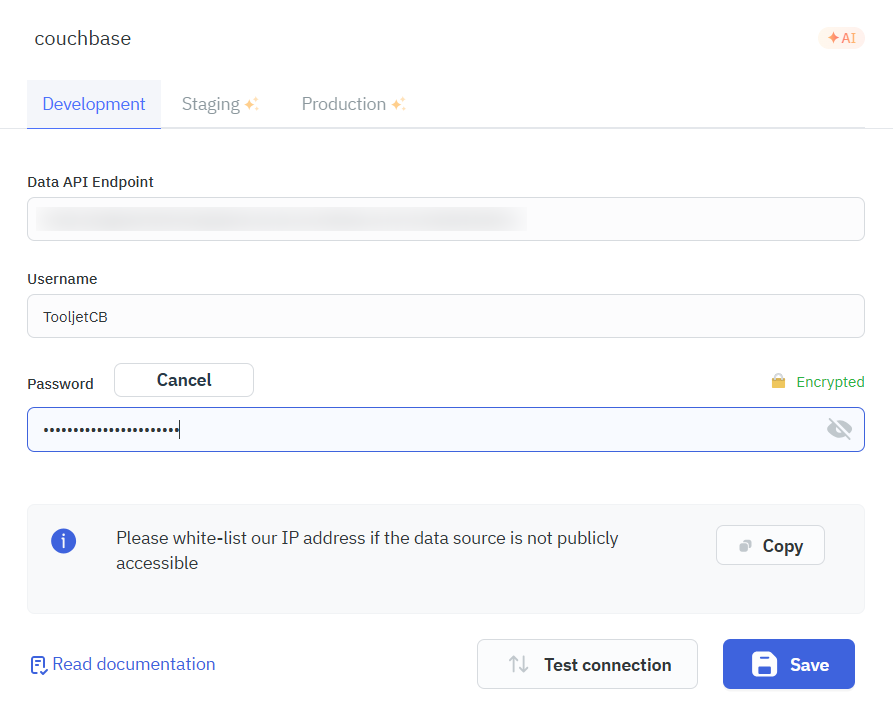
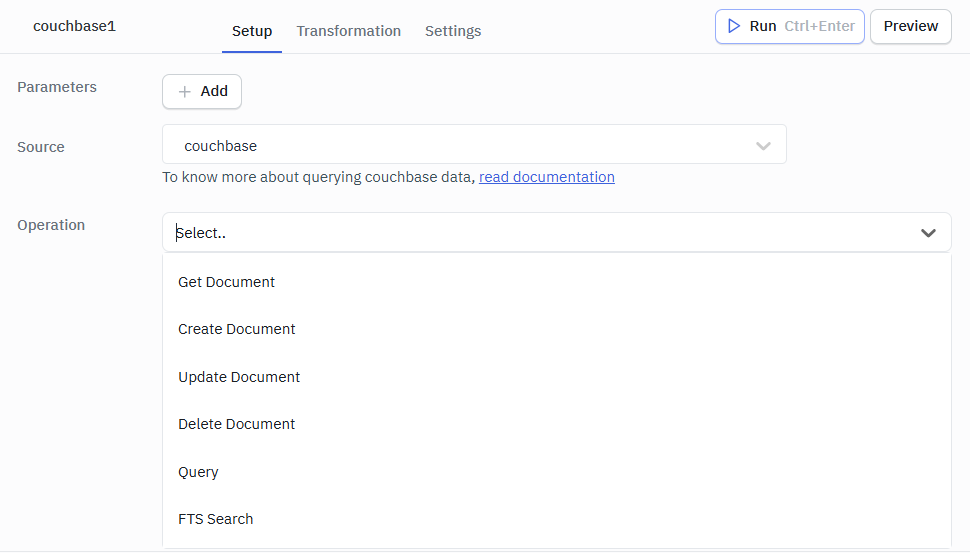
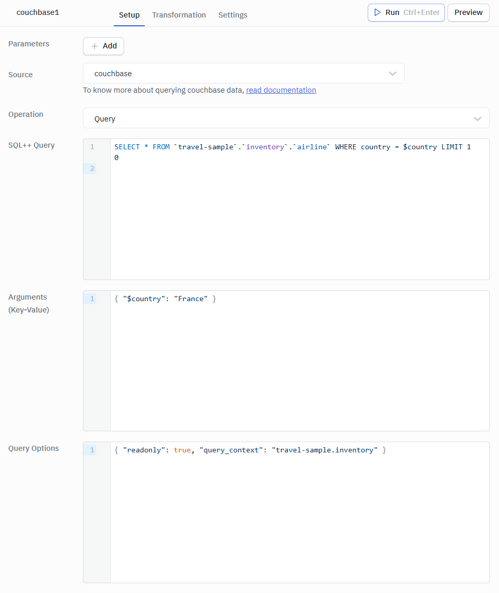

---
# frontmatter
path: "/tutorial-tooljet-couchbase"
# title and description do not need to be added to markdown, start with H2 (##)
title: Build an Airline Dashboard with ToolJet and Couchbase
short_title: ToolJet Integration
description:
  - Build a fully functional Airline Dashboard using ToolJet's low-code platform and Couchbase
  - Learn all 6 Couchbase operations in ToolJet — CRUD, SQL++, and Full-Text Search
  - Connect ToolJet to Couchbase via the Data API for both Capella and self-managed clusters
content_type: tutorial
filter: connectors
technology:
  - kv
  - query
  - fts
tags:
  - Data API
  - Connector
  - SQL++ (N1QL)
  - FTS
  - REST API
sdk_language:
  - nodejs
length: 30 Mins
---

## Overview

In this tutorial, you will build an **Airline Dashboard** — a fully functional internal tool that lets you browse, search, create, edit, and delete airline records stored in Couchbase. You'll use ToolJet's visual app builder and connect it to Couchbase using the Couchbase marketplace plugin, covering all 6 supported operations.

By the end, you'll have a deployed web app that your team can use immediately — no backend code, no frontend framework, no deployment pipeline required.

### What You'll Learn

- How to install and configure the Couchbase plugin from the ToolJet Marketplace
- How to connect to Couchbase via the Data API (both Capella and self-managed)
- How to run SQL++ queries with parameterized arguments
- How to perform CRUD operations (Get, Create, Update, Delete documents)
- How to add Full-Text Search (FTS) to your app
- How to bind Couchbase query results to ToolJet UI components

### What You'll Build

An Airline Dashboard with:
- A **table** displaying airline data from the `travel-sample` dataset
- A **search bar** powered by Couchbase Full-Text Search
- A **form** to create new airline documents
- **Edit and delete** capabilities for existing airlines
- All connected to Couchbase with zero backend code

## Prerequisites

To follow this tutorial, you will need:

- A **Couchbase cluster** with the `travel-sample` bucket loaded (see [Couchbase Cluster Setup](#couchbase-cluster-setup))
- A **ToolJet instance** — either [ToolJet Cloud](https://www.tooljet.com) (free tier available) or self-hosted via Docker (see [ToolJet Setup](#tooljet-setup))

### Couchbase Cluster Setup

<details>
<summary><b>Option A: Couchbase Capella (Cloud) — Recommended</b></summary>

Couchbase Capella is the easiest way to get started. It has a free tier and the Data API is available out of the box.

1. **Sign up** at [cloud.couchbase.com](https://cloud.couchbase.com) and create a free-tier cluster
2. **Load the travel-sample bucket**:
   - Go to your cluster → **Settings** → **Sample Buckets**
   - Select `travel-sample` and click **Load Sample Data**
   - Wait for the import to complete
   - For detailed instructions, see [Load travel-sample bucket in Couchbase Capella](https://docs.couchbase.com/cloud/clusters/data-service/import-data-documents.html#import-sample-data)
3. **Create database credentials**:
   - Go to **Cluster Access** → **Database Access**
   - Create a new user with **Read/Write** access to the `travel-sample` bucket
   - Note down the **username** and **password**
4. **Allow network access**:
   - Go to **Allowed IP Addresses**
   - Add the IP address of your ToolJet instance (visit [whatismyip.com](https://whatismyip.com) to find your public IP if self-hosting)
   - For detailed instructions, see [Allow IP Address on Capella](https://docs.couchbase.com/cloud/clusters/allow-ip-address.html)
   > **Security Note**: Never allow `0.0.0.0/0` (all IPs). Always restrict access to specific IP addresses, even in development.
5. **Find your Data API endpoint**:
   - Go to **Connect** tab
   - Look for the **Data API** endpoint URL — it will look like `https://<cluster-id>.data.cloud.couchbase.com`
   - Copy this URL

</details>

<details>
<summary><b>Option B: Self-Managed Couchbase Server (Docker)</b></summary>

If you prefer to run Couchbase locally:

1. **Start Couchbase Server via Docker**:

```shell
docker run -d --name couchbase-server \
  -p 8091-8096:8091-8096 \
  -p 11210-11211:11210-11211 \
  -p 18091-18096:18091-18096 \
  couchbase:7.6.2
```

2. **Initialize the cluster**:
   - Open `http://<your-server-hostname-or-ip>:8091` in your browser (use `localhost` if running Docker on your local machine)
   - Follow the setup wizard to create the cluster
   - Create an admin user (note the **username** and **password**)

3. **Load the travel-sample bucket**:
   - Go to **Settings** → **Sample Buckets**
   - Check `travel-sample` and click **Load Sample Data**

4. **Your Data API endpoint** is the base URL of the server running Couchbase:
   ```
   http://<your-server-hostname-or-ip>:8091
   ```
   Use `http://localhost:8091` only if Couchbase is running on the same machine as ToolJet. For remote servers, replace with the server's actual hostname or IP address.
   > Note: For self-managed clusters, the Data API is available on the same port as the management API. Ensure Data API is enabled in your cluster configuration.

</details>

### ToolJet Setup

<details>
<summary><b>Option A: ToolJet Cloud — Recommended</b></summary>

1. Sign up at [tooljet.com](https://www.tooljet.com) (free tier available)
2. You'll get a workspace ready to use immediately

</details>

<details>
<summary><b>Option B: Self-Hosted ToolJet (Docker)</b></summary>

```shell
docker run -d \
  --name tooljet \
  -p 80:80 \
  tooljet/tooljet-ce:v3.16.0-LTS
```

Open `http://localhost` and create your admin account. For more setup options (Kubernetes, AWS, GCP, Azure), see the [ToolJet self-hosting guide](https://docs.tooljet.com/docs/setup/docker).

</details>

### Create an FTS Index

Step 9 of this tutorial uses Couchbase Full-Text Search. Create the index now so it's ready when you need it.

<details>
<summary><b>Capella Users</b></summary>

1. In the Capella UI, go to your cluster → **Search**
2. Click **Create Index**
3. Configure:
   - **Index Name**: `airline-name-index`
   - **Bucket**: `travel-sample`
   - **Scope**: `inventory`
   - Add a **Type Mapping** for the `airline` collection
   - Index the `name` field as **text**
4. Click **Create**

</details>

<details>
<summary><b>Self-Managed Users</b></summary>

1. Open the Couchbase Web Console → **Search**
2. Click **Add Index**
3. Configure:
   - **Index Name**: `airline-name-index`
   - **Bucket**: `travel-sample`
   - **Scope**: `inventory`
   - Add a **Type Mapping** for the `airline` collection
   - Index the `name` field as **text**
4. Click **Create Index**

</details>

---

## Step 1: Install the Couchbase Plugin

The Couchbase integration is a **marketplace plugin** — you need to install it first.

1. In ToolJet, click the **gear icon** (bottom-left) to open **Workspace Settings**
2. Navigate to **Marketplace** → **Plugins**
3. Search for **"Couchbase"**
4. Click **Install**

You should see the Couchbase plugin with its red logo appear in your installed plugins list.

## Step 2: Configure the Couchbase Data Source

Now connect ToolJet to your Couchbase cluster:

1. Go to **Data Sources** (left sidebar, database icon)
2. Click **+ Add new data source**
3. Search for **"Couchbase"** and select it
4. Enter your **Data API Endpoint**, **Username**, and **Password** from the prerequisites section
5. Click **Test Connection** — you should see a green "Connection successful" message
6. Click **Save**



## Step 3: Create a SQL++ Query to List Airlines

Let's fetch airline data from the `travel-sample` dataset.

1. Create a new app: click **+ Create new app** and name it "Airline Dashboard"
2. In the bottom panel, click **+ Add** → **Query** → select your **Couchbase** data source
3. Name the query `listAirlines`
4. Configure the query:
   - **Operation**: Select **Query** from the dropdown (see all available operations below)



   - **SQL++ Query**: Enter the following:

```sql
SELECT META().id AS doc_id, name, country, callsign, iata, icao
FROM `travel-sample`.`inventory`.`airline`
ORDER BY name
LIMIT 50
```

5. Click **Run** to test the query

You should see results in the preview panel — a list of airlines with their names, countries, and callsigns.

> **How it works**: This SQL++ query runs against the `airline` collection inside the `inventory` scope of the `travel-sample` bucket. `META().id` gives us the document ID, which we'll need for CRUD operations later.

### Using Parameterized Queries

Now let's create a second query that uses **parameterized arguments** — this is the recommended way to pass dynamic values in SQL++ because it prevents injection attacks.

1. Create another query named `listAirlinesByCountry`
2. Configure it:
   - **Operation**: **Query**
   - **SQL++ Query**:

```sql
SELECT META().id AS doc_id, name, country, callsign, iata, icao
FROM `travel-sample`.`inventory`.`airline`
WHERE country = $country
ORDER BY name
LIMIT 50
```

   - **Arguments (Key-Value)**:

```json
{ "$country": "United States" }
```



3. Click **Run** — you should see only airlines from the United States

> **Why parameterized queries?** Instead of concatenating user input directly into SQL++ strings (which risks injection attacks), Couchbase's `$parameter` syntax sends values separately from the query statement. The plugin passes these through the `args` field in the Data API request body. You can also pass **Query Options** like `{ "readonly": true, "timeout": "30s" }` for additional control.

## Step 4: Display Airlines in a Table

1. From the **Components** panel (right sidebar), drag a **Table** component onto the canvas
2. In the Table's properties (right panel), set the **Data** field to:

```
{{queries.listAirlines.data.results}}
```

3. The table will automatically populate with columns based on the query results

You should now see a table showing airline names, countries, callsigns, IATA codes, and ICAO codes.

**Customize the table** (optional):
- Click on individual columns to rename headers (e.g., `doc_id` → "Document ID")
- Hide the `doc_id` column if you don't want users to see it (but keep it — we'll need it later)
- Enable **sorting** and **filtering** on columns

## Step 5: View Airline Details (Get Document)

Let's add the ability to view a single airline's full document when a user clicks a row.

1. Create a new query named `getAirline`:
   - **Operation**: **Get Document**
   - **Bucket**: `travel-sample`
   - **Scope**: `inventory`
   - **Collection**: `airline`
   - **Document ID**: `{{components.table1.selectedRow.doc_id}}`


2. Drag a **Modal** component onto the canvas and add **Text** components inside it to display:
   - `{{queries.getAirline.data.name}}` — Airline name
   - `{{queries.getAirline.data.country}}` — Country
   - `{{queries.getAirline.data.callsign}}` — Callsign
   - `{{queries.getAirline.data.iata}}` — IATA code

3. On the **Table** component, add a **Row clicked** event handler:
   - **Action**: Run query → `getAirline`
   - Then **Show modal** → your modal component

Now when you click any airline row, it fetches the full document and displays it in a modal.

## Step 6: Create a New Airline (Create Document)

1. Drag a **Button** component above the table, label it "Add Airline"

2. Drag a **Modal** component for the creation form. Inside it, add:
   - **Text Input**: `airlineName` (label: "Airline Name")
   - **Text Input**: `airlineCountry` (label: "Country")
   - **Text Input**: `airlineCallsign` (label: "Callsign")
   - **Text Input**: `airlineIata` (label: "IATA Code")
   - **Text Input**: `airlineIcao` (label: "ICAO Code")
   - **Text Input**: `airlineDocId` (label: "Document ID", placeholder: "airline_9999")
   - **Button**: "Create" (to submit the form)

3. Create a new query named `createAirline`:
   - **Operation**: **Create Document**
   - **Bucket**: `travel-sample`
   - **Scope**: `inventory`
   - **Collection**: `airline`
   - **Document ID**: `{{components.airlineDocId.value}}`
   - **Document**:

```javascript
{
  "type": "airline",
  "name": "{{components.airlineName.value}}",
  "country": "{{components.airlineCountry.value}}",
  "callsign": "{{components.airlineCallsign.value}}",
  "iata": "{{components.airlineIata.value}}",
  "icao": "{{components.airlineIcao.value}}"
}
```


4. Wire it up:
   - "Add Airline" button → **Show modal** (the creation form modal)
   - "Create" button inside modal → **Run query** `createAirline`, then **Run query** `listAirlines` (to refresh the table), then **Hide modal**

Test it: Click "Add Airline", fill in the form, click "Create". The new airline should appear in the table.

## Step 7: Edit an Airline (Update Document)

1. Add an **Actions** column to the table with an "Edit" button

2. Create a new modal with the same form fields as Step 6, but pre-populated with the selected row's data:
   - Set each input's **Default value** to the corresponding table column, e.g.:
     - `airlineNameEdit` default: `{{components.table1.selectedRow.name}}`
     - `airlineCountryEdit` default: `{{components.table1.selectedRow.country}}`

3. Create a new query named `updateAirline`:
   - **Operation**: **Update Document**
   - **Bucket**: `travel-sample`
   - **Scope**: `inventory`
   - **Collection**: `airline`
   - **Document ID**: `{{components.table1.selectedRow.doc_id}}`
   - **Document**:

```javascript
{
  "type": "airline",
  "name": "{{components.airlineNameEdit.value}}",
  "country": "{{components.airlineCountryEdit.value}}",
  "callsign": "{{components.airlineCallsignEdit.value}}",
  "iata": "{{components.airlineIataEdit.value}}",
  "icao": "{{components.airlineIcaoEdit.value}}"
}
```


4. Wire the "Save" button to: **Run query** `updateAirline` → **Run query** `listAirlines` → **Hide modal**

> **Important**: The Update operation performs a **full document replacement** (HTTP PUT), not a partial update. Make sure your document JSON includes all fields, not just the ones you changed.

## Step 8: Delete an Airline (Delete Document)

1. Add a "Delete" button in the table's Actions column

2. Create a new query named `deleteAirline`:
   - **Operation**: **Delete Document**
   - **Bucket**: `travel-sample`
   - **Scope**: `inventory`
   - **Collection**: `airline`
   - **Document ID**: `{{components.table1.selectedRow.doc_id}}`


3. Wire the "Delete" button to show a **confirmation dialog**, then:
   - **Run query** `deleteAirline` → **Run query** `listAirlines` (to refresh the table)

## Step 9: Add Full-Text Search

Now let's add a search bar that uses Couchbase's Full-Text Search to find airlines by name.

> Before continuing, ensure you have created the `airline-name-index` FTS index as described in the [Prerequisites](#create-an-fts-index) section.

### Add Search to ToolJet

1. Drag a **Text Input** component above the table, label it "Search Airlines" (`searchInput`)

2. Create a new query named `searchAirlines`:
   - **Operation**: **FTS Search**
   - **Bucket**: `travel-sample`
   - **Scope**: `inventory`
   - **Index Name**: `airline-name-index`
   - **Search Query**:

```javascript
{
  "query": {
    "match": "{{components.searchInput.value}}",
    "field": "name"
  },
  "fields": ["name", "country", "callsign"],
  "size": 20
}
```


3. Add an event handler on the search input: **On change** → **Run query** `searchAirlines`

4. Update the **Table's Data** to conditionally show search results or all airlines:

```javascript
{{components.searchInput.value
  ? queries.searchAirlines.data.hits.map(hit => hit.fields)
  : queries.listAirlines.data.results}}
```

Now when you type in the search bar, it performs a real-time Full-Text Search against Couchbase and displays matching airlines.

## Step 10: Deploy the App

1. Click the **Deploy** button (top-right, rocket icon)
2. Your app is now live with a shareable URL
3. Share the URL with your team — they can use it immediately

---

## Conclusion

You've built a complete Airline Dashboard that demonstrates all 6 Couchbase operations in ToolJet:

| Operation | What You Built |
|-----------|---------------|
| **SQL++ Query** | Main airline listing with sorting |
| **Get Document** | Click-to-view airline details modal |
| **Create Document** | "Add Airline" form |
| **Update Document** | Inline edit functionality |
| **Delete Document** | Delete with confirmation |
| **FTS Search** | Real-time search bar |

### Key Takeaways

- **No backend code** — ToolJet handles the API layer, UI rendering, and deployment
- **Couchbase Data API** — the plugin uses REST calls, making it compatible with both Capella and self-managed clusters
- **SQL++ for analytics** — parameterized queries keep your app secure
- **FTS for search** — real-time full-text search powered by Couchbase indexes

### Next Steps

- **Add vector search**: Replace the FTS match query with a vector search query for semantic/AI-powered search
- **Build more apps**: Customer support tools, inventory managers, reporting dashboards — all on your Couchbase data
- **Explore ToolJet components**: Charts, maps, JSON viewers, and 50+ other widgets can visualize your Couchbase data in different ways

### Useful Links

- [ToolJet Couchbase Plugin Documentation](https://docs.tooljet.com/docs/marketplace/plugins/couchbase)
- [Couchbase Data API Documentation](https://docs.couchbase.com/cloud/data-api/data-api.html)
- [Couchbase SQL++ Reference](https://docs.couchbase.com/server/current/n1ql/n1ql-language-reference/index.html)
- [Couchbase FTS Documentation](https://docs.couchbase.com/server/current/fts/fts-introduction.html)
- [ToolJet Documentation](https://docs.tooljet.com)
