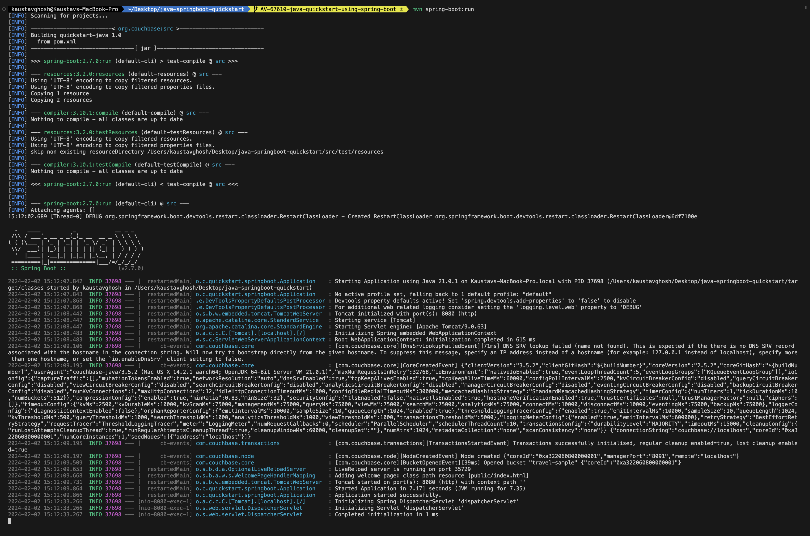
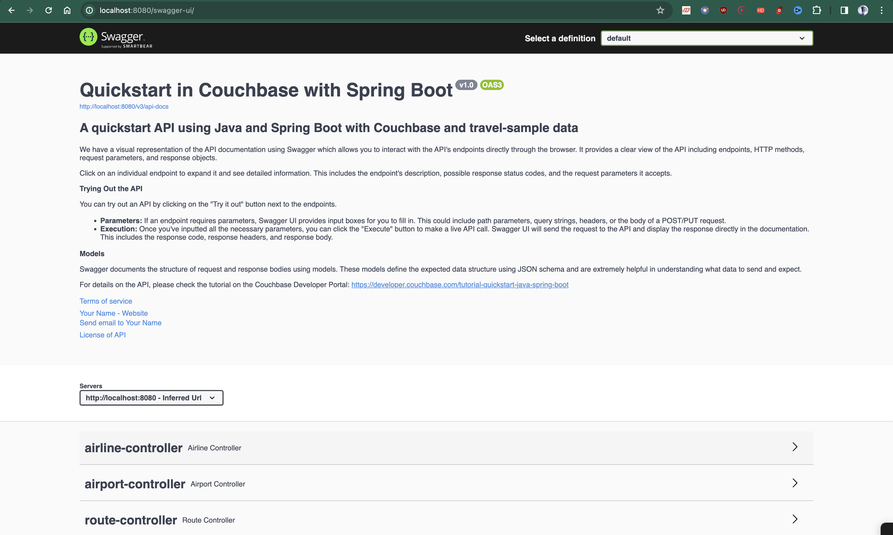

---
# frontmatter
path: "/tutorial-quickstart-java-springboot"
# title and description do not need to be added to markdown, start with H2 (##)
title: Start with Java and Spring Boot
short_title: Java and Spring Boot
description:
  - Learn how to configure Spring Data with Couchbase
  - Explore key-based operations and SQL++ querying using Spring Data Couchbase repositories
  - Build a simple REST APIs that stores user profiles on a Couchbase cluster
content_type: quickstart
filter: sdk
technology:
  - kv
  - query
tags:
  - REST API
  - Spring Boot
  - Spring Data
sdk_language:
  - java
length: 30 Mins
---

<!--
  The name of this file does not need to be `tutorial-quickstart-java-springboot` because it is in the `tutorials/java/markdown` directory, so we can just call it `spring-boot`. The idea is that we can leave off `tutorial-quickstart` as a prefix.
-->

<!-- TODO:  Figure out how to add width to image size in try it now links -->

## Table of Contents

- [Getting Started](#getting-started)
  - [Prerequisites](#prerequisites)
  - [Source Code](#source-code)
  - [Install Dependencies](#install-dependencies)
  - [Database Server Configuration](#database-server-configuration)
  - [Environment Variables](#environment-variables)
- [Running The Application](#running-the-application)
  - [Directly on the machine](#directly-on-the-machine)
  - [Docker](#docker)
- [What We'll Cover](#what-well-cover)
  - [Document Structure](#document-structure)
  - [Code Organization](#code-organization)
- [Data Model](#data-model)
- [Let's Review the Code](#lets-review-the-code)
  - [Integration Tests](#integration-tests)
  - [Repository](#repository)
  - [Model](#model)
  - [Controller](#controller)
  - [Service](#service)
- [Route Specifications](#route-specifications)
  - [GET Route](#get-route)
  - [POST Route](#post-route)
  - [PUT Route](#put-route)
  - [DELETE Route](#delete-route)
- [Route Workflow](#route-workflow)
  - [GET Route Workflow](#get-route-workflow)
  - [POST Route Workflow](#post-route-workflow)
  - [PUT Route Workflow](#put-route-workflow)
  - [DELETE Route Workflow](#delete-route-workflow)
- [Custom SQL++ Queries](#custom-sql-queries)
- [Running The Tests](#running-the-tests)
- [Project Setup Notes](#project-setup-notes)
- [Contributing](#contributing)
- [Appendix](#appendix)
  - [Extending API by Adding New Entity](#extending-api-by-adding-new-entity)
  - [Running Self Managed Couchbase Cluster](#running-self-managed-couchbase-cluster)
  - [Swagger Documentation](#swagger-documentation)

## Getting Started

### Prerequisites

To run this prebuilt project, you will need:

- Follow [Couchbase Installation Options](/tutorial-couchbase-installation-options) for installing the latest Couchbase Database Server Instance (at least Couchbase Server 7)
- Java SDK v1.8 or higher installed
- Code Editor installed (IntelliJ IDEA, Eclipse, or Visual Studio Code)
- Maven command line

### Source Code

```shell
git clone https://github.com/couchbase-examples/java-springboot-quickstart.git
```

### Install Dependencies

```shell
mvn package
```

> Note: Maven packages auto restore when building the project in IntelliJ IDEA or Eclipse depending on IDE configuration.

### Database Server Configuration

the `CouchbaseConfig` class is a Spring configuration class responsible for setting up the connection to a Couchbase database in a Spring Boot application. It defines two beans:

`getCouchbaseCluster()`: This bean creates and configures a connection to the Couchbase cluster using the provided hostname, username, and password.

`getCouchbaseBucket(Cluster cluster)`: This bean creates a Couchbase bucket within the cluster if it doesn't already exist and returns the Bucket object associated with the specified bucket name.

### Environment Variables

You need to configure the connection details to your Couchbase Server in the application.properties file located in the src/main/resources directory.

In the connection string, replace `DB_CONN_STR` with the connection string of your Couchbase cluster. Replace `DB_USERNAME` and `DB_PASSWORD` with the username and password of a Couchbase user with access to the bucket.

The connection string should be in the following format:

```properties
spring.couchbase.bootstrap-hosts=couchbases://cb.fwu-oviwcpjq4v.cloud.couchbase.com
OR
spring.couchbase.bootstrap-hosts=localhost
```

The couchbases protocol is used for secure connections. If you are using Couchbase Server 6.5 or earlier, you should use the couchbase protocol instead.

```properties
spring.couchbase.bootstrap-hosts=DB_CONN_STR
spring.couchbase.bucket.user=DB_USERNAME
spring.couchbase.bucket.password=DB_PASSWORD
```

## Running The Application

### Directly on the machine

At this point the application is ready, and you can run it via your IDE or from the terminal:

```shell
mvn spring-boot:run -e -X
```

<!-- Screeenshot -->



> Note: Couchbase Server 7 must be installed and running on localhost (http://127.0.0.1:8091) prior to running the Spring Boot app.

Once the site is up and running you can launch your browser and go to the Swagger Start Page]: `http://localhost:8080/swagger-ui/` to test the APIs.

<!-- Screenshot -->



### Docker

You can also run the application using Docker. The `Dockerfile` is provided in the root directory of the project. To build and run the Docker image, use the following commands:

```shell
docker build -t springboot-couchbase .
```

```shell
docker run -p 8080:8080 springboot-couchbase
```

## What We'll Cover

A simple REST API using Spring Boot and the `Couchbase SDK version 3.x` with the following endpoints:

- [Create new airlines with essential information](#post-route).
- [Update airline details](#put-route).
- [Delete airlines](#delete-route).
- [Retrieve airlines by ID](#get-route).
- [List all airlines with pagination](#get-route).
- [List airlines by country](#custom-sql-queries).
- [List airlines by destination airport](#custom-sql-queries).

### Document Structure

We will be setting up a REST API to manage some airline documents. Our airline document will have a structure similar to the following:

```json
{
  "id": "airline_8091",
  "type": "airline",
  "name": "Couchbase Airways",
  "callsign": "Couchbase",
  "iata": "CB",
  "icao": "CBA",
  "country": "United States",
  "active": true
}
```

The `id` field is the unique identifier for the document. The `type` field is used to identify the type of document. The `name` field is the name of the airline. The `callsign` field is the callsign of the airline. The `iata` field is the IATA code of the airline. The `icao` field is the ICAO code of the airline. The `country` field is the country of the airline. The `active` field is a boolean value indicating whether the airline is active or not.

### Code Organization

- `src/test/java`: Contains integration tests.
- `src/main/java/org/couchbase/quickstart/springboot/repositories`: Contains the repository implementation.
- `src/main/java/org/couchbase/quickstart/springboot/models`: Contains the data model.
- `src/main/java/org/couchbase/quickstart/springboot/controllers`: Contains the RESTful API controllers.
- `src/main/java/org/couchbase/quickstart/springboot/services`: Contains the service classes.

## Data Model

For this tutorial, we use three collections, `airport`, `airline` and `route` that contain sample airports, airlines and airline routes respectively. The route collection connects the airports and airlines as seen in the figure below. We use these connections in the quickstart to generate airports that are directly connected and airlines connecting to a destination airport. Note that these are just examples to highlight how you can use SQL++ queries to join the collections.


## Let's Review the Code

To begin clone the repo and open it up in the IDE of your choice to learn about how to create, read, update and delete documents in your Couchbase Server.

### Integration Tests

`AirlineIntegrationTest.java`
This class contains integration tests for the application. It tests various functionalities like getting, creating, updating, and deleting airlines, as well as listing airlines by country and destination airport.

### Repository

`AirlineRepositoryImpl.java`
This class implements the AirlineRepository interface. It interacts with the Couchbase database to perform CRUD operations on airline documents. It uses the Couchbase Java SDK to execute queries and operations.

### Model

`Airline.java`
This class represents the data model for an airline. It contains fields such as ID, type, name, IATA code, ICAO code, callsign, and country. The class uses annotations for validation.

### Controller

`AirlineController.java`
This class defines the RESTful API endpoints for managing airlines. It handles HTTP requests for creating, updating, deleting, and retrieving airlines. It also provides endpoints for listing airlines by various criteria.

### Service

`AirlineServiceImpl.java`
This class implements the AirlineService interface. It acts as an intermediary between the controller and repository, providing business logic for managing airlines.

## Route Specifications

### GET Route

`@GetMapping("/{id}")`
This route is used to retrieve an airline by its unique identifier (ID).

- It expects the id of the airline as a path parameter.
- It calls the `getAirlineById` method of the `AirlineService` to retrieve the airline with the specified ID.
- If the airline is found, it returns a `ResponseEntity` with HTTP status `200 OK` and the airline data in the response body.
- If the airline is not found, it returns a `ResponseEntity` with HTTP status `404 Not Found`.
- If any other error occurs, it returns a `ResponseEntity` with HTTP status `500 Internal Server Error`.

### POST Route

`@PostMapping("/{id}")`
This route is used to create a new airline.

- It expects the id of the airline as a path parameter, but this ID is typically generated by the server.
- It receives the airline data in the request body, which should be a valid JSON representation of an airline.
- It calls the `createAirline` method of the `AirlineService` to create the new airline.
- If the airline is created successfully, it returns a `ResponseEntity` with HTTP status `201 Created` and the created airline data in the response body.
- If a conflict occurs (e.g., an airline with the same ID already exists), it returns a `ResponseEntity` with HTTP status `409 Conflict`.
- If any other error occurs, it returns a `ResponseEntity` with HTTP status `500 Internal Server Error`.

### PUT Route

`@PutMapping("/{id}")`
This route is used to update an existing airline by its ID.

- It expects the id of the airline as a path parameter.
- It receives the updated airline data in the request body.
- It calls the `updateAirline` method of the `AirlineService` to update the airline with the specified ID.
- If the airline is updated successfully, it returns a `ResponseEntity` with HTTP status `200 OK` and the updated airline data in the response body.
- If the airline with the specified ID is not found, it returns a `ResponseEntity` with HTTP status `404 Not Found`.
- If any other error occurs, it returns a `ResponseEntity` with HTTP status `500 Internal Server Error`.

### DELETE Route

`@DeleteMapping("/{id}")`
This route is used to delete an airline by its ID.

- It expects the id of the airline as a path parameter.
- It calls the `deleteAirline` method of the `AirlineService` to delete the airline with the specified ID.
- If the airline is deleted successfully, it returns a `ResponseEntity` with HTTP status `204 No Content` (indicating success with no response body).
- If the airline with the specified ID is not found, it returns a `ResponseEntity` with HTTP status `404 Not Found`.
- If any other error occurs, it returns a `ResponseEntity` with HTTP status `500 Internal Server Error`.

These routes together provide the basic CRUD (Create, Read, Update, Delete) operations for managing airlines via the RESTful API. The `AirlineService` contains the business logic for these operations, and the `AirlineRepository` interacts with the database to perform the actual data operations.

## Route Workflow

### GET Route Workflow

`@GetMapping("/{id}")`

The GET route is triggered when a client sends an HTTP GET request to `/api/v1/airline/{id}` where `{id}` is the unique identifier of the airline.

1. The `AirlineController` receives the request and extracts the `id` from the URL path.
2. It then calls the `getAirlineById` method of the `AirlineService`, passing the extracted `id` as a parameter.This function internally calls [airlineCol.get()](https://docs.couchbase.com/java-sdk/current/howtos/kv-operations.html#retrieving-documents) to retrieve the airline from the database.
3. The `AirlineService` interacts with the database through the `AirlineRepository` to find the airline with the specified `id`.
4. If the airline is found, the `AirlineService` returns it as a response.
5. The `AirlineController` constructs an HTTP response with a status code of 200 OK and includes the airline data in the response body as a JSON object.
6. The response is sent back to the client with the airline data if found, or a 404 Not Found response if the airline does not exist.

### POST Route Workflow

`@PostMapping("/{id}")`

The POST route is triggered when a client sends an HTTP POST request to `/api/v1/airline/{id}`, where `{id}` is typically a unique identifier generated by the server (not provided by the client).

1. The client includes the data of the new airline to be created in the request body as a JSON object.
2. The `AirlineController` receives the request and extracts the `id` from the URL path, but this `id` is not used for creating the airline; it's often generated by the server.
3. The `AirlineController` calls the `createAirline` method of the `AirlineService`, passing the airline data from the request body. This function internally calls [airlineCol.insert()](https://docs.couchbase.com/java-sdk/current/howtos/kv-operations.html#insert) to insert the airline into the database.
4. The `AirlineService` is responsible for creating a new airline and saving it to the database using the `AirlineRepository`.
5. If the airline is created successfully, the `AirlineService` returns the newly created airline.
6. The `AirlineController` constructs an HTTP response with a status code of 201 Created and includes the created airline data in the response body as a JSON object.
7. The response is sent back to the client with the newly created airline data.

### PUT Route Workflow

`@PutMapping("/{id}")`

The PUT route is triggered when a client sends an HTTP PUT request to `/api/v1/airline/{id}`, where `{id}` is the unique identifier of the airline to be updated.

1. The client includes the updated data of the airline in the request body as a JSON object.
2. The `AirlineController` receives the request, extracts the `id` from the URL path, and retrieves the updated airline data from the request body.
3. The `AirlineController` calls the `updateAirline` method of the `AirlineService`, passing the `id` and updated airline data. This function internally calls [airlineCol.replace()](https://docs.couchbase.com/java-sdk/current/howtos/kv-operations.html#replace) to replace the airline in the database.
4. The `AirlineService` is responsible for updating the airline in the database using the `AirlineRepository`.
5. If the airline is updated successfully, the `AirlineService` returns the updated airline.
6. The `AirlineController` constructs an HTTP response with a status code of 200 OK and includes the updated airline data in the response body as a JSON object.
7. The response is sent back to the client with the updated airline data if found, or a 404 Not Found response if the airline with the specified ID does not exist.

### DELETE Route Workflow

`@DeleteMapping("/{id}")`

The DELETE route is triggered when a client sends an HTTP DELETE request to `/api/v1/airline/{id}`, where `{id}` is the unique identifier of the airline to be deleted.

1. The `AirlineController` receives the request and extracts the `id` from the URL path.
2. The `AirlineController` calls the `deleteAirline` method of the `AirlineService`, passing the `id` of the airline to be deleted. This function internally calls [airlineCol.remove()](https://docs.couchbase.com/java-sdk/current/howtos/kv-operations.html#removing) to remove the airline from the database.
3. The `AirlineService` is responsible for deleting the airline from the database using the `AirlineRepository`.
4. If the airline is deleted successfully, the `AirlineService` performs the deletion operation without returning any response data.
5. The `AirlineController` constructs an HTTP response with a status code of 204 No Content, indicating that the request was successful, but there is no content to return in the response body.
6. The response is sent back to the client to indicate the successful deletion of the airline.

These workflows illustrate how each HTTP method interacts with the `AirlineService` and the underlying database through the `AirlineRepository` to perform various operations on airline data.

## Custom SQL++ Queries

1. Get all airlines by country

```java

    @Override
    public List<Airline> findByCountry(String country, int limit, int offset) {
      String statement = "SELECT airline.id, airline.type, airline.name, airline.iata, airline.icao, airline.callsign, airline.country FROM `"
                + dbProperties.getBucketName() + "`.`inventory`.`airline` WHERE country = '" + country + "' LIMIT "
                + limit + " OFFSET " + offset;
        return cluster
                .query(statement, QueryOptions.queryOptions().scanConsistency(QueryScanConsistency.REQUEST_PLUS)
                        .parameters(JsonObject.create().put("country", country)))
                .rowsAs(Airline.class);

    }
```

<!-- Explaination -->

In the above example, we are using the `QueryOptions` class to set the `scanConsistency` to `REQUEST_PLUS` to ensure that the query returns the latest data. We are also using the `JsonObject` class to set the `country` parameter in the query.

Finally, we are using the `rowsAs` method to return the query results as a list of `Airline` objects.

In the query, we are using the `country` parameter to filter the results by country. We are also using the `limit` and `offset` parameters to limit the number of results returned and to implement pagination.

Once the query is executed, the `AirlineController` constructs an HTTP response with a status code of 200 OK and includes the list of airlines in the response body as a list of JSON objects.

<!-- Link to docs -->

For more information on the `QueryOptions` class, see the [Couchbase Java SDK documentation](https://docs.couchbase.com/java-sdk/current/howtos/n1ql-queries-with-sdk.html).

2. Get all airlines by destination airport

```java
    @Override
    public List<Airline> findByDestinationAirport(String destinationAirport, int limit, int offset) {
        String statement = "SELECT air.callsign, air.country, air.iata, air.icao, air.id, air.name, air.type " +
                "FROM (SELECT DISTINCT META(airline).id AS airlineId " +
                "      FROM `" + dbProperties.getBucketName() + "`.`inventory`.`route` " +
                "      JOIN `" + dbProperties.getBucketName() + "`.`inventory`.`airline` " +
                "      ON route.airlineid = META(airline).id " +
                "      WHERE route.destinationairport = $1) AS subquery " +
                "JOIN `" + dbProperties.getBucketName() + "`.`inventory`.`airline` AS air " +
                "ON META(air).id = subquery.airlineId LIMIT " + limit + " OFFSET " + offset;

        return cluster.query(
                statement,
                QueryOptions.queryOptions().parameters(JsonArray.from(destinationAirport))
                        .scanConsistency(QueryScanConsistency.REQUEST_PLUS))
                .rowsAs(Airline.class);
    }
```

<!-- Explaination -->

In the query, we are using the `destinationAirport` parameter to filter the results by destination airport. We are also using the `limit` and `offset` parameters to limit the number of results returned and to implement pagination.

We are performing a `JOIN` operation between the `route` and `airline` documents to get the airlines that fly to the specified destination airport. We are using the `META` function to get the ID of the airline document.

Once the query is executed, the `AirlineController` constructs an HTTP response with a status code of 200 OK and includes the list of airlines in the response body as a list of JSON objects.

## Running The Tests

To run the standard integration tests, use the following commands:

```shell
mvn test
```

## Project Setup Notes

This project was based on the standard [Spring Boot project](https://spring.io/guides/gs/rest-service/). The HealthCheckController is provided as a santity check and is used in unit tests.

A full list of packages are referenced in the pom.xml file.

## Contributing

Contributions are welcome! If you'd like to contribute to this project, please fork the repository and create a pull request.

## Appendix

### Extending API by Adding New Entity

If you would like to add another entity to the APIs, these are the steps to follow:

- Create the new entity (collection) in the Couchbase bucket. You can create the collection using the [SDK](https://docs.couchbase.com/java-sdk/current/howtos/provisioning-cluster-resources.html#collection-management) or via the [Couchbase Server interface](https://docs.couchbase.com/cloud/n1ql/n1ql-language-reference/createcollection.html).
- Define the routes in a new class in the `controllers` package similar to the existing routes like `AirportController.java`.
- Define the service in a new class in the `services` package similar to the existing services like `AirportService.java`.
- Define the repository in a new class in the `repositories` package similar to the existing repositories like `AirportRepository.java`.

### Running Self Managed Couchbase Cluster

If you are running this quickstart with a self managed Couchbase cluster, you need to [load](https://docs.couchbase.com/server/current/manage/manage-settings/install-sample-buckets.html) the travel-sample data bucket in your cluster and generate the credentials for the bucket.

You need to update the connection string and the credentials in the [`src/main/resources/application.properties`](https://github.com/couchbase-examples/java-springboot-quickstart/blob/main/src/main/resources/application.properties) file.

> **NOTE:** Couchbase must be installed and running prior to running the Spring Boot app.

### Swagger Documentation

Swagger documentation provides a clear view of the API including endpoints, HTTP methods, request parameters, and response objects.

Click on an individual endpoint to expand it and see detailed information. This includes the endpoint's description, possible response status codes, and the request parameters it accepts.

#### Trying Out the API

You can try out an API by clicking on the "Try it out" button next to the endpoints.

- Parameters: If an endpoint requires parameters, Swagger UI provides input boxes for you to fill in. This could include path parameters, query strings, headers, or the body of a POST/PUT request.

- Execution: Once you've inputted all the necessary parameters, you can click the "Execute" button to make a live API call. Swagger UI will send the request to the API and display the response directly in the documentation. This includes the response code, response headers, and response body.

#### Models

Swagger documents the structure of request and response bodies using models. These models define the expected data structure using JSON schema and are extremely helpful in understanding what data to send and expect.
