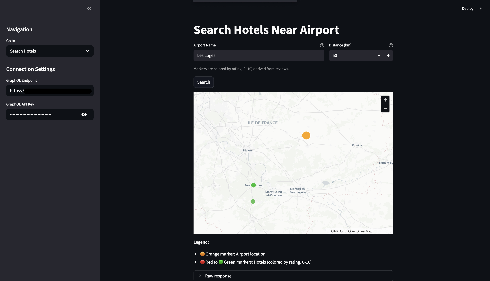
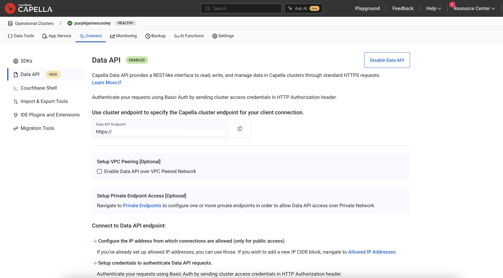
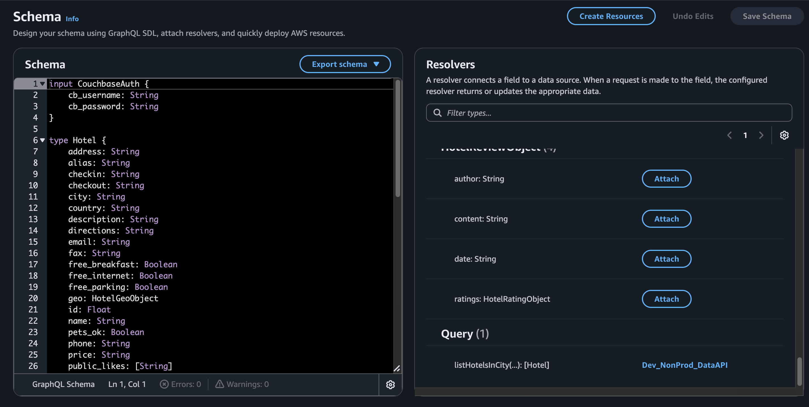
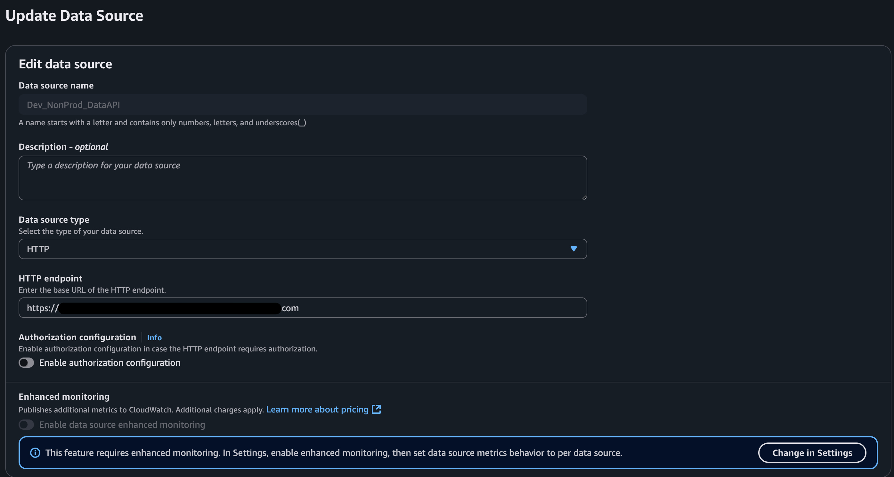
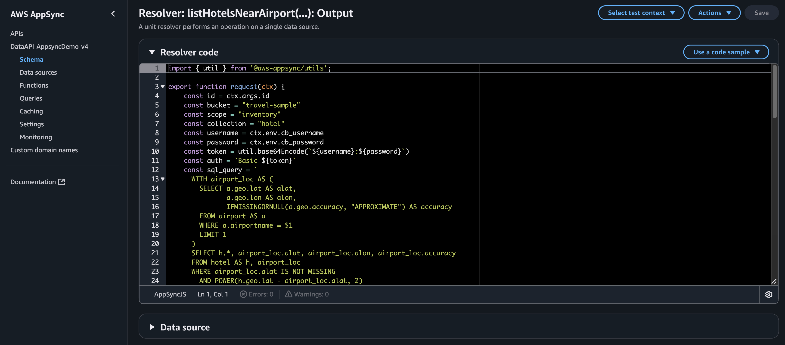
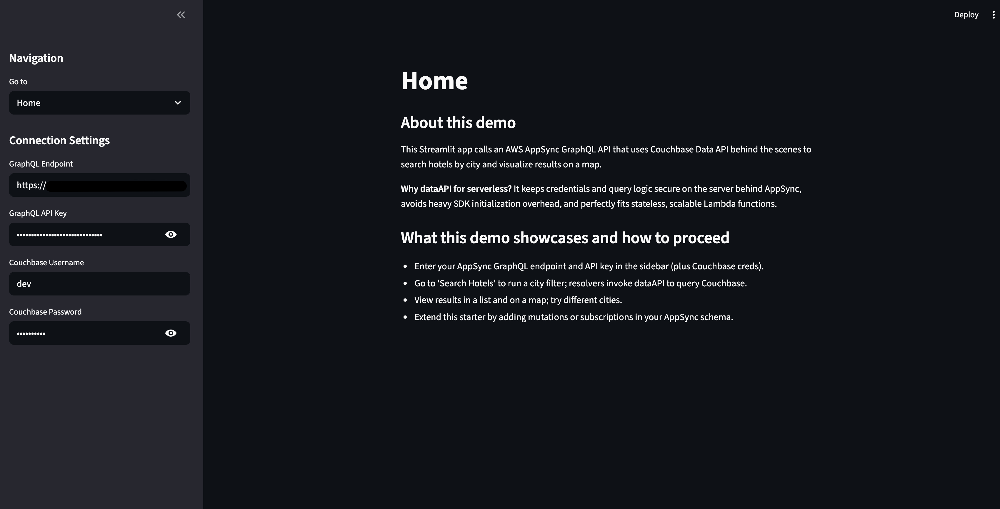
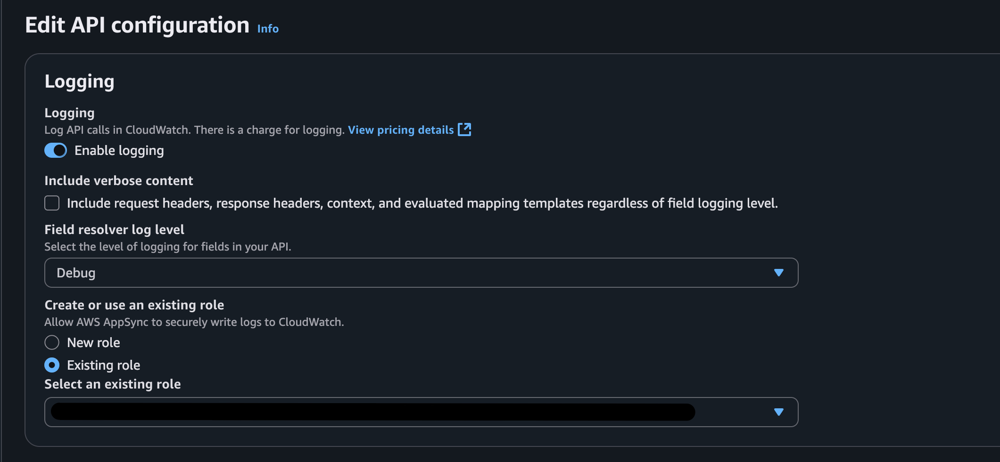

---
# frontmatter
path: "/tutorial-appsync-data-api-streamlit-travel-sample"
title: Build a Hotel Search App with AWS AppSync, Couchbase Data API, and Streamlit
short_title: Hotel Search with AppSync & Data API
description:
  - Build a serverless hotel search application using AWS AppSync GraphQL and Couchbase Data API.
  - Learn how to integrate Couchbase Data API with AppSync resolvers for RESTful access to your cluster.
  - Create an interactive map-based UI with Streamlit to visualize hotel search results.
content_type: tutorial
filter: sdk
technology:
  - fts
  - kv
tags:
  - GraphQL
  - Data API
  - Streamlit
  - Travel Sampl
sdk_language:
  - nodejs
  - python
length: 45 Mins
---

## Tutorial: AppSync + Couchbase Data API + Streamlit (Travel Sample)



If you want to see the final code you can refer to it here: [Final Demo Code](https://github.com/couchbase-examples/couchbase-data_api-appsync-demo)

This guide walks you through building the hotel search demo using AWS AppSync (GraphQL), Couchbase Data API, and a Streamlit frontend — end to end, with inlined code.

### Prerequisites
- Couchbase Capella account with the Travel Sample dataset loaded and credentials that can access it (and network access allowed).
  - Learn/setup here: [Couchbase Connect Prerequisites](https://docs.couchbase.com/python-sdk/current/hello-world/start-using-sdk.html#prerequisites)
- Placeholder: Couchbase Data API docs (enable Data API, copy endpoint)
  - [Add Data API docs link here]

---

### Enable Couchbase Data API

**What is Data API?**
Couchbase Data API provides a RESTful HTTP interface to your cluster. Instead of embedding the Couchbase SDK in your app, you make standard HTTP requests to query, insert, or update documents. This is perfect for serverless architectures (like AppSync) because:
- No heavy SDK initialization on cold starts
- Works from any language with HTTP support

**Steps:**
1. In Capella, enable Data API for your project/cluster (single click in the cluster settings).
2. Copy the Data API base URL (something like `https://your-cluster.apps.cloud.couchbase.com`). Keep your Couchbase username/password handy.
3. Ensure the Travel Sample bucket (`travel-sample`) is loaded and accessible.

#### Screenshot


**Notes:**
- We will query `travel-sample.inventory.hotel` with a simple city filter.
- Credentials are passed from the front end to AppSync and used by AppSync's resolver to call Data API.
- Data API authenticates each request via Basic auth (username:password Base64-encoded in the `Authorization` header).

---

### Create AWS AppSync GraphQL API

**Why AppSync?**
AppSync provides a managed GraphQL layer with built-in auth, and logging. It lets your frontend speak GraphQL while your backend (Data API) speaks SQL++. The resolver bridges the two.

**Steps:**
1. Create an AppSync GraphQL API with Public API (we'll use API key auth for demo simplicity).

#### Define the schema (paste into the schema editor)

This schema defines:
- `CouchbaseAuth`: an input type for passing Couchbase username/password from the client.
- `Hotel`, `HotelGeoObject`, `HotelRatingObject`, `HotelReviewObject`: types matching the Travel Sample hotel documents.
- `Query.listHotelsInCity`: the single query that takes auth + city and returns a list of hotels.

```graphql
input CouchbaseAuth {
    cb_username: String
    cb_password: String
}

type Hotel {
    address: String
    alias: String
    checkin: String
    checkout: String
    city: String
    country: String
    description: String
    directions: String
    email: String
    fax: String
    free_breakfast: Boolean
    free_internet: Boolean
    free_parking: Boolean
    geo: HotelGeoObject
    id: Float
    name: String
    pets_ok: Boolean
    phone: String
    price: String
    public_likes: [String]
    reviews: [HotelReviewObject]
    state: String
    title: String
    tollfree: String
    type: String
    url: String
    vacancy: Boolean
}

type HotelGeoObject {
    accuracy: String
    lat: Float
    lon: Float
}

type HotelRatingObject {
    Cleanliness: Float
    Location: Float
    Overall: Float
    Rooms: Float
    Service: Float
    Value: Float
}

type HotelReviewObject {
    author: String
    content: String
    date: String
    ratings: HotelRatingObject
}

type Query {
    listHotelsInCity(auth: CouchbaseAuth!, city: String!): [Hotel]
}

schema {
    query: Query
}
```

#### Create HTTP data source

**What's an HTTP data source?**
AppSync can call external HTTP APIs. You configure a base URL (your Data API endpoint), and resolvers send requests to it.

**Steps:**
- In AppSync, create a new HTTP data source.
- Set the endpoint to your Couchbase Data API base URL (from step 1).
- **Do not** configure auth here; we'll add Basic auth dynamically in the resolver using the username/password from the GraphQL request.

#### Add a JavaScript Unit Resolver for `Query.listHotelsInCity`

**What does this resolver do?**
AppSync resolvers have two functions:
1. `request()` — transforms the GraphQL request into an HTTP request to send to the data source.
2. `response()` — transforms the HTTP response from the data source back into GraphQL data.

Our resolver:
- Extracts `auth.cb_username`, `auth.cb_password`, and `city` from the GraphQL arguments.
- Constructs a SQL++ query: `SELECT c.* FROM hotel AS c WHERE city = "London"` (for example).
- Builds a Data API Query Service request:
  - **Endpoint**: `/_p/query/query/service` (Data API's SQL++ query endpoint).
  - **Headers**: `Authorization: Basic <base64(username:password)>`, `Content-Type: application/json`.
  - **Body**: `{ query_context: "default:travel-sample.inventory", statement: "SELECT ...", timeout: "30m" }`.
- Returns the `results` array from Data API's JSON response, which AppSync then maps to the `[Hotel]` type.

**Why `query_context`?**
Setting `query_context` to `default:travel-sample.inventory` lets you write `FROM hotel` instead of the fully qualified `FROM travel-sample.inventory.hotel` in your SQL++. It's a namespace shortcut.

**Why Basic auth in the resolver?**
We pass credentials from the client at request time. This means:
- Each user can use their own Couchbase creds (multi-tenancy).
- No hardcoded secrets in AppSync configuration.
- The resolver dynamically builds the `Authorization` header per request.

Paste this code:

```javascript
import { util } from '@aws-appsync/utils';

export function request(ctx) {
    // Extract GraphQL arguments from the client request
    const username = ctx.arguments.auth.cb_username;
    const password = ctx.arguments.auth.cb_password;
    const city = ctx.arguments.city;

    // Define the Couchbase keyspace (bucket.scope.collection)
    const bucket = "travel-sample";
    const scope = "inventory";
    const collection = "hotel";

    // Build Basic auth header for Data API
    // Data API expects: Authorization: Basic <base64(username:password)>
    const token = util.base64Encode(`${username}:${password}`);
    const auth = `Basic ${token}`;

    // Construct a SQL++ query to filter hotels by city
    // The query_context below lets us use "hotel" instead of "travel-sample.inventory.hotel"
    const sql_query = `SELECT c.* FROM ${collection} AS c WHERE city = \"${city}\"`;

    // Build the HTTP request object for the Data API Query Service
    const requestObject = {
        method: 'POST',
        resourcePath: '/_p/query/query/service',  // Data API SQL++ endpoint
        params: {
            headers: {
                'Accept': 'application/json',
                'Content-Type': 'application/json',
                'Authorization': auth  // Dynamic Basic auth per request
            },
            body: {
                query_context: `default:${bucket}.${scope}`,  // Namespace shortcut
                statement: sql_query,  // The SQL++ query
                timeout: '30m'  // Query timeout (generous for demo)
            }
        }
    };
    return requestObject;
}

export function response(ctx) {
    // Data API returns JSON like: { results: [ {...hotel1...}, {...hotel2...} ], ... }
    // Parse it if it arrives as a string, then extract the results array
    let parsedResult = ctx.result.body;
    if (typeof ctx.result.body === 'string') {
        parsedResult = JSON.parse(ctx.result.body);
    }
    // Return the array of hotel documents; AppSync maps them to the Hotel GraphQL type
    // and filters fields based on the client's selection set (e.g., { id, name, geo { lat lon } })
    return parsedResult.results;
}
```

**Key takeaways:**
- `ctx.arguments` gives you the GraphQL args: `auth` and `city`.
- `util.base64Encode` is an AppSync helper to encode credentials.
- `resourcePath` is relative to the HTTP data source base URL.
- `query_context` sets the default bucket/scope for SQL++.
- `parsedResult.results` is the array of documents returned by Data API.

Save and deploy your resolver.

#### Screenshots







#### Quick test (optional)

Test your resolver directly in the AppSync console before building the frontend.

1. In the AppSync console, open **Queries**.
2. Paste this query, replacing `cb_username`, `cb_password`, and `city` with your actual values:

```graphql
query ListHotelsInCity {
  listHotelsInCity(
    auth: {
      cb_username: "Administrator",
      cb_password: "password"
    },
    city: "London"
  ) {
    id
    name
    address
    city
    country
    phone
    price
    url
    geo { lat lon }
    reviews { ratings { Overall } }
  }
}
```

3. Click **Run**. You should see a JSON response with hotels in London.

If it works, you've successfully bridged AppSync → Data API → Couchbase!

---

### Streamlit frontend

Now we'll build a simple web UI to call AppSync and visualize hotels on a map.

**What is Streamlit?**
Streamlit is a Python framework for building data apps with minimal code. You write Python functions, and Streamlit renders them as interactive web UIs.

**Steps:**

1. Create and activate a virtual environment, then install dependencies:
   ```bash
   python3 -m venv .venv
   source .venv/bin/activate
   pip install streamlit requests pandas pydeck
   ```

2. Create a file (e.g., `search_hotels.py`) with the following code.

**Code walkthrough:**

```python
# Standard libs and third-party imports
from typing import Any, Dict, List

import pandas as pd
import pydeck as pdk
import requests
import streamlit as st


def get_connection_settings() -> Dict[str, str]:
    """
    Read connection details from the Streamlit sidebar state.
    Streamlit uses session_state to persist user inputs across reruns.
    """
    return {
        "endpoint": st.session_state.get("gql_endpoint", ""),
        "api_key": st.session_state.get("api_key", ""),
        "username": st.session_state.get("username", ""),
        "password": st.session_state.get("password", ""),
    }


def validate_required(settings: Dict[str, str]) -> List[str]:
    """
    Return labels of any missing required settings for quick UX feedback.
    If the user hasn't filled in the sidebar, we show an error before making the API call.
    """
    labels = {
        "endpoint": "GraphQL Endpoint",
        "api_key": "GraphQL API Key",
        "username": "Couchbase Username",
        "password": "Couchbase Password",
    }
    return [labels[k] for k, v in settings.items() if not v]


def build_query() -> str:
    """
    GraphQL query string for listHotelsInCity.
    We request id, name, address, city, country, phone, price, url, geo (lat/lon), and reviews.
    AppSync will call our resolver, which queries Data API, and returns hotels matching the city.
    """
    return (
        "query ListHotelsInCity($auth: CouchbaseAuth!, $city: String!) {\n"
        "  listHotelsInCity(auth: $auth, city: $city) {\n"
        "    id\n"
        "    name\n"
        "    address\n"
        "    city\n"
        "    country\n"
        "    phone\n"
        "    price\n"
        "    url\n"
        "    geo { lat lon }\n"
        "    reviews { ratings { Overall } }\n"
        "  }\n"
        "}"
    )


def build_variables(settings: Dict[str, str], city: str) -> Dict[str, Any]:
    """
    Map UI inputs to GraphQL variables.
    The 'auth' object contains Couchbase creds, which the resolver will use to authenticate with Data API.
    """
    return {
        "auth": {
            "cb_username": settings["username"],
            "cb_password": settings["password"],
        },
        "city": city,
    }


def fetch_hotels(endpoint: str, api_key: str, query: str, variables: Dict[str, Any]) -> List[Dict[str, Any]]:
    """
    Call AppSync GraphQL API using HTTP POST.
    - endpoint: your AppSync GraphQL URL
    - api_key: AppSync API key (passed in x-api-key header)
    - query: the GraphQL query string
    - variables: the GraphQL variables (auth + city)
    
    Returns the list of hotels from the response, or raises on errors.
    """
    headers = {"x-api-key": api_key} if api_key else {}
    resp = requests.post(endpoint, json={"query": query, "variables": variables}, headers=headers)
    payload = resp.json()
    if payload.get("errors"):
        raise RuntimeError(str(payload["errors"]))
    return payload.get("data", {}).get("listHotelsInCity", [])


def compute_rating_from_reviews(hotel: Dict[str, Any]) -> float:
    """
    Derive a 0–10 rating score from hotel reviews.
    The Travel Sample hotel documents have a 'reviews' array with 'ratings.Overall' (0–5 scale).
    We average all Overall ratings and scale to 0–10 for display.
    Missing reviews -> 0.
    """
    reviews = hotel.get("reviews") or []
    overall_values: List[float] = []
    for review in reviews:
        ratings = (review or {}).get("ratings") or {}
        overall = ratings.get("Overall")
        if isinstance(overall, (int, float)):
            overall_values.append(float(overall))
    avg_overall = sum(overall_values) / len(overall_values) if overall_values else None
    # Scale 0–5 -> 0–10
    return (avg_overall * 2.0) if avg_overall is not None else 0.0


def color_from_rating(rating_out_of_10: float) -> List[int]:
    """
    Map a 0–10 rating to an RGBA color for the map layer.
    Low rating -> red (255, 30, 40), high rating -> green (0, 200, 40).
    This gives visual feedback: red dots = poor, green dots = excellent.
    """
    normalized = max(0.0, min(1.0, rating_out_of_10 / 10.0))
    red = int(255 * (1.0 - normalized))
    green = int(200 * normalized + 30 * (1 - normalized))
    blue = 40
    return [red, green, blue, 200]


def hotels_to_points(hotels: List[Dict[str, Any]]) -> List[Dict[str, Any]]:
    """
    Transform GraphQL hotel results into a list of map-friendly dicts.
    Each point has: name, rating, lat, lon, color (RGBA), address, city, country, price, phone, url.
    We skip hotels without geo.lat or geo.lon (can't plot them).
    """
    points: List[Dict[str, Any]] = []
    for hotel in hotels:
        geo = hotel.get("geo") or {}
        lat = geo.get("lat")
        lon = geo.get("lon")
        if lat is None or lon is None:
            continue
        rating = compute_rating_from_reviews(hotel)
        color = color_from_rating(rating)
        points.append(
            {
                "name": hotel.get("name", ""),
                "rating": rating,
                "rating_display": f"{rating:.1f}/10",
                "address": hotel.get("address", ""),
                "city": hotel.get("city", ""),
                "country": hotel.get("country", ""),
                "price": hotel.get("price", ""),
                "phone": hotel.get("phone", ""),
                "url": hotel.get("url", ""),
                "lat": float(lat),
                "lon": float(lon),
                "color": color,
            }
        )
    return points


def get_map_style() -> str:
    """
    Choose a map basemap style.
    If the user provides a Mapbox token in the sidebar, use Mapbox light style.
    Otherwise, fall back to a free Carto basemap (no token required).
    """
    token = st.session_state.get("mapbox_token", "")
    if token:
        try:
            pdk.settings.mapbox_api_key = token
        except Exception:
            pass
        return "mapbox://styles/mapbox/light-v10"
    return "https://basemaps.cartocdn.com/gl/positron-gl-style/style.json"


def build_map(df: pd.DataFrame) -> pdk.Deck:
    """
    Create a pydeck Deck with a ScatterplotLayer for hotel locations.
    - get_position: [lon, lat] columns from the DataFrame
    - get_fill_color: the 'color' column (RGBA list per hotel)
    - get_radius: fixed 8m radius per point (scales with zoom)
    - pickable: enables hover tooltips
    - tooltip: shows hotel name, rating, address, price, phone, url on hover
    
    The map centers on the average lat/lon of all hotels and zooms to level 11 (city scale).
    """
    layer = pdk.Layer(
        "ScatterplotLayer",
        data=df,
        get_position="[lon, lat]",
        get_fill_color="color",
        get_radius=8,
        radius_units="meters",
        radius_min_pixels=4,
        radius_max_pixels=20,
        pickable=True,
        auto_highlight=True,
    )
    center_lon = float(df["lon"].mean())
    center_lat = float(df["lat"].mean())
    view_state = pdk.ViewState(
        longitude=center_lon,
        latitude=center_lat,
        zoom=11,
        pitch=0,
        bearing=0,
    )
    tooltip = {
        "html": (
            "<div>"
            "<b>{name}</b><br/>"
            "Rating: {rating_display}<br/>"
            "{address}<br/>{city}, {country}<br/>"
            "Price: {price}<br/>"
            "Phone: {phone}<br/>"
            "{url}"
            "</div>"
        ),
        "style": {"color": "white"},
    }
    return pdk.Deck(
        layers=[layer],
        initial_view_state=view_state,
        tooltip=tooltip,
        map_style=get_map_style(),
    )


def render():
    """
    Main UI: collect inputs (city), call AppSync, render map and raw response.
    Flow:
    1. User enters city in a text input.
    2. User clicks "Search" button.
    3. We validate connection settings (AppSync endpoint, API key, Couchbase creds).
    4. We call fetch_hotels() -> AppSync GraphQL -> resolver -> Data API -> Couchbase.
    5. We transform hotel results into map points (with color-coded ratings).
    6. We render a pydeck map with tooltips.
    7. We show the raw JSON response in an expander for debugging.
    """
    st.title("Search Hotels by City")
    settings = get_connection_settings()
    city = st.text_input("City", help="Enter the city to search hotels in")
    st.caption("Markers are colored by rating (0–10) derived from reviews.")

    if st.button("Search"):
        missing = validate_required(settings)
        if missing:
            st.error(f"Please fill the required connection settings: {', '.join(missing)}")
            return
        try:
            hotels = fetch_hotels(
                endpoint=settings["endpoint"],
                api_key=settings["api_key"],
                query=build_query(),
                variables=build_variables(settings, city),
            )
        except Exception as exc:
            st.error(f"GraphQL error: {exc}")
            return
        if not hotels:
            st.warning("No hotels found for this city.")
            return
        points = hotels_to_points(hotels)
        if not points:
            st.warning("No hotel coordinates to plot on the map.")
            return
        df = pd.DataFrame(points)
        deck = build_map(df)
        st.pydeck_chart(deck)
        with st.expander("Raw response"):
            st.json({"data": {"listHotelsInCity": hotels}})


if __name__ == "__main__":
    render()
```

**What happens when you run this?**
1. Streamlit starts a local web server.
2. The user fills in the sidebar (GraphQL endpoint, API key, Couchbase username/password).
3. The user enters a city and clicks "Search".
4. The app POSTs a GraphQL query to AppSync with the city and Couchbase creds.
5. AppSync invokes the resolver, which calls Data API, which queries Couchbase.
6. Data API returns matching hotels; the resolver returns them to AppSync; AppSync returns them to Streamlit.
7. Streamlit computes a rating from reviews, maps it to a color, and plots each hotel on a map.
8. Hovering over a hotel shows name, rating, address, price, phone, url.

**Key points:**
- `fetch_hotels()` is a standard GraphQL HTTP client: POST to AppSync with `query` + `variables`.
- `compute_rating_from_reviews()` averages the `Overall` rating from all reviews and scales 0–5 to 0–10.
- `color_from_rating()` interpolates red→green based on rating for visual feedback.
- `build_map()` uses pydeck's ScatterplotLayer to plot lat/lon points with color and tooltips.

3. Run the app:
   ```bash
   streamlit run search_hotels.py
   ```

4. In the browser sidebar, set:
   - **GraphQL Endpoint**: your AppSync API URL (e.g., `https://xxx.appsync-api.us-east-1.amazonaws.com/graphql`)
   - **GraphQL API Key**: your AppSync API key
   - **Couchbase Username**: your Couchbase username (e.g., `Administrator`)
   - **Couchbase Password**: your Couchbase password
   - (Optional) **Mapbox Token**: for a prettier map

5. Go to "Search Hotels", enter a city (e.g., "London"), and click "Search".

#### Screenshots




---

### Enable AppSync request/response logging (optional but recommended)

**Why enable logging?**
CloudWatch logs let you see exactly what your resolver sends to Data API and what it receives back. This is invaluable for debugging:
- Incorrect SQL++ syntax? Check the `statement` in the request log.
- Auth errors? Check the `Authorization` header and Data API response.
- Unexpected results? Compare the Data API JSON with what AppSync returns to the client.

**Steps:**
1. In the AppSync console, open your API → **Settings** → **Logging**.
2. Choose (or create) a CloudWatch Log Group.
3. Set **Field resolver log level** to at least **ERROR** (use **INFO** or **ALL** during development for full request/response logs).
4. Save.

Now, every resolver invocation will log to CloudWatch. You can view logs in the CloudWatch console under the log group you selected.

#### Screenshot


---

### Conclusion
You now have an end-to-end, serverless-friendly hotel search: AppSync handles GraphQL, the resolver securely calls Couchbase Data API, and Streamlit provides a quick UI with a city search and map. From here, consider adding more filters (price, ratings), mutations for reviews, or caching in AppSync.
