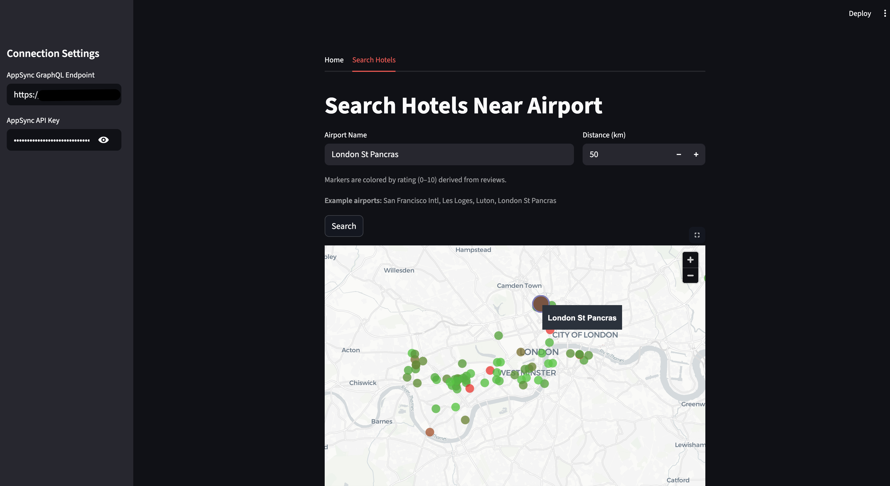

---
# frontmatter
path: "/tutorial-appsync-data-api-streamlit-travel-sample"
title: Build a Geospatial Hotel Search App with AWS AppSync, Couchbase Data API, and Streamlit
short_title: Geospatial Hotel Search with AppSync & Data API
description:
  - Build a serverless geospatial hotel search application using AWS AppSync GraphQL and Couchbase Data API.
  - Learn how to integrate Couchbase Data API with AppSync resolvers for RESTful access to your cluster.
  - Implement geospatial distance calculations using SQL++ queries.
  - Create an interactive map-based UI with Streamlit to visualize hotels near airports.
content_type: tutorial
filter: sdk
technology:
  - query
  - kv
tags:
  - GraphQL
  - Data API
  - Streamlit
sdk_language:
  - nodejs
  - python
length: 45 Mins
---

## Tutorial: AppSync + Couchbase Data API + Streamlit (Travel Sample)



If you want to see the final code you can refer to it here: [Final Demo Code](https://github.com/couchbase-examples/couchbase-data_api-appsync-demo)

This guide walks you through building a geospatial hotel search demo that finds hotels within a specified distance from airports. The application uses AWS AppSync (GraphQL) with environment variables for credential management, Couchbase Data API for executing SQL++ queries, and a Streamlit frontend for interactive map visualization — end to end, with inlined code.

### Prerequisites
- Couchbase Capella account with the Travel Sample dataset loaded and credentials that can access it (and network access allowed).
  - Learn/setup here: [Couchbase Data API Prerequisites](https://docs.couchbase.com/cloud/data-api-guide/data-api-start.html#prerequisites)
- Couchbase Data API docs (enable Data API, copy endpoint)
  - [Data API Docs](https://docs.couchbase.com/cloud/data-api-guide/data-api-start.html)

---

### Enable Couchbase Data API

**What is Data API?**
Couchbase Data API provides a RESTful HTTP interface to your cluster. Instead of embedding the Couchbase SDK in your app, you make standard HTTP requests to query, insert, or update documents. This is perfect for serverless architectures (like AppSync) because:
- No heavy SDK initialization on cold starts
- Works from any language with HTTP support

**Steps:**
1. In Capella, enable Data API for your project/cluster (single click in the cluster settings).
2. Copy the Data API base URL (something like `https://your-cluster.apps.cloud.couchbase.com`). Keep your Couchbase username/password handy.
3. Ensure the Travel Sample bucket (`travel-sample`) is loaded and accessible.

#### Screenshot


**Notes:**
- We will query `travel-sample.inventory.hotel` and `travel-sample.inventory.airport` collections using a geospatial distance calculation.
- Credentials are configured as environment variables in AppSync and used by the resolver to call Data API.
- Data API authenticates each request via Basic auth (username:password Base64-encoded in the `Authorization` header).
- The query uses SQL++ Common Table Expressions (CTEs) to first find the airport, then calculate distances to nearby hotels.

---

### Create AWS AppSync GraphQL API

**Why AppSync?**
AppSync provides a managed GraphQL layer with built-in auth, and logging. It lets your frontend speak GraphQL while your backend (Data API) speaks SQL++. The resolver bridges the two.

**Steps:**
1. Create an AppSync GraphQL API with Public API (we'll use API key auth for demo simplicity).

#### Define the schema (paste into the schema editor)

This schema defines:
- `Hotel`: type matching the Travel Sample hotel documents with all fields including geo location and reviews.
- `Airport`: type with `name` and nested `location` (GeoObject) representing airport information.
- `GeoObject`: shared type for latitude, longitude, and accuracy used by both hotels and airports.
- `Output`: response type that returns both `hotels` array and `airport` object.
- `Query.listHotelsNearAirport`: the main query that takes an airport name and distance in km, returns hotels within that radius plus the airport information.

```graphql
type Airport {
	location: GeoObject
	name: String
}

type GeoObject {
	accuracy: String
	lat: Float
	lon: Float
}

type Hotel {
	address: String
	alias: String
	checkin: String
	checkout: String
	city: String
	country: String
	description: String
	directions: String
	email: String
	fax: String
	free_breakfast: Boolean
	free_internet: Boolean
	free_parking: Boolean
	geo: GeoObject
	id: Float
	name: String
	pets_ok: Boolean
	phone: String
	price: String
	public_likes: [String]
	reviews: [HotelReviewObject]
	state: String
	title: String
	tollfree: String
	type: String
	url: String
	vacancy: Boolean
}

type HotelRatingObject {
	Cleanliness: Float
	Location: Float
	Overall: Float
	Rooms: Float
	Service: Float
	Value: Float
}

type HotelReviewObject {
	author: String
	content: String
	date: String
	ratings: HotelRatingObject
}

type Output {
	hotels: [Hotel]
	airport: Airport
}

type Query {
	listHotelsNearAirport(airportName: String!, withinKm: Int!): Output
}

schema {
	query: Query
}
```

#### Screenshot


#### Create HTTP data source

**What's an HTTP data source?**
AppSync can call external HTTP APIs. You configure a base URL (your Data API endpoint), and resolvers send requests to it.

**Steps:**
- In AppSync, create a new HTTP data source.
- Set the endpoint to your Couchbase Data API base URL (from step 1).
- **Do not** configure auth here; we'll add Basic auth dynamically in the resolver using credentials from environment variables.

#### Screenshot


#### Configure environment variables in AppSync

**Why environment variables?**
Storing credentials as environment variables in AppSync keeps them centralized. This approach:
- Avoids exposing credentials to clients
- Makes credential rotation easier (update once in AppSync, not in every client)

**Steps:**
1. In the AppSync console, navigate to your API → **Settings** → **Environment variables**.
2. Add the following environment variables:
   - **Key**: `cb_username`, **Value**: Your Couchbase username
   - **Key**: `cb_password`, **Value**: Your Couchbase password
3. Save the changes.

These environment variables will be accessible in your resolvers via `ctx.env.cb_username` and `ctx.env.cb_password`.

#### Screenshot


#### Add a JavaScript Unit Resolver for `Query.listHotelsInCity`

**What does this resolver do?**
AppSync resolvers have two functions:
1. `request()` — transforms the GraphQL request into an HTTP request to send to the data source.
2. `response()` — transforms the HTTP response from the data source back into GraphQL data.

Our resolver:
- Reads `cb_username` and `cb_password` from AppSync environment variables (`ctx.env`).
- Extracts `city` from the GraphQL arguments.
- Constructs a parameterized SQL++ query: `SELECT c.* FROM hotel AS c WHERE city = $1`.
- Builds a Data API Query Service request:
  - **Endpoint**: `/_p/query/query/service` (Data API's SQL++ query endpoint).
  - **Headers**: `Authorization: Basic <base64(username:password)>`, `Content-Type: application/json`.
  - **Body**: `{ query_context: "default:travel-sample.inventory", statement: "SELECT ...", args: [city], timeout: "30m" }`.
- Returns the `results` array from Data API's JSON response, which AppSync then maps to the `[Hotel]` type.

**Why `query_context`?**
Setting `query_context` to `default:travel-sample.inventory` lets you write `FROM hotel` instead of the fully qualified `FROM travel-sample.inventory.hotel` in your SQL++. It's a namespace shortcut.

**Why environment variables for credentials?**
Storing credentials as environment variables in AppSync means:
- Credentials never leave the server or get exposed to clients.
- Easy credential rotation without updating client code.
- Centralized credential management across all resolvers.

Paste this code:

```javascript
import { util } from '@aws-appsync/utils';

export function request(ctx) {
    // Read credentials from AppSync environment variables
    const username = ctx.env.cb_username;
    const password = ctx.env.cb_password;
    
    // Define the Couchbase keyspace (bucket.scope.collection)
    const bucket = "travel-sample";
    const scope = "inventory";

    // Build Basic auth header for Data API
    // Data API expects: Authorization: Basic <base64(username:password)>
    const token = util.base64Encode(`${username}:${password}`);
    const auth = `Basic ${token}`;

    // Construct a geospatial SQL++ query using a Common Table Expression (CTE)
    // The query:
    // 1. WITH clause: Finds the airport by name and extracts its coordinates
    // 2. Main SELECT: Joins hotels with airport location and calculates distance
    // 3. WHERE clause: Filters hotels within the specified radius using Pythagorean theorem
    // Using $1, $2 as positional parameters for security (prevents SQL injection)
    const sql_query = `
      WITH airport_loc AS (
        SELECT a.geo.lat AS alat, 
               a.geo.lon AS alon, 
               IFMISSINGORNULL(a.geo.accuracy, "APPROXIMATE") AS accuracy
        FROM airport AS a
        WHERE a.airportname = $1
        LIMIT 1
      )
      SELECT h.*, airport_loc.alat, airport_loc.alon, airport_loc.accuracy
      FROM hotel AS h, airport_loc
      WHERE airport_loc.alat IS NOT MISSING
        AND POWER(h.geo.lat - airport_loc.alat, 2)
          + POWER(h.geo.lon - airport_loc.alon, 2) <= POWER($2 / 111, 2)
    `;

    // Log to CloudWatch for debugging (best practice)
    console.log("Request Context:", ctx);
    
    // Build the HTTP request object for the Data API Query Service
    const requestObject = {
        method: 'POST',
        resourcePath: '/_p/query/query/service',  // Data API SQL++ endpoint - see https://docs.couchbase.com/cloud/data-api-reference/index.html#tag/Query
        params: {
            headers: {
                'Accept': 'application/json',
                'Content-Type': 'application/json',
                'Authorization': auth  // Basic auth using environment variables
            },
            body: {
                query_context: `default:${bucket}.${scope}`,  // Namespace shortcut
                statement: sql_query,  // The geospatial SQL++ query
                args: [ctx.arguments.airportName, ctx.arguments.withinKm],  // Positional parameters
                timeout: '30m'  // Query timeout
            }
        }
    };
    
    // Log the outgoing request
    console.log("Outgoing Request to Data API:", requestObject);
    
    return requestObject;
}

export function response(ctx) {
    // Log the complete response context
    console.log("Response Context:", ctx);
    
    // Data API returns JSON like: { results: [ {...hotel1...}, {...hotel2...} ], ... }
    // Each result contains hotel fields plus airport coordinates (alat, alon, accuracy)
    let parsedResult = ctx.result.body;
    if (typeof ctx.result.body === 'string') {
        parsedResult = JSON.parse(ctx.result.body);
        console.log("Parsed Result:", parsedResult);
    }
    
    const results = parsedResult.results || [];
    
    // Extract airport information from the first result (all results have the same airport location)
    let airport = null;
    if (results.length > 0) {
        const first = results[0];
        airport = {
            name: ctx.arguments.airportName,  // Use the input airport name
            location: {
                lat: first.alat,
                lon: first.alon,
                accuracy: first.accuracy
            }
        };
    }
    
    // Clean up hotels by removing airport location fields (alat, alon, accuracy)
    // These were added by the JOIN but aren't part of the Hotel schema
    const hotels = results.map(hotel => {
        const { alat, alon, accuracy, ...cleanHotel } = hotel;
        return cleanHotel;
    });
    
    // Return in the Output schema format with both hotels and airport
    return {
        hotels: hotels,
        airport: airport
    };
}
```

**Key takeaways:**
- `ctx.env` provides access to AppSync environment variables (credentials stored securely).
- `ctx.arguments` gives you the GraphQL args: `airportName` and `withinKm`.
- `util.base64Encode` is an AppSync helper to encode credentials.
- `resourcePath` is the API endpoint path relative to your HTTP data source base URL. In this case, `/_p/query/query/service` is the [Data API Query Service endpoint](https://docs.couchbase.com/cloud/data-api-reference/index.html#tag/Query) for executing SQL++ queries.
- `query_context` sets the default bucket/scope for SQL++, allowing short names like `hotel` instead of `travel-sample.inventory.hotel`.
- Using positional parameters (`$1`, `$2`) in the SQL++ query prevents SQL injection.
- Distance calculation uses Pythagorean theorem approximation.
- The response function constructs an `Airport` object from the result data and input arguments.
- Hotel objects are cleaned to remove the joined airport coordinate fields before returning.
- CloudWatch logging helps debug the complex geospatial query and response transformation.

Save and deploy your resolver.

#### Screenshot


#### Enable AppSync request/response logging (recommended)

**Why enable logging?**
CloudWatch logs let you see exactly what your resolver sends to Data API and what it receives back. This is invaluable for debugging:
- Incorrect SQL++ syntax? Check the `statement` in the request log.
- Auth errors? Check the `Authorization` header and Data API response.
- Unexpected results? Compare the Data API JSON with what AppSync returns to the client.

**Steps:**
1. In the AppSync console, open your API → **Settings** → **Logging**.
2. Choose (or create) a CloudWatch Log Group.
3. Set **Field resolver log level** to at least **ERROR** (use **INFO** or **ALL** during development for full request/response logs).
4. Save.

Now, every resolver invocation will log to CloudWatch. You can view logs in the CloudWatch console under the log group you selected.

#### Screenshot


#### Quick test (optional)

Test your resolver directly in the AppSync console before building the frontend.

1. In the AppSync console, open **Queries**.
2. Paste this query, replacing the airport name and distance as needed:

```graphql
query ListHotelsNearAirport {
  listHotelsNearAirport(
    airportName: "Les Loges"
    withinKm: 50
  ) {
    hotels {
      id
      name
      address
      city
      country
      phone
      price
      url
      geo { lat lon }
      reviews { ratings { Overall } }
    }
    airport {
      name
      location {
        lat
        lon
        accuracy
      }
    }
  }
}
```

3. Click **Run**. You should see a JSON response with:
   - An array of hotels within 50km of Heathrow airport
   - Airport information including name and location coordinates

Try different airport names like "Charles de Gaulle", or "Changi" to see results from different locations.

If it works, you've successfully bridged AppSync → Data API → Couchbase with geospatial querying!

**Note:** The credentials are read from the environment variables you configured earlier, so you don't need to pass them in the query.

---

### Test Your AppSync API with the Hosted Streamlit Frontend

Now that you've set up your AWS AppSync backend with the Couchbase Data API integration, you can test it immediately using our hosted Streamlit frontend—no need to install or run anything locally!

Visit the live Streamlit app at **[https://couchbase-data-api-appsync-demo.streamlit.app/](https://couchbase-data-api-appsync-demo.streamlit.app/)**

The app provides an interactive map-based interface where you can search for hotels near airports. Simply enter your AppSync GraphQL endpoint and API key in the sidebar (note that Couchbase credentials are securely stored as environment variables in AppSync, so you don't need to enter them). Navigate to "Search Hotels", enter an airport name like **"Les Loges"** and a distance like **100 km**, then click "Search".

Results display on an interactive map with the airport shown as an orange marker and hotels as color-coded dots (green for excellent ratings, red for poor). The map automatically centers on the airport location. Hover over any marker to see details like hotel names, addresses, prices, and phone numbers, or expand the "Raw response" section to see the full JSON data from AppSync.


**Want to explore the source code or run it locally?** The complete Streamlit frontend code is available at [https://github.com/couchbase-examples/couchbase-data_api-appsync-demo/tree/main/src/frontend](https://github.com/couchbase-examples/couchbase-data_api-appsync-demo/tree/main/src/frontend). The frontend consists of `home.py` (navigation and connection settings) and `search_hotels.py` (hotel search with map visualization using `pydeck`). It uses the `requests` library to call AppSync GraphQL with standard HTTP POST requests. Ratings are computed from review data and mapped to colors for visual feedback.

To run locally: clone the repo, install dependencies with `pip install -r requirements.txt`, navigate to `src/frontend`, and run `streamlit run home.py`. The app will start at `http://localhost:8501`.

---

### Why This Architecture?

You might wonder why we chose this particular stack instead of calling Couchbase Data API directly from the frontend. Here's the reasoning behind each technology choice:

**AppSync as an API Gateway** provides credential security by storing your Couchbase credentials as environment variables on the server side—your frontend never sees or handles database credentials. It also acts as a unified gateway that can aggregate data from multiple sources as your application grows. You get built-in authentication, authorization, request throttling, caching, and CloudWatch logging without building these features yourself.

**GraphQL over REST** gives clients the flexibility to request exactly the data they need, reducing bandwidth and improving performance. Instead of multiple REST endpoints, you have one endpoint with a strongly-typed schema that serves as self-documenting API documentation. The schema can evolve over time by adding new fields without breaking existing queries.

**Streamlit for the frontend** enables rapid development with pure Python—no HTML, CSS, or JavaScript required. It's perfect for prototypes and internal tools, with built-in support for maps (via pydeck), charts, and tables. You get direct access to data science libraries like pandas and easy integration with any HTTP API. Plus, Streamlit apps can be deployed to Streamlit Cloud in minutes.

**The architecture summary:** Frontend (Streamlit) → API Layer (AppSync GraphQL) → Data API (Couchbase) → Database (Capella). This separates concerns so each layer can be developed, tested, and scaled independently.

---

### Conclusion
You've successfully built a complete demo showcasing **Couchbase Data API** integration with **AWS AppSync GraphQL** and **Streamlit**—creating a serverless geospatial hotel search application that executes SQL++ queries through AppSync resolvers, manages credentials securely via environment variables, and visualizes results on interactive maps with color-coded ratings and dual layers for hotels and airports.
