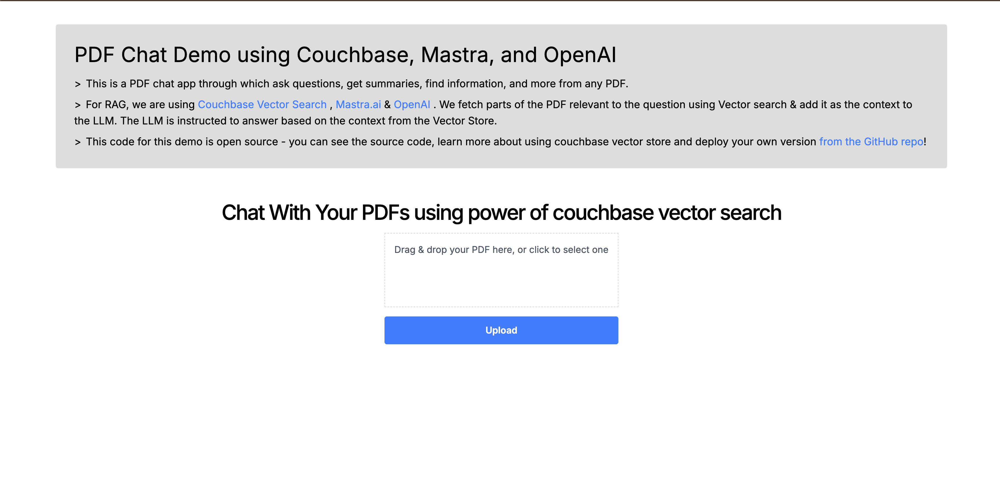
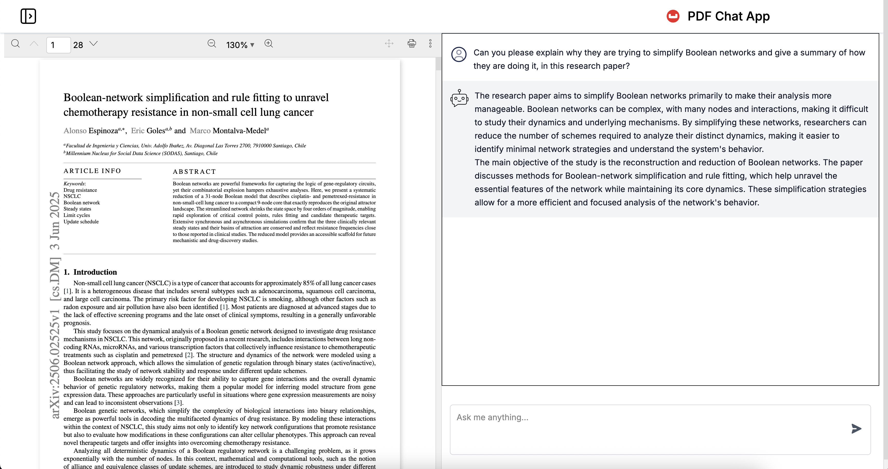

---
# frontmatter
path: "/tutorial-rag-mastra-couchbase-nextjs"
# title and description do not need to be added to markdown, start with H2 (##)
title: Building a RAG Application with Mastra and Couchbase
short_title: Mastra and Couchbase RAG
description:
  - Build a complete Retrieval-Augmented Generation (RAG) application using Next.js, Mastra, and Couchbase.
  - Use Couchbase as a vector database for AI-powered applications.
  - Learn to integrate Mastra for AI orchestration and workflow management.
content_type: quickstart
filter: sdk
technology:
  - vector search
  - react
tags:
  - Next.js
  - mastra
sdk_language: 
  - nodejs
length: 60 Mins
---

# Building a RAG Application with Mastra and Couchbase: A Step-by-Step Tutorial

This tutorial will guide you through building a complete Retrieval-Augmented Generation (RAG) application from scratch using Next.js, the Mastra AI framework, and Couchbase for vector search. We'll start by getting the pre-built application running and then break down how each part works so you can build it yourself.

## Part 1: Quick Start

First, let's get the completed application running to see what we're building.

### 1.1 Clone and Install

Get the project code and install the necessary dependencies.

```bash
git clone https://github.com/couchbase-examples/mastra-nextJS-quickstart.git
cd mastra-nextJS-quickstart
npm install
```

### 1.2 Prerequisites & Environment Setup

Before running, you need to configure your environment.

1.  **Couchbase:**
    *   Sign up for a free Couchbase Capella account or run a local Couchbase cluster.
    *   Create a Bucket, Scope, and Collection. Note down the names.
    *   Get your database credentials (connection string, username, and password).

2.  **OpenAI:**
    *   Get an API key from the [OpenAI Platform](https://platform.openai.com/api-keys).

3.  **`.env` File:**
    *   Create a `.env` file in the root of the project.
    *   Copy the contents from `.env.sample` (if available) or use the following template and fill in your credentials.

    ```bash
    # Couchbase Vector Store Configuration
    COUCHBASE_CONNECTION_STRING=couchbase://localhost
    COUCHBASE_USERNAME=Administrator
    COUCHBASE_PASSWORD=your_password
    COUCHBASE_BUCKET_NAME=your_bucket
    COUCHBASE_SCOPE_NAME=your_scope
    COUCHBASE_COLLECTION_NAME=your_collection

    # Embedding Configuration
    EMBEDDING_MODEL=text-embedding-3-small
    EMBEDDING_DIMENSION=1536
    EMBEDDING_BATCH_SIZE=100

    # Chunking Configuration
    CHUNK_SIZE=1000
    CHUNK_OVERLAP=200

    # Vector Index Configuration
    VECTOR_INDEX_NAME=document-embeddings
    VECTOR_INDEX_METRIC=cosine

    # OpenAI Configuration
    OPENAI_API_KEY=your_openai_api_key 
    ```

### 1.3 Run the Application

Start the Next.js development server.

```bash
npm run dev
```

Open your browser to `http://localhost:3000`. You should see the PDF upload interface.

### 1.4 Test the RAG Flow

1.  **Upload a PDF:** Drag and drop a PDF file into the designated area or click to select one.
2.  **Processing:** The application will process the file. This involves extracting text, chunking it, generating vector embeddings, and storing them in your Couchbase database. The UI will navigate you to the chat page upon completion.
3.  **Chat:** Ask a question about the content of the PDF you just uploaded. The application will use vector search to find relevant information and generate an answer.

---

## Part 2: Building From Scratch - The Mastra Foundation

Mastra is the AI orchestration framework that powers our application's intelligence. It helps define agents, tools, and workflows for complex AI tasks.

### 2.1 What is Mastra?

Mastra provides a structured way to build AI applications. Instead of writing scattered functions, you define:
*   **Agents:** AI entities with a specific purpose, model, and set of instructions (e.g., a "Research Assistant").
*   **Tools:** Functions that an Agent can use to interact with the outside world (e.g., a tool to query a database).
*   **Workflows:** Sequences of operations that orchestrate agents and tools.

### 2.2 Setting Up the Mastra Research Agent

Our core AI component is the `researchAgent`. Let's create it in `src/mastra/agents/researchAgent.ts`.

```typescript
// src/mastra/agents/researchAgent.ts
import { Agent } from "@mastra/core/agent";
import { openai } from "@ai-sdk/openai";
import { vectorQueryTool } from "../tools/embed";
import { Memory } from "@mastra/memory";
import { LibSQLStore } from "@mastra/libsql";
 
export const researchAgent = new Agent({
  name: "Research Assistant",
  instructions: `You are a helpful research assistant... Base your responses only on the content provided.`,
  model: openai("gpt-4o-mini"),
  tools: {
    vectorQueryTool,
  },
  memory: new Memory({
        storage: new LibSQLStore({
            url: "file:../../memory.db"
        })
    }),
});
```
Here, we define an `Agent` that uses the `gpt-4o-mini` model, has a clear set of instructions for its personality and task, and is equipped with a `vectorQueryTool` to find information. It also uses `LibSQLStore` for memory, allowing it to remember conversation history.

### 2.3 Creating a Mastra Tool for Vector Search

The agent needs a tool to search for information. We create this in `src/mastra/tools/embed.ts`. This tool is responsible for taking a user's query, embedding it, and searching the vector database.

```typescript
// src/mastra/tools/embed.ts
import { createTool } from "@mastra/core";
import { openai } from "@ai-sdk/openai";
import { embed } from "ai";
import { z } from "zod";
import { getVectorStore } from "./store";

// ... (Environment variable configuration)

export const vectorQueryTool = createTool({
    id: "vector_query",
    description: "Search for relevant document chunks...",
    inputSchema: z.object({
        query: z.string().describe("The search query..."),
        topK: z.number().optional().default(5),
        minScore: z.number().optional().default(0.1),
    }),
    execute: async (executionContext) => {
        const { query, topK, minScore } = executionContext.context;

        // Generate embedding for the query
        const { embedding: queryEmbedding } = await embed({
            model: openai.embedding(EMBEDDING_CONFIG.model),
            value: query,
        });

        // Perform vector search
        const vectorStore = getVectorStore();
        const results = await vectorStore.query({
            indexName: INDEX_CONFIG.indexName,
            queryVector: queryEmbedding,
            topK,
        });

        // Filter and format results
        const relevantResults = results
            .filter(result => result.score >= minScore)
            .map(result => ({ /* ... format result ... */ }));

        return { /* ... results ... */ };
    },
});
```
This tool uses the `ai` SDK to create an embedding for the search query and then uses our Couchbase vector store to find the most relevant text chunks.

---

## Part 3: Couchbase Vector Database Integration

Couchbase serves as our high-performance vector database, storing the document embeddings and allowing for fast semantic search.

### 3.1 Why Couchbase for Vector Search?

Couchbase is an excellent choice for RAG applications because it combines a powerful, scalable NoSQL database with integrated vector search capabilities. This means you can store your unstructured metadata and structured vector embeddings in the same place, simplifying your architecture.

### 3.2 Connecting to Couchbase

We need a way to manage the connection to Couchbase. A singleton pattern is perfect for this, ensuring we don't create unnecessary connections. We'll write this in `src/mastra/tools/store.ts`.

```typescript
// src/mastra/tools/store.ts
import { CouchbaseVector } from "@mastra/couchbase";

function createCouchbaseConnection(): CouchbaseVector {
  // ... reads environment variables ...
  return new CouchbaseVector({ /* ... connection config ... */ });
}

let vectorStoreInstance: CouchbaseVector | null = null;

export function getVectorStore(): CouchbaseVector {
  if (!vectorStoreInstance) {
    vectorStoreInstance = createCouchbaseConnection();
  }
  return vectorStoreInstance;
}
```
The `@mastra/couchbase` package provides the `CouchbaseVector` class, which handles all the complexities of interacting with Couchbase for vector operations.

### 3.3 Automatic Vector Index Creation

A key feature of our application is that it automatically creates the necessary vector search index if it doesn't already exist. This logic resides in our PDF ingestion API route.

```typescript
// src/app/api/ingestPdf/route.ts

// Inside createDocumentEmbeddings function:
const vectorStore = connectToCouchbase();

try {
    await vectorStore.createIndex({
        indexName: INDEX_CONFIG.indexName,
        dimension: EMBEDDING_CONFIG.dimension,
        metric: INDEX_CONFIG.metric,
    });
    console.info('Successfully created search index');
} catch (error) {
    // Continue anyway - index might already exist
    console.warn(`Index creation warning: ${error}`);
}
```
This ensures that the application is ready for vector search as soon as the first document is uploaded, without any manual setup required in Couchbase.

---

## Part 4: The Full RAG Pipeline

Now let's connect everything to build the full Retrieval-Augmented Generation pipeline.

### 4.1 Ingestion: From PDF to Vector Embeddings

The ingestion process is handled by the `/api/ingestPdf` API route. Here's the step-by-step flow defined in `src/app/api/ingestPdf/route.ts`:

1.  **Receive File:** The `POST` handler receives the uploaded PDF from the frontend.
2.  **Save File:** The file is saved locally to the `public/assets` directory.
3.  **Extract Text:** The server uses the `pdf-parse` library to extract raw text from the PDF buffer.
4.  **Chunk Text:** The extracted text is chunked into smaller, overlapping pieces using Mastra's `MDocument` utility. This is crucial for providing focused context to the AI.
    ```typescript
    const doc = MDocument.fromText(documentText);
    const chunks = await doc.chunk({ /* ... chunking config ... */ });
    ```
5.  **Generate Embeddings:** The text chunks are sent to the OpenAI API to be converted into vector embeddings using `embedMany`.
6.  **Upsert to Couchbase:** The embeddings, along with their corresponding text and metadata, are saved to Couchbase using `vectorStore.upsert()`.

### 4.2 Retrieval & Generation: From Query to Answer

When a user sends a message in the chat, the `/api/chat` route takes over.

1.  **Receive Query:** The `POST` handler in `src/app/api/chat/route.ts` receives the user's message history.
2.  **Invoke Agent:** It calls our `researchAgent` with the conversation history.
    ```typescript
    // src/app/api/chat/route.ts
    const stream = await researchAgent.stream(matraMessages);
    ```
3.  **Use Tool:** The `researchAgent`, guided by its instructions, determines that it needs to find information and calls its `vectorQueryTool`.
4.  **Vector Search:** The tool embeds the user's query and searches Couchbase for the most relevant document chunks.
5.  **Augment Prompt:** The retrieved chunks are added to the context of the agent's prompt to the LLM.
6.  **Generate Response:** The agent sends the augmented prompt to OpenAI's `gpt-4o-mini`, which generates a response based *only* on the provided information.
7.  **Stream Response:** The response is streamed back to the user for a real-time chat experience.

---

## Part 5: Next.js Frontend Integration

The frontend is a Next.js application using React Server Components and Client Components for a modern, responsive user experience.

### 5.1 PDF Upload Component

The file upload functionality is handled by `src/components/PDFUploader.tsx`.

*   It uses the `react-dropzone` library to provide a drag-and-drop interface.
*   It's a "use client" component because it relies on browser-side state and events.
*   When a file is uploaded, it sends a `POST` request with `FormData` to our `/api/ingestPdf` endpoint.
*   Upon a successful response, it navigates the user to the chat page.



```javascript
// src/components/PDFUploader.tsx

const uploadPdf = async (event) => {
    // ...
    const data = new FormData();
    data.set("file", selectedFile);

    const response = await fetch("/api/ingestPdf", {
        method: "POST",
        body: data,
    });
    const jsonResp = await response.json();

    router.push("/chatPage" + "?" + createQueryString("fileName", jsonResp.fileName));
};
```

### 5.2 Chat Interface

The chat interface is composed of several components found in `src/components/chatPage/`. The main logic for handling the conversation would typically use the `useChat` hook from the `ai` package to manage message state, user input, and the streaming response from the `/api/chat` endpoint.



This separation of concerns allows the backend to focus on the heavy lifting of AI and data processing, while the frontend focuses on delivering a smooth user experience.

---

## Part 6: Customization and Extensions

### 7.1 Supporting Different Document Types
You can extend the `readDocument` function in `ingestPdf/route.ts` to support other file types like `.docx` or `.txt` by using different parsing libraries.

### 7.2 Advanced Mastra Features
Explore more of Mastra's capabilities by creating multi-agent workflows, adding more custom tools (e.g., a tool to perform web searches), or implementing more sophisticated memory strategies.

### 7.3 Enhanced Vector Search
Improve retrieval by experimenting with hybrid search (combining vector search with traditional keyword search), filtering by metadata, or implementing more advanced chunking and embedding strategies.

---

Congratulations! You've now seen how to build a powerful RAG application with Mastra, Couchbase, and Next.js. Use this foundation to build your own custom AI-powered solutions.
