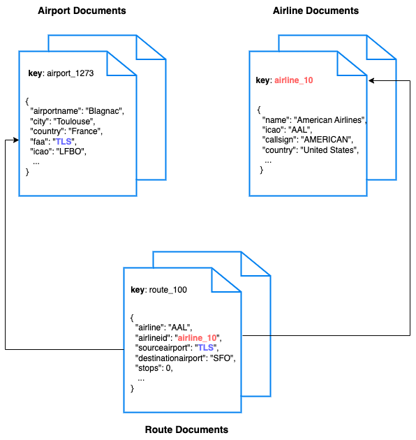

---
# frontmatter
path: "/tutorial-quickstart-php-laravel"
# title and description do not need to be added to markdown, start with H2 (##)
title: Quickstart in Couchbase with PHP and Laravel
short_title: PHP and Laravel
description:
  - Learn to build a REST API in PHP using Laravel and Couchbase
  - Explore key-based operations and SQL++ querying using PHP SDK
  - Explore CRUD operations in action with Couchbase
content_type: quickstart
filter: sdk
technology:
  - kv
  - query
tags:
  - REST API
  - Laravel
sdk_language:
  - php
length: 30 Mins
---

<!--
    The name of this file does not need to be `tutorial-quickstart-php-laravel` because it is in the `tutorials/php/markdown` directory, so we can just call it `php-laravel`. The idea is that we can leave off `tutorial-quickstart` as a prefix.
-->

<!-- TODO:  Figure out how to add width to image size in try it now links -->

## Getting Started

### Prerequisites

To run this prebuilt project, you will need:

- [Couchbase Capella](https://www.couchbase.com/products/capella/) cluster with [travel-sample](https://docs.couchbase.com/php-sdk/current/ref/travel-app-data-model.html) bucket loaded.
    - To run this tutorial using a self managed Couchbase cluster, please refer to the [appendix](#running-self-managed-couchbase-cluster).
- [PHP](https://www.php.net/downloads.php) 8.2 or higher installed
  - Ensure that the PHP version is [compatible](https://docs.couchbase.com/php-sdk/current/project-docs/compatibility.html#php-version-compat) with the Couchbase SDK.
- Code Editor installed (Visual Studio Code, PhpStorm, or Sublime Text)
- Composer command line

### Source Code

```shell
git clone https://github.com/couchbase-examples/php-laravel-quickstart.git
```

### Change Directory

```shell
cd php-laravel-quickstart
```

### Install Dependencies

```shell
cd php-laravel-quickstart
composer install
```

> Note: Composer automatically installs the required dependencies when building the project.

### Initial Configuration

After installing dependencies, you need to set up the basic Laravel configuration:

1. Create the environment file:

```sh
cp .env.example .env
```

2. Generate application key:

```sh
php artisan key:generate
```

### Couchbase Service Provider

The `CouchbaseServiceProvider` class is a Laravel service provider class responsible for setting up the connection to a Couchbase database in a Laravel application.


### Application Environment

All configuration for communication with the database is read from environment variables. As a security best practice, you should set these values in your `.env` file:

```env
DB_CONN_STR=<connection_string>
DB_USERNAME=<username>
DB_PASSWORD=<password>
DB_BUCKET=travel-sample
```

Replace the placeholder values with your actual Couchbase cluster details.

The connection string should be in the following format:

```php
return [
    'host' => env('DB_CONN_STR', 'couchbase://127.0.0.1'),
    'username' => env('DB_USERNAME', 'Administrator'),
    'password' => env('DB_PASSWORD', 'password'),
    'bucket' => env('DB_BUCKET', 'travel-sample'),
];
```

For more information on the Laravel connection string, see the [Database Configuration](https://laravel.com/docs/8.x/database#configuration) documentation.

## Running The Application

### Directly on the machine

At this point the application is ready, and you can run it via the command line:

```shell
php artisan serve
```

> Note: Either the Couchbase Server must be installed and running on localhost or the connection string must be updated in the `config/couchbase.php` file.

> Tip: If Swagger UI loads without endpoints, generate the docs:
> 
> ```sh
> php artisan l5-swagger:generate
> ```

### Docker

Build the Docker image

```sh
docker build -t php-laravel-quickstart .
```

Run the Docker image

```sh
docker run -d --name laravel-container -p 8000:8000 \
  -e DB_CONN_STR=<connection_string> \
  -e DB_USERNAME=<username> \
  -e DB_PASSWORD=<password> \
  -e DB_BUCKET=travel-sample \
  php-laravel-quickstart
```

Note: Environment variables passed to the Docker container will override the default values in the configuration.

Once the application is running, you can access it in your browser at [http://localhost:8000](http://localhost:8000). Swagger UI is available at [http://localhost:8000/api/documentation](http://localhost:8000/api/documentation).

### Verifying the Application

Once the application starts, you can see the details of the application on the logs.


The application will run on port 8000 of your local machine (http://localhost:8000). Open Swagger UI at [http://localhost:8000/api/documentation](http://localhost:8000/api/documentation) to try the API endpoints. Swagger documentation is used in this demo to showcase the different API endpoints and how they can be invoked. More details on the Swagger documentation can be found in the [appendix](#swagger-documentation).


## Data Model

For this tutorial, we use three collections, `airport`, `airline` and `route` that contain sample airports, airlines and airline routes respectively. The route collection connects the airports and airlines as seen in the figure below. We use these connections in the quickstart to generate airports that are directly connected and airlines connecting to a destination airport. Note that these are just examples to highlight how you can use SQL queries to join the collections.



## Airline Document Structure

We will be setting up a REST API to manage some airline documents. The `name` field is the name of the airline. The `callsign` field is the callsign of the airline. The `iata` field is the IATA code of the airline. The `icao` field is the ICAO code of the airline. The `country` field is the country of the airline.

Our airline document will have a structure similar to the following example:

```json
{
    "name": "Couchbase Airways",
    "callsign": "Couchbase",
    "iata": "CB",
    "icao": "CBA",
    "country": "United States"
}
```

## Code Structure

### Project Structure

```
.
├── app/
│   ├── Http/
│   │   └── Controllers/
│   │       ├── AirlineController.php
│   │       ├── AirportController.php
│   │       ├── RouteController.php
│   │       └── HotelController.php
│   ├── Models/
│   │   ├── Airline.php
│   │   ├── Airport.php
│   │   ├── Route.php
│   │   └── Hotel.php
│   └── Providers/
│       └── CouchbaseServiceProvider.php
├── config/
│   └── couchbase.php
├── routes/
│   └── api.php
└── tests/
    └── Feature/
        ├── AirlineTest.php
        ├── AirportTest.php
        ├── RouteTest.php
        └── HotelTest.php
```

### Key Components

- **Controllers**: Handle HTTP requests and responses for each entity
- **Models**: Define data structures and business logic for Couchbase operations
- **Service Provider**: Configures Couchbase connection and collection references
- **Tests**: Integration tests for all API endpoints

### Airline Entity

For this tutorial, we will focus on the airline entity to demonstrate CRUD operations and SQL++ queries.

We will be setting up a REST API to manage airline documents:

- [POST Airline](#post-airline) – Create a new airline
- [GET Airline](#get-airline) – Read specified airline
- [PUT Airline](#put-airline) – Update specified airline
- [DELETE Airline](#delete-airline) – Delete airline
- [List Airlines](#list-airlines) – Get all airlines. Optionally filter the list by country
- [Airlines to Destination](#airlines-to-destination) – Get airlines flying to a destination airport

For CRUD operations, we will use the [Key-Value operations](https://docs.couchbase.com/php-sdk/current/howtos/kv-operations.html) that are built into the Couchbase SDK to create, read, update, and delete a document. Every document will need an ID (similar to a primary key in other databases) to save it to the database. This ID is passed in the URL. For other endpoints, we will use [SQL++](https://docs.couchbase.com/php-sdk/current/howtos/n1ql-queries-with-sdk.html) to query for documents.

### POST Airline

Open the `AirlineController.php` file and navigate to the `store` method. The request data is validated and then passed to the model to save the airline document.

```php
// store method in AirlineController.php
public function store(Request $request, $id)
{
    if ($errorResponse = $this->validateRequest($request)) {
        return $errorResponse;
    }
    try {
        $data = $request->only($this->allowedAttributes);
        $airline = new Airline($data);
        $airline->saveAirline($id);
        return response()->json(['message' => 'Airline created successfully'], 201);
    } catch (\Exception $e) {
        return response()->json(['message' => 'Internal Server Error'], 500);
    }
}
```

We call the `saveAirline` method in the Airline model, which uses the [`upsert`](https://docs.couchbase.com/php-sdk/current/howtos/kv-operations.html#upsert) method from the Couchbase SDK. The upsert method inserts a new document or updates an existing one.

```php
// saveAirline method in Airline model
public function saveAirline($id)
{
    $data = $this->attributesToArray();
    unset($data['id']);
    $this->bucket->scope('inventory')->collection('airline')->upsert($id, $data);
}
```

### GET Airline

Navigate to the `show` method in the `AirlineController.php` file. This method retrieves a specific airline document using its ID.

```php
// show method in AirlineController.php
public function show($id)
{
    try {
        $airline = Airline::findAirline($id);
        if (!$airline) {
            return response()->json(['message' => 'Airline not found'], 404);
        }
        return response()->json($airline);
    } catch (\Exception $e) {
        return response()->json(['message' => 'Internal Server Error'], 500);
    }
}
```

We call the `findAirline` method in the Airline model, which uses the [`get`](https://docs.couchbase.com/php-sdk/current/howtos/kv-operations.html#retrieving-documents) method from the Couchbase SDK for key-value retrieval.

```php
// findAirline method in Airline model
public static function findAirline($id)
{
    $instance = new static;
    $document = $instance->bucket->scope('inventory')->collection('airline')->get($id);
    $data = $document->content();
    return new static($data);
}
```

### PUT Airline

The PUT operation uses the same `store` method as POST, leveraging the `upsert` functionality to either update an existing document or create a new one if it doesn't exist.

```php
// Same store method handles both POST and PUT
$airline->saveAirline($id); // Uses upsert internally
```

The `upsert` operation in Couchbase automatically handles both insert and update scenarios, making it perfect for PUT requests.

### DELETE Airline

Navigate to the `destroy` method in the `AirlineController.php` file. This method deletes an airline document by its ID.

```php
// destroy method in AirlineController.php
public function destroy($id)
{
    try {
        $airline = Airline::findAirline($id);
        if (!$airline) {
            return response()->json(['message' => 'Airline not found'], 404);
        }
        Airline::destroyAirline($id);
        return response()->json(['message' => 'Airline deleted successfully'], 200);
    } catch (\Exception $e) {
        return response()->json(['message' => 'Internal Server Error'], 500);
    }
}
```

We call the `destroyAirline` method in the Airline model, which uses the [`remove`](https://docs.couchbase.com/php-sdk/current/howtos/kv-operations.html#removing-documents) method from the Couchbase SDK.

```php
// destroyAirline method in Airline model
public static function destroyAirline($id)
{
    $instance = new static;
    $instance->bucket->scope('inventory')->collection('airline')->remove($id);
}
```

### List Airlines

Navigate to the `index` method in the `AirlineController.php` file. This method retrieves a list of airlines with optional country filtering and pagination.

```php
// index method in AirlineController.php
public function index(Request $request)
{
    try {
        $offset = $request->query('offset', 0);
        $limit = $request->query('limit', 10);
        $country = $request->query('country');
        $airlines = Airline::getAllAirlinesByCountry($country, $offset, $limit);
        return response()->json($airlines);
    } catch (\Exception $e) {
        return response()->json(['message' => 'Internal Server Error'], 500);
    }
}
```

We call the `getAllAirlinesByCountry` method in the Airline model, which uses SQL++ queries to retrieve filtered results.

```php
// getAllAirlinesByCountry method in Airline model
public static function getAllAirlinesByCountry($country, $offset = 0, $limit = 10)
{
    $query = "SELECT * FROM `travel-sample`.`inventory`.`airline`";
    if ($country) {
        $query .= " WHERE country = '$country'";
    }
    $query .= " LIMIT $limit OFFSET $offset";
    
    $result = $instance->bucket->scope('inventory')->query($query);
    return collect($result->rows());
}
```

### Airlines to Destination

This endpoint demonstrates SQL++ queries with JOINs to find airlines that fly to a specific destination airport.

```php
// getAirlinesToAirport method in Airline model
public static function getAirlinesToAirport($destinationAirportCode, $offset = 0, $limit = 10)
{
    $query = "
    SELECT air.callsign, air.country, air.iata, air.icao, META(air).id AS id, air.name
    FROM (
        SELECT DISTINCT route.airlineid AS airlineId
        FROM `travel-sample`.`inventory`.`route` AS route
        WHERE route.destinationairport = '$destinationAirportCode'
    ) AS subquery
    JOIN `travel-sample`.`inventory`.`airline` AS air ON META(air).id = subquery.airlineId
    LIMIT $limit OFFSET $offset";
    
    $result = $instance->bucket->scope('inventory')->query($query);
    return collect($result->rows());
}
```

This query demonstrates advanced SQL++ features:
- **Subquery**: Finds distinct airline IDs from routes to the destination
- **JOIN**: Connects route and airline collections
- **META()**: Accesses document metadata to get the document ID

## Running The Tests

This command will execute all the test cases in your project.

```sh
php artisan test
```

## Project Setup Notes

This project was based on the standard [Laravel project](https://laravel.com/docs).

A full list of packages are referenced in the `composer.json` file.


## Contributing

Contributions are welcome! If you'd like to contribute to this project, please fork the repository and create a pull request.

## Appendix

### Extending API by Adding New Entity

If you would like to add another entity to the APIs, follow these steps:

- **Create the new entity (collection) in the Couchbase bucket:** You can create the collection using the [SDK](https://docs.couchbase.com/php-sdk/current/howtos/provisioning-cluster-resources.html#collection-management) or via the [Couchbase Server interface](https://docs.couchbase.com/cloud/n1ql/n1ql-language-reference/createcollection.html).
  
- **Define the model:** Create a new model in the `app/Models` directory, similar to the existing `Airline` model. Note that this quickstart already includes a `Hotel` model as an example. For a new entity, you would create a similar structure:
  ```php
  namespace App\Models;

  use Illuminate\Database\Eloquent\Model;

  class YourEntity extends Model
  {
      protected $bucket;

      protected $fillable = [
          // Define your entity fields here
      ];

      public function __construct(array $attributes = [])
      {
          parent::__construct($attributes);
          $this->bucket = app('couchbase.bucket');
      }

      // Add methods for querying, saving, and deleting data
  }
  ```

- **Define the controller:** Create a new controller in the `app/Http/Controllers` directory, similar to the existing `AirlineController`. For example, you can create a file `HotelController.php`:
  ```php
  namespace App\Http\Controllers;

  use Illuminate\Http\Request;
  use App\Models\Hotel;

  class HotelController extends Controller
  {
      // Add methods for handling HTTP requests for the Hotel entity
  }
  ```

- **Define the routes:** In the `routes/api.php` file, define the routes for the new entity similar to the existing routes for airlines:
  ```php
  Route::prefix('v1/hotels')->group(function () {
      Route::get('list', 'HotelController@index');
      Route::get('{id}', 'HotelController@show');
      Route::post('{id}', 'HotelController@store');
      Route::put('{id}', 'HotelController@update');
      Route::delete('{id}', 'HotelController@destroy');
  });
  ```

- **Integration tests:** Create a new test class in the `tests/Feature` directory, similar to the existing tests. For example, you can create a file `HotelIntegrationTest.php`:
  ```php
  namespace Tests\Feature;

  use Tests\TestCase;

  class HotelIntegrationTest extends TestCase
  {
      // Add test methods for the Hotel endpoints
  }
  ```

### Running Self Managed Couchbase Cluster

If you are running this quickstart with a self-managed Couchbase cluster, you need to [load](https://docs.couchbase.com/server/current/manage/manage-settings/install-sample-buckets.html) the travel-sample data bucket in your cluster and generate the credentials for the bucket.

You need to update the connection string and the credentials in the `config/couchbase.php` file:

```env
DB_CONN_STR=couchbase://<your-couchbase-server>
DB_USERNAME=<your-username>
DB_PASSWORD=<your-password>
DB_BUCKET=travel-sample
```

Replace `<your-couchbase-server>`, `<your-username>`, and `<your-password>` with your actual Couchbase server details and credentials.
> **NOTE:** Couchbase must be installed and running prior to running the Laravel app.

### Swagger Documentation

Swagger documentation provides a clear view of the API including endpoints, HTTP methods, request parameters, and response objects.

Click on an individual endpoint to expand it and see detailed information. This includes the endpoint's description, possible response status codes, and the request parameters it accepts.

#### Trying Out the API

You can try out an API by clicking on the "Try it out" button next to the endpoints.

- Parameters: If an endpoint requires parameters, Swagger UI provides input boxes for you to fill in. This could include path parameters, query strings, headers, or the body of a POST/PUT request.

- Execution: Once you've inputted all the necessary parameters, you can click the "Execute" button to make a live API call. Swagger UI will send the request to the API and display the response directly in the documentation. This includes the response code, response headers, and response body.

#### Models

Swagger documents the structure of request and response bodies using models. These models define the expected data structure using JSON schema and are extremely helpful in understanding what data to send and expect.
