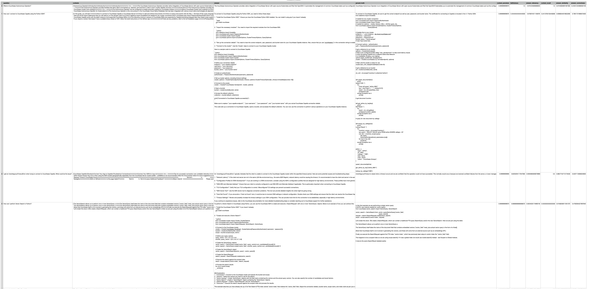

---
# frontmatter
path: "/tutorial-evaluate-rag-responses-using-ragas"
# title and description do not need to be added to markdown, start with H2 (##)
title: Evaluate RAG Responses using Ragas
short_title: Evaluate RAGs using Ragas
description:
  - Learn the different metrics for measuring RAG responses
  - Learn how to calculate the metrics using Ragas
content_type: tutorial
filter: sdk
technology:
  - fts
  - vector search
tags:
  - Ragas
  - LangChain

sdk_language:
  - python
length: 45 Mins
---

## Introduction

Welcome to this guide on evaluating the responses of a Retrieval Augmented Generation system. We will come up with a reference test set for the RAG application and then evaluate the metrics for both the Retrieval and Generation steps. We can also evaluate the overall performance of the RAG application.

This tutorial will demonstrate how to -

- Construct a reference test set for evaluating the responses from the RAG application.
- Build a RAG pipeline using LangChain that will answer the same questions.
- Measure the performance using [Ragas](https://ragas.io/), an evaluation framework for RAG applications.

## Overview of the Evaluation Process

The evaluation process involves coming up with a reference test set consisting of a list of questions along with the reference answers that are accurate.

We evaluate these set of questions with our RAG pipeline for both the retrieval and generation step and the overall performance. In the retrieval step, we are checking the accuracy and relevance of the documents (used as context to LLM) being fetched from the Vector Store with the ground truth answer. In the generation step, we are checking the accuracy and relevance of the answers from the retrieved contexts using the LLM as a judge. The LLM evaluates it based on identifying key parts of the reference answer in the context. In the overall evaluation, we are measuring the similarity and correctness of the answer with respect to the reference answer using an LLM.

## Creating the Test Set

We need to come up with a list of questions and reference answers for them. This will serve as the baseline for evaluating both the answers and the contexts from the RAG. There are other approaches to generate test sets by using LLM to generate both the questions and answers based on given data.

In this example, we have created a set of 10 questions and reference answers for them based on the official documentation. These can be found in the file, `create_dataset.py`. In practice, you would want to have more examples with a lot of diverse examples for the questions that you want your RAG application to answer. The idea is that if some of the questions are not answered correctly, the RAG application can be revisited by ingesting more data or optimizing the prompts.

The test set containing the ground truth can be stored in a Couchbase cluster. The test set can then be retrieved from the cluster using the SDKs and used for evaluation.

Another option to generate the reference data is by using an observability tool like [LangSmith](https://www.langchain.com/langsmith). The questions from the users can be annotated with ground truth answers.

The test set can be used for evaluating the RAG applications with every change in the application similar to applications being tested for regression with unit tests.

## RAG Application

For this demo, we will create a RAG application that is similar to the one we used to create a chatbot with Couchbase documentation described in this [repo](https://github.com/couchbase-examples/qa-bot-demo). We will use the RAG pipeline of the application without the UI elements for evaluating the responses.

For this RAG pipeline, we will be using LangChain with Couchbase as the Vector Store and OpenAI for the embeddings and as the Large Language Model (LLM) for generating the answers.

For this application, we will test the answers for Couchbase specific questions and will be evaluating both the retrieval part and the generation part of the RAG chain.

Here is the relevant part of the RAG application

```python
# Fetch ingested document store
embeddings = OpenAIEmbeddings(model=EMBEDDING_MODEL)

# Get the vector store
vector_store = get_vector_store(
    cluster,
    DB_BUCKET,
    DB_SCOPE,
    DB_COLLECTION,
    embeddings,
    INDEX_NAME,
)

# Fetch documents from the vector store
retriever = vector_store.as_retriever()

system_prompt = """You are a chatbot that can answer questions related to Couchbase. Remember that you can only reply to questions related to Couchbase or Couchbase SDKs and follow this strictly. If the user question is not related to couchbase, simply return "I am sorry, I am afraid I can't answer that".
    If you cannot answer based on the context provided, respond with a generic answer.
    Answer the question as truthfully as possible using the context below:
    {context}"""

qa_prompt = ChatPromptTemplate.from_messages(
    [
        ("system", system_prompt),
        ("human", "{input}"),
    ]
)

# Use OpenAI GPT-4o as the LLM for the RAG
llm = ChatOpenAI(temperature=0, model="gpt-4o")

# Create a chain to insert relevant documents into prompt to LLM
question_answer_chain = create_stuff_documents_chain(llm, qa_prompt)
rag_chain = create_retrieval_chain(retriever, question_answer_chain)
```

Here, we are using the Couchbase Vector store containing the Couchbase documentation to provide the contexts to ground the answers from the LLM. The prompt is asking the LLM to answer the questions based on the context retrieved from the Vector store.

Additionally, we are using the [`create_stuff_documents_chain`](https://python.langchain.com/api_reference/langchain/chains/langchain.chains.combine_documents.stuff.create_stuff_documents_chain.html) from LangChain to return the documents that were returned by the Vector store. We will use this to evaluate the contexts.

The RAG pipeline, `rag_chain` can be invoked by calling it with the question as shown below:

```python
response = rag_chain.invoke({"input": "What is Couchabse?"})
```

The response will contain the answer along with the documents that were provided as context to the LLM.

```
{'input': 'What is Couchabse?', 'context': [Document(metadata={'description': 'Enable developer preview mode in target cluster', 'language': 'en', 'source': 'https://docs.couchbase.com/server/current/cli/cbcli/couchbase-cli-enable-developer-preview.html', 'title': 'enable-developer-preview | Couchbase Docs'}, page_content='COUCHBASE-CLI\n\n\nPart of the couchbase-cli suite\n\n\n\n\n\n\n\n\n\n\n\n\n\n\n\n\n\n\nDocumentation\nForums\nSupport\n\n\n\n\nDeveloper Portal\nBlog\nResources\n\n\n\n\nGet Started\nDownloads\nTraining\n\n\n\n\n\n \n\n              Twitter\n            \n\n\n \n\n             Linkedin\n            \n\n\n \n\n            Facebook\n            \n\n\n\n\n\n\n© 2024 Couchbase, Inc. Couchbase, Couchbase Lite and the Couchbase logo are registered trademarks of Couchbase, Inc.\n\n\nTerms of Use\nPrivacy Policy\nCookie Policy\nSupport Policy\nMarketing Preference Center'), Document(metadata={'description': 'Manage collections and scopes in a bucket', 'language': 'en', 'source': 'https://docs.couchbase.com/server/current/cli/cbcli/couchbase-cli-collection-manage.html', 'title': 'collection-manage | Couchbase Docs'}, page_content='COUCHBASE-CLI\n\n\nPart of the couchbase-cli suite\n\n\n\n\n\n\n\n\n\n\n\n\n\n\n\n\n\n\nDocumentation\nForums\nSupport\n\n\n\n\nDeveloper Portal\nBlog\nResources\n\n\n\n\nGet Started\nDownloads\nTraining\n\n\n\n\n\n \n\n              Twitter\n            \n\n\n \n\n             Linkedin\n            \n\n\n \n\n            Facebook\n            \n\n\n\n\n\n\n© 2024 Couchbase, Inc. Couchbase, Couchbase Lite and the Couchbase logo are registered trademarks of Couchbase, Inc.\n\n\nTerms of Use\nPrivacy Policy\nCookie Policy\nSupport Policy\nMarketing Preference Center'), Document(metadata={'description': 'The Couchbase cluster management utility.', 'language': 'en', 'source': 'https://docs.couchbase.com/server/current/cli/cbcli/couchbase-cli.html', 'title': 'couchbase-cli | Couchbase Docs'}, page_content='COUCHBASE-CLI\n\n\nPart of the couchbase-cli suite\n\n\n\n\n\n\n\n\n\n\n\n\n\n\n\n\n\n\nDocumentation\nForums\nSupport\n\n\n\n\nDeveloper Portal\nBlog\nResources\n\n\n\n\nGet Started\nDownloads\nTraining\n\n\n\n\n\n \n\n              Twitter\n            \n\n\n \n\n             Linkedin\n            \n\n\n \n\n            Facebook\n            \n\n\n\n\n\n\n© 2024 Couchbase, Inc. Couchbase, Couchbase Lite and the Couchbase logo are registered trademarks of Couchbase, Inc.\n\n\nTerms of Use\nPrivacy Policy\nCookie Policy\nSupport Policy\nMarketing Preference Center'), Document(metadata={'language': 'en', 'source': 'https://docs.couchbase.com/server/current/cli/cbcli/couchbase-cli-backup-service.html', 'title': 'backup-service | Couchbase Docs'}, page_content='COUCHBASE-CLI\n\n\nPart of the couchbase-cli suite\n\n\n\n\n\n\n\n\n\n\n\n\n\n\n\n\n\n\nDocumentation\nForums\nSupport\n\n\n\n\nDeveloper Portal\nBlog\nResources\n\n\n\n\nGet Started\nDownloads\nTraining\n\n\n\n\n\n \n\n              Twitter\n            \n\n\n \n\n             Linkedin\n            \n\n\n \n\n            Facebook\n            \n\n\n\n\n\n\n© 2024 Couchbase, Inc. Couchbase, Couchbase Lite and the Couchbase logo are registered trademarks of Couchbase, Inc.\n\n\nTerms of Use\nPrivacy Policy\nCookie Policy\nSupport Policy\nMarketing Preference Center')], 'answer': 'Couchbase is a NoSQL database that combines the best of both relational and NoSQL databases. It provides high performance, scalability, and flexibility for modern web, mobile, and IoT applications. Couchbase supports a flexible data model, easy scalability, consistent high performance, and a powerful query language (N1QL) that extends SQL for JSON. It is designed to handle a wide variety of data types and workloads, making it suitable for a range of use cases from caching to full-fledged database applications.'}
```

## Evaluation Metrics

The main evaluation metrics that we consider are described in the coming sections along with a brief description of them. For more details on their calculations, please refer to the [documentation](https://docs.ragas.io/en/stable/concepts/metrics/index.html) from Ragas. By default, Ragas uses the models from OpenAI to perform the evaluation with the option to override them.

### Retrieval

These are metrics on the Retrieval part of the RAG pipeline. They evaluate if the contexts fetched by the RAG pipeline contain all the relevant parts of the ground truth answer.

#### Context Precision

Context Precision is a metric that evaluates whether all of the ground-truth relevant items present in the contexts are ranked higher or not. Ideally all the relevant chunks must appear at the top ranks. This metric is computed using the question, ground_truth and the contexts, with values ranging between 0 and 1, where higher scores indicate better precision.

#### Context Recall

Context recall measures the extent to which the retrieved context aligns with the annotated answer, treated as the ground truth. It is computed using question, ground truth and the retrieved context, and the values range between 0 and 1, with higher values indicating better performance. To estimate context recall from the ground truth answer, each claim in the ground truth answer is analyzed to determine whether it can be attributed to the retrieved context or not. In an ideal scenario, all claims in the ground truth answer should be attributable to the retrieved context.

### Generation

These metrics are used to measure the Generation part of the RAG pipeline. They measure the similarity of the generated answers to the provided context.

#### Faithfulness

This measures the factual consistency of the generated answer against the given context. It is calculated from answer and retrieved context. The answer is scaled to (0,1) range. Higher the better.

#### Answer Relevance

The evaluation metric, Answer Relevancy, focuses on assessing how pertinent the generated answer is to the given prompt. A lower score is assigned to answers that are incomplete or contain redundant information and higher scores indicate better relevancy. This metric is computed using the question, the context and the answer.

### Overall Evaluation

In the overall evaluation, we will try to measure how accurate and correct the generated answers are to the reference answer. For question answer type of use cases, the Answer Semantic Similarity and Answer Correctness metrics are the most suited.

#### Answer Semantic Similarity

The concept of Answer Semantic Similarity pertains to the assessment of the semantic resemblance between the generated answer and the ground truth. This evaluation is based on the ground truth and the answer, with values falling within the range of 0 to 1. A higher score signifies a better alignment between the generated answer and the ground truth.

#### Answer Correctness

The assessment of Answer Correctness involves gauging the accuracy of the generated answer when compared to the ground truth. This evaluation relies on the ground truth and the answer, with scores ranging from 0 to 1. A higher score indicates a closer alignment between the generated answer and the ground truth, signifying better correctness.

## Running the Evaluation

The evaluation involves creating the dataset with the questions and ground truths from the reference test set along with the answers generated by the RAG pipeline. We can do that by running the RAG pipeline and storing the results and the contexts retrieved.

```python
# Test against the Custom dataset
data = {
    "question": example_questions,
    "ground_truth": ground_truth_answers,
    "answer": [],
    "retrieved_contexts": [],
}

# Running the RAG pipeline on the dataset
for question in tqdm(data["question"]):
    response = rag_chain.invoke({"input": question})
    data["answer"].append(response["answer"])
    data["retrieved_contexts"].append(
        [doc.page_content for doc in response["context"]]
    )

# Save the results
dataset = Dataset.from_dict(data)
```

After creating the dataset, the answers can be evaluated on the metrics using Ragas.

```python
from ragas.metrics import (
    answer_relevancy,
    faithfulness,
    context_recall,
    context_precision,
    answer_similarity,
    answer_correctness,
)
from ragas import evaluate

# Evaluate the results
result = evaluate(
      dataset,
      metrics=[
          context_precision,
          faithfulness,
          answer_relevancy,
          context_recall,
          answer_similarity,
          answer_correctness,
      ],
  )

  df = result.to_pandas()
  print(df.head())

  # Save evaluation results
  df.to_csv("evaluation_results.csv")
```

For each question and answer, the metrics will be calculated based on the generated answer, contexts and the ground truth answers.



If we look at interpreting some of these results, you will see that the Context Precision is high in this evaluation. This means that relevant parts of our ground truth answers are ranked high in the retrieved contexts. One thing to note here is that we have a short context size of 4 documents which means that all of our contexts are quite high in the ranking. If that is not the case, the use of a reranker could be considered based on the context precision metric.

For Context Recall, for some of the answers it is high while for some it is low. The high ones are the contexts that are aligning closely with the ground truth answers. For knowledge based answers, this is expected. For more creative answers (code/applied answers), this could be low due to the possibility of multiple ways to accomplish the same results.

For Answer Relevance, we want the answers to answer the question without too much extra and redundant information. In the ideal case, we should be able to come up with the question based on the answer alone. This could be tuned by tuning the prompt used in the generation.

For Faithfulness, the idea is that the answers have to be rooted in the provided context. If the value is low, this could mean that the answers are being generated by the LLM independent of the context leading to possible hallucinations. This can be improved by ingesting more relevant data and/or tuning the documents by different parsing techniques.

Answer Semantic Similarity measures how similar the generated answer is to the ground truth answer by performing a cosine similarity between the embeddings of the sets of answers. Answer Correctness evaluates the similarity of the generated answer with the reference answer by checking the presence or absence of the facts in the ground truth set. These value can be used as a metric for the overall performance of the RAG pipeline with higher values for them indicating that the generated answers closely follow the reference answers.

The metrics can be tracked over time to note the improvements or regressions in the RAG application with changes.

## References

- Code Repository: https://github.com/couchbase-examples/evaluate-rag
- Generating Reference Test Sets: https://docs.ragas.io/en/stable/getstarted/evaluation.html
- Evaluation Metrics: https://docs.ragas.io/en/stable/concepts/metrics/index.html
