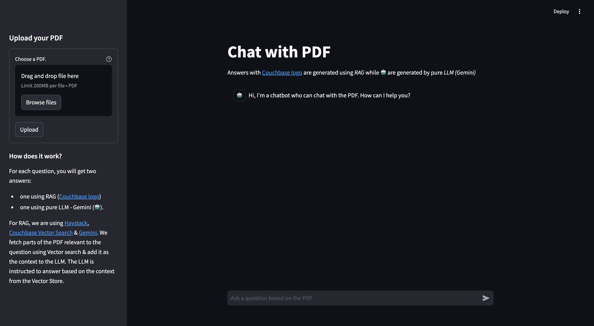
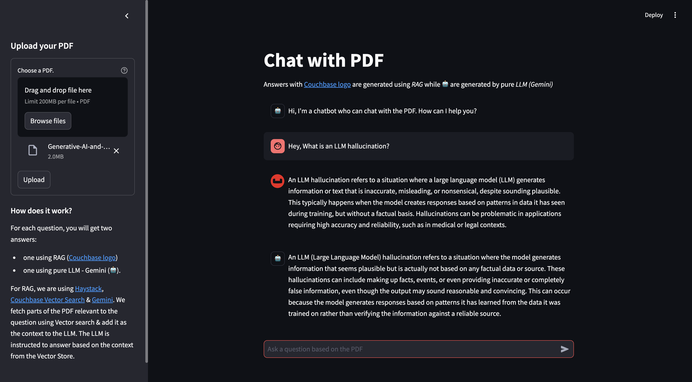
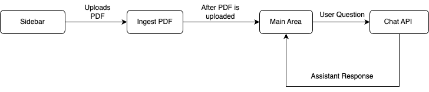

---
# frontmatter
path: "/tutorial-python-haystack-pdf-chat"
# title and description do not need to be added to markdown, start with H2 (##)
title: Build PDF Chat App With Couchbase Python SDK, Haystack and OpenAI
short_title: Build PDF Chat App
description:
  - Construct a PDF Chat App with Haystack, Couchbase Python SDK, Couchbase Vector Search, and Streamlit.
  - Learn to upload PDFs into Couchbase Vector Store with Haystack.
  - Discover how to use RAG’s for context-based Q&A’s from PDFs with LLMs.
content_type: tutorial
filter: sdk
technology:
  - fts
  - kv
tags:
  - Streamlit
  - Haystack
  - OpenAI
sdk_language:
  - python
length: 45 Mins
---

## Introduction

Welcome to this comprehensive guide on constructing an AI-enhanced Chat Application. We will create a dynamic chat interface capable of delving into PDF documents to extract and provide summaries, key facts, and answers to your queries. By the end of this tutorial, you’ll have a powerful tool at your disposal, transforming the way you interact with and utilize the information contained within PDFs.

This tutorial will demonstrate how to:

- Construct a [Couchbase Search Index](https://www.couchbase.com/products/vector-search/) for Vector Search.
- Chunk PDFs into Vectors with [Haystack](https://haystack.deepset.ai/) and use [Couchbase Vector Store](https://python.langchain.com/docs/integrations/vectorstores/couchbase/) to store the vectors into Couchbase.
- Query large language models via the [RAG framework](https://aws.amazon.com/what-is/retrieval-augmented-generation/) for contextual insights. We will use [OpenAI](https://openai.com) for generating Embeddings and querying the LLM.
- Craft an elegant UI with Streamlit. All these components come together to create a seamless, AI-powered chat experience.

## Prerequisites

- [Python](https://www.python.org/downloads/) 3.10 or higher installed.
- Ensure that the Python version is [compatible](https://docs.couchbase.com/python-sdk/current/project-docs/compatibility.html#python-version-compat) with the Couchbase SDK.
- Couchbase Cluster (Self Managed or Capella) version 7.6+ with [Search Service](https://docs.couchbase.com/server/current/fts/fts-introduction.html). Vector Search in Couchbase is only supported at Couchbase Version 7.6+. 
- [Streamlit](https://streamlit.io/) installed via pip install streamlit.

> Note that this tutorial is designed to work with the latest Python SDK version (4.2.0+) for Couchbase. It will not work with the older Python SDK versions.

## Quick Start Guide:

### Cloning Repo

```shell
git clone https://github.com/couchbase-examples/haystack-demo.git
```

### Install Dependencies

Any dependencies should be installed through `pip`, the default package manager for Python. You may use [virtual environment](https://docs.python.org/3/tutorial/venv.html) as well.

```shell
python -m pip install -r requirements.txt
```

### Setup Database Configuration

#### Capella Setup

To know more about connecting to your Capella cluster, please follow the [instructions](https://docs.couchbase.com/cloud/get-started/connect.html).

Specifically, you need to do the following:

- Create the [database credentials](https://docs.couchbase.com/cloud/clusters/manage-database-users.html) to access cluster via SDK
- [Allow access](https://docs.couchbase.com/cloud/clusters/allow-ip-address.html) to the Cluster from the IP on which the application is running.

#### Self Managed Setup

- Follow [Couchbase Installation Options](/tutorial-couchbase-installation-options) for installing the latest Couchbase Database Server Instance. Make sure to add the [Search Service](https://docs.couchbase.com/server/current/fts/fts-introduction.html).

### Create Bucket

- For this of this tutorial, we will use a specific bucket, scope, and collection. However, you may use any name of your choice but make sure to update names in all the steps.
- Create a bucket named `pdf-chat`. We will use the `_default` scope and `_default` collection of this bucket.

### Create the Search Index on Full Text Service

We need to create the Search Index on the Full Text Service in Couchbase. For this demo, you can import the following index using the instructions.

- [Couchbase Capella](https://docs.couchbase.com/cloud/search/import-search-index.html)

  - Copy the index definition to a new file index.json.
  - Import the file in Capella using the instructions in the documentation.
  - Click on Create Index to create the index.

- [Couchbase Server](https://docs.couchbase.com/server/current/search/import-search-index.html)

  - Click on Search -> Add Index -> Import.
  - Copy the following Index definition in the Import screen.
  - Click on Create Index to create the index.

You may also create a vector index using Search UI on both [Couchbase Capella](https://docs.couchbase.com/cloud/vector-search/create-vector-search-index-ui.html) and [Couchbase Self Managed Server](https://docs.couchbase.com/server/current/vector-search/create-vector-search-index-ui.html).

#### Index Definition

Here, we are creating the index `pdf_search` on the documents. The Vector field is set to `embedding` with 1536 dimensions and the text field set to `text`. We are also indexing and storing all the fields under `metadata` in the document as a dynamic mapping to account for varying document structures. The similarity metric is set to `dot_product`. If there is a change in these parameters, please adapt the index accordingly.

```json
{
  "name": "pdf_search",
  "type": "fulltext-index",
  "params": {
    "doc_config": {
      "docid_prefix_delim": "",
      "docid_regexp": "",
      "mode": "scope.collection.type_field",
      "type_field": "type"
    },
    "mapping": {
      "default_analyzer": "standard",
      "default_datetime_parser": "dateTimeOptional",
      "default_field": "_all",
      "default_mapping": {
        "dynamic": true,
        "enabled": false
      },
      "default_type": "_default",
      "docvalues_dynamic": false,
      "index_dynamic": true,
      "store_dynamic": false,
      "type_field": "_type",
      "types": {
        "_default._default": {
          "dynamic": true,
          "enabled": true,
          "properties": {
            "embedding": {
              "enabled": true,
              "dynamic": false,
              "fields": [
                {
                  "dims": 1536,
                  "index": true,
                  "name": "embedding",
                  "similarity": "dot_product",
                  "type": "vector",
                  "vector_index_optimized_for": "recall"
                }
              ]
            },
            "metadata": {
              "dynamic": true,
              "enabled": true
            },
            "text": {
              "enabled": true,
              "dynamic": false,
              "fields": [
                {
                  "index": true,
                  "name": "text",
                  "store": true,
                  "type": "text"
                }
              ]
            }
          }
        }
      }
    },
    "store": {
      "indexType": "scorch",
      "segmentVersion": 16
    }
  },
  "sourceType": "gocbcore",
  "sourceName": "pdf-chat",
  "sourceParams": {},
  "planParams": {
    "maxPartitionsPerPIndex": 64,
    "indexPartitions": 16,
    "numReplicas": 0
  }
}
```

### Setup Environment Config

Copy the `secrets.example.toml` file in `.streamlit` folder and rename it to `secrets.toml` and replace the placeholders with the actual values for your environment. All configuration for communication with the database is read from the environment variables.

```bash
    DB_CONN_STR = "<couchbase_cluster_connection_string>"
    DB_USERNAME = "<couchbase_username>"
    DB_PASSWORD = "<couchbase_password>"
    DB_BUCKET = "<bucket_name>"
    DB_SCOPE = "<scope_name>"
    DB_COLLECTION = "<collection_name>"
    INDEX_NAME = "<vector_capable_fts_index_name>"
    OPENAI_API_KEY = "<openai_api_key>"
```

> [OpenAI](https://openai.com) API Key is required for usage in generating embedding and querying LLM.

> The [connection string](https://docs.couchbase.com/python-sdk/current/howtos/managing-connections.html#connection-strings) expects the `couchbases://` or `couchbase://` part.

> For this tutorial, `DB_BUCKET = pdf-chat`, `DB_SCOPE = _default`, `DB_COLLECTION = _default` and `INDEX_NAME = pdf_search`.

### Running the Application

After starting Couchbase server, adding vector index and installing dependencies. Our Application is ready to run.

In the projects root directory, run the following command

```sh
streamlit run chat_with_pdf.py
```

The application will run on your local machine at http://localhost:8501.

### Using PDF Chat App

On the left sidebar, you'll find an option to upload a PDF document you want to use with this PDF Chat App. Depending on the size of the PDF, the upload process may take some time.



In the main area, there's a chat screen where you can ask questions about the uploaded PDF document. You will receive two responses: one with context from the PDF (Couchbase Logo -  ) , and one without the PDF context (Bot Logo - 🤖). This demonstrates how the Retrieval Augmented Generation (RAG) model enhances the answers provided by the language model using the PDF content.



## Concepts

The PDF Chat application leverages two powerful concepts: [Retrieval-Augmented Generation (RAG)](https://aws.amazon.com/what-is/retrieval-augmented-generation/) and [Vector Search](https://www.couchbase.com/products/vector-search/). Together, these techniques enable efficient and context-aware interactions with PDF documents.

### Retrieval-Augmented Generation (RAG)

RAG is like having two helpers:

- **Retriever**: This helper looks through all the PDF documents to find the most relevant information based on your question or prompt.
- **Generator**: This helper is like a large language model (e.g., GPT-4, Gemini) that can understand natural language and generate human-like responses.

Here's how RAG works:

- You ask a question or provide a prompt to the app.
- The Retriever helper goes through the PDF documents and finds the most relevant passages or sections related to your question using Vector Search.
- The Generator helper takes those relevant passages and your original question, and uses them to generate a clear and contextual answer.

This enhances the context from PDF and LLM is able to give relevant results from the PDF rather than giving generalized results.

### Vector Search with Couchbase

Couchbase is a NoSQL database that provides a powerful Vector Search capability. It allows you to store and search through high-dimensional vector representations (embeddings) of textual data, such as PDF content.

The PDF Chat app uses LangChain to convert the text from the PDF documents into embeddings. These embeddings are then stored in a Couchbase bucket, along with the corresponding text.

When a user asks a question or provides a prompt:

- The app converts the user's query into an embedding using Haystack's embedding models (e.g., OpenAI's embeddings).
- [Couchbase's Vector Search](https://docs.couchbase.com/python-sdk/current/howtos/full-text-searching-with-sdk.html#vector-search) capability is utilized, which supports search indexes. A dedicated search index is created for the PDF embeddings and their corresponding text content, configured with the necessary indexing parameters (bucket, scope, collection, index name).
- The app queries this search index using the user's query embedding. Couchbase's Vector Search calculates the [similarity](https://www.couchbase.com/blog/vector-similarity-search/) (e.g., dot product) between the query embedding and the indexed PDF embeddings, enabling fast retrieval of the nearest neighbor embeddings.
- The nearest neighbor embeddings represent the most semantically similar passages or sections from the PDF documents compared to the user's query.
- The app retrieves the text content associated with these nearest neighbor embeddings, providing the necessary context for generating a relevant response.
- Couchbase's Vector Search supports advanced indexing techniques, such as [scoped indexes](https://docs.couchbase.com/python-sdk/current/howtos/full-text-searching-with-sdk.html#scoped-vs-global-indexes), [dynamic indexing](https://docs.couchbase.com/server/current/fts/fts-creating-index-from-REST-dynamic.html) and [hybrid search](https://docs.couchbase.com/python-sdk/current/howtos/full-text-searching-with-sdk.html#combining-fts-and-vector-queries), allowing for efficient management, better scaling of the vector store and multiple types of search supported.
- The search index facilitates fast and accurate retrieval, enabling the app to provide context-aware and relevant responses to the user's queries, even when the phrasing or terminology differs from the PDF content.
- Couchbase's Vector Search integrates seamlessly with Haystack's [CouchbaseVectorStore](https://haystack.deepset.ai/integrations/couchbase-document-store) class, abstracting away the complexities of vector similarity calculations.

### Haystack

Haystack is a powerful library that simplifies the process of building applications with [large language models](https://en.wikipedia.org/wiki/Large_language_model) (LLMs) and vector stores like Couchbase.

In the PDF Chat app, Haystack is used for several tasks:

- **Loading and processing PDF documents**: Haystack's [_PyPDFToDocument_](https://docs.haystack.deepset.ai/docs/pypdftodocument) component can convert PDF files into Haystack Document objects, which can hold various types of content, including text, metadata, and embeddings.
- **Text splitting**: Haystack's [_DocumentSplitter_](https://docs.haystack.deepset.ai/docs/documentsplitter) is used to split the text from the PDF documents into smaller chunks or passages, which are more suitable for embedding and retrieval.
- **Vector store integration**: Haystack provides a [CouchbaseDocumentStore](https://haystack.deepset.ai/integrations/couchbase-document-store) class that seamlessly integrates with Couchbase's Vector Search, allowing the app to store and search through the embeddings and their corresponding text.
- **Pipelines**: Haystack uses [Pipelines](https://docs.haystack.deepset.ai/docs/pipelines) to combine different components for various tasks. In this app, we have an indexing pipeline for processing and storing documents, and a RAG pipeline for retrieval and generation.
- **Prompt Building**: Haystack's [PromptBuilder](https://docs.haystack.deepset.ai/docs/promptbuilder) component allows you to create custom prompts that guide the language model's behavior and output.
- **Streaming Output**: LangChain supports [streaming](https://python.langchain.com/docs/expression_language/streaming/), allowing the app to stream the generated answer to the client in real-time.

By combining Vector Search with Couchbase, RAG, and Haystack, the PDF Chat app can efficiently ingest PDF documents, convert their content into searchable embeddings, retrieve relevant information based on user queries and conversation context, and generate context-aware and informative responses using large language models.

## Let us Understand the Flow

To begin this tutorial, clone the repo and open it up in the IDE of your choice. Now you can learn how to create the PDF Chat App. The whole code is written in `chat_with_pdf.py` file.

### App Flow

The fundamental workflow of the application is as follows: The user initiates the process from the Main Page's sidebar by uploading a PDF. This action triggers the `save_to_vector_store` function, which subsequently uploads the PDF into the Couchbase vector store. Following this, the user can now chat with the LLM.

On the Chat Area, the user can pose questions. These inquiries are processed by the Chat API, which consults the LLM for responses, aided by the context provided by RAG. The assistant then delivers the answer, and the user has the option to ask additional questions.



## Connecting to Couchbase

The first step is connecting to Couchbase. Couchbase Vector Search is required for PDF Upload as well as during chat (For Retrieval). We will use the Haystack CouchbaseDocumentStore to connect to the Couchbase cluster. The connection is established in the `get_document_store` function.

The connection string and credentials are read from the environment variables. We perform some basic required checks for the environment variable not being set in the `secrets.toml`, and then proceed to connect to the Couchbase cluster. We connect to the cluster using [connect](https://docs.couchbase.com/python-sdk/current/hello-world/start-using-sdk.html#connect) method.

```python
from couchbase_haystack import CouchbaseDocumentStore, CouchbasePasswordAuthenticator, CouchbaseClusterOptions

@st.cache_resource(show_spinner="Connecting to Vector Store")
def get_document_store():
    """Return the Couchbase document store"""
    return CouchbaseDocumentStore(
        cluster_connection_string=Secret.from_env_var("DB_CONN_STR"),
        authenticator=CouchbasePasswordAuthenticator(
            username=Secret.from_env_var("DB_USERNAME"),
            password=Secret.from_env_var("DB_PASSWORD")
        ),
        cluster_options=CouchbaseClusterOptions(profile='wan_development'),
        bucket=os.getenv("DB_BUCKET"),
        scope=os.getenv("DB_SCOPE"),
        collection=os.getenv("DB_COLLECTION"),
        vector_search_index=os.getenv("INDEX_NAME"),
    )
```
We will define the bucket, scope, collection and index names from [Environment Variables](#setup-environment-config).

## Initialize Couchbase Vector Store

We will now initialize the CouchbaseDocumentStore which will be used for storing and retrieving document embeddings.
```python
# Initialize document store
document_store = get_document_store()
```

## Uploading And Ingesting PDF

The `save_to_vector_store` function takes care of uploading the PDF file in vector format to the Couchbase Database using the Haystack indexing pipeline. It converts the PDF to documents, cleans them, splits text into small chunks, generates embeddings for those chunks, and ingests the chunks and their embeddings into the Couchbase vector store.

### Upload PDF

This part of code creates a file uploader on sidebar using Streamlit library. After PDF is uploaded, `save_to_vector_store` function is called to further process the PDF.

```python
with st.form("upload pdf"):
    uploaded_file = st.file_uploader("Choose a PDF.", help="The document will be deleted after one hour of inactivity (TTL).", type="pdf")
    submitted = st.form_submit_button("Upload")
    if submitted:
        save_to_vector_store(uploaded_file, indexing_pipeline)
```

### Read, Load, and Process Uploaded PDF

The `save_to_vector_store` function ensures that the uploaded PDF file is properly handled, loaded, and prepared for storage in the vector store. It first checks if a file was actually uploaded. Then the uploaded file is saved to a temporary file.

The indexing pipeline takes care of converting the PDF to documents, cleaning them, splitting them into chunks, generating embeddings, and storing them in the Couchbase vector store.

```python
def save_to_vector_store(uploaded_file, indexing_pipeline):
    """Process the PDF & store it in Couchbase Vector Store"""
    if uploaded_file is not None:
        temp_dir = tempfile.TemporaryDirectory()
        temp_file_path = os.path.join(temp_dir.name, uploaded_file.name)
        
        with open(temp_file_path, "wb") as f:
            f.write(uploaded_file.getvalue())
        result = indexing_pipeline.run({"converter": {"sources": [temp_file_path]}})
        
        st.info(f"PDF loaded into vector store: {result['writer']['documents_written']} documents indexed")
```

### Indexing Pipeline

The indexing pipeline is created to handle the entire process of ingesting PDFs into the vector store. It includes the following components:
1. PyPDFToDocument: Converts PDF files to Haystack Document objects.
2. DocumentCleaner: Cleans the extracted text from the PDF.
3. DocumentSplitter: Splits the cleaned text into smaller chunks.
4. OpenAIDocumentEmbedder: Generates embeddings for the document chunks.
5. DocumentWriter: Writes the processed documents and their embeddings to the Couchbase vector store.

```python
from haystack import Pipeline
from haystack.components.converters import PyPDFToDocument
from haystack.components.preprocessors import DocumentCleaner, DocumentSplitter
from haystack.components.embedders import OpenAIDocumentEmbedder

indexing_pipeline = Pipeline()
indexing_pipeline.add_component("converter", PyPDFToDocument())
indexing_pipeline.add_component("cleaner", DocumentCleaner())
indexing_pipeline.add_component("splitter", DocumentSplitter(split_by="sentence", split_length=250, split_overlap=30))
indexing_pipeline.add_component("embedder", OpenAIDocumentEmbedder())
indexing_pipeline.add_component("writer", DocumentWriter(document_store=document_store))

indexing_pipeline.connect("converter.documents", "cleaner.documents")
indexing_pipeline.connect("cleaner.documents", "splitter.documents")
indexing_pipeline.connect("splitter.documents", "embedder.documents")
indexing_pipeline.connect("embedder.documents", "writer.documents")
```

### Chat With PDF

After uploading the PDF into Couchbase, we are now ready to utilize the power of Couchbase Vector Search, RAG and LLM to get context based answers to our questions. When the user asks a question. The assistant (LLM) is called here with RAG context, the response from the assistant is sent back to the user.

### RAG Pipeline

We create a RAG (Retrieval-Augmented Generation) pipeline using Haystack components. This pipeline handles the entire process of retrieving relevant context from the vector store and generating responses using the LLM.

The OpenAIGenerator is a crucial component in our RAG pipeline, responsible for generating human-like responses based on the retrieved context and user questions. Here's a more detailed explanation of its configuration and role:

- API Key: The OpenAIGenerator uses the OPENAI_API_KEY from the environment variables to authenticate with the OpenAI API.
- Model: It's configured to use the "gpt-4o" model, which is a powerful language model capable of understanding context and generating coherent, relevant responses.
- Role in the Pipeline: The OpenAIGenerator receives a prompt constructed by the PromptBuilder, which includes the user's question and relevant context retrieved from the vector store. It then generates a response based on this input.
- Integration: The generator's output is connected to the AnswerBuilder component, which formats the final response for display to the user.

By using the OpenAIGenerator, we leverage state-of-the-art natural language processing capabilities to provide accurate, context-aware answers to user queries about the uploaded PDF content.

```python
from haystack.components.embedders import OpenAIDocumentEmbedder
from couchbase_haystack import CouchbaseEmbeddingRetriever
from haystack.components.builders import PromptBuilder, AnswerBuilder

rag_pipeline = Pipeline()
rag_pipeline.add_component("query_embedder", OpenAIDocumentEmbedder())
rag_pipeline.add_component("retriever", CouchbaseEmbeddingRetriever(document_store=document_store))
rag_pipeline.add_component("prompt_builder", PromptBuilder(template="""
You are a helpful bot. If you cannot answer based on the context provided, respond with a generic answer. Answer the question as truthfully as possible using the context below:

    {{ doc.content }}


Question: {{question}}
"""))
rag_pipeline.add_component(
    "llm",
    OpenAIGenerator(
        api_key=OPENAI_API_KEY,
        model="gpt-4o",
    ),
)
rag_pipeline.add_component("answer_builder", AnswerBuilder())

rag_pipeline.connect("query_embedder", "retriever.query_embedding")
rag_pipeline.connect("retriever.documents", "prompt_builder.documents")
rag_pipeline.connect("prompt_builder.prompt", "llm.prompt")
rag_pipeline.connect("llm.replies", "answer_builder.replies")
rag_pipeline.connect("llm.meta", "answer_builder.meta")
rag_pipeline.connect("retriever", "answer_builder.documents")
```

### User Asks A Question

This section creates an interactive chat interface where users can ask questions based on the uploaded PDF. The key steps are:

1. Display a chat input box with the prompt "Ask a question based on the PDF".
2. When the user submits a question:
- Display the user's question in the chat interface.
- Add the user's question to the chat history.
- Run the RAG pipeline to generate a response.
- Display the response in the chat interface.
- Add the assistant's response to the chat history.

```python
if question := st.chat_input("Ask a question based on the PDF"):
    st.chat_message("user").markdown(question)
    st.session_state.messages.append({"role": "user", "content": question, "avatar": "👤"})

    # RAG response
    with st.chat_message("assistant", avatar=couchbase_logo):
        message_placeholder = st.empty()
        rag_result = rag_pipeline.run(
            {
                "query_embedder": {"text": question},
                "retriever": {"top_k": 3},
                "prompt_builder": {"question": question},
                "answer_builder": {"query": question},
            }
        )
        rag_response = rag_result["answer_builder"]["answers"][0].data
        message_placeholder.markdown(rag_response)
    st.session_state.messages.append({"role": "assistant", "content": rag_response, "avatar": couchbase_logo})

```
This setup allows users to have a conversational experience, asking questions related to the uploaded PDF, with responses generated by the RAG pipeline. Both the user's questions and the assistant's responses are displayed in the chat interface, along with their respective roles and avatars.

### Stream Answer without context

Similar to last section, we will get answer from LLM of the user question. Answers from here are also shown in the UI to showcase difference on how using RAG gives better and more context enabled results.

```python
# stream the response from the pure LLM

# Add placeholder for streaming the response
    with st.chat_message("ai", avatar="🤖"):
        message_placeholder_pure_llm = st.empty()
        pure_llm_result = rag_pipeline.run(
            {
                "prompt_builder": {"question": question},
                "llm": {},
                "answer_builder": {"query": question},
                "query_embedder": {"text": question}
            }
        )
        pure_llm_response = pure_llm_result["answer_builder"]["answers"][0].data
        message_placeholder_pure_llm.markdown(pure_llm_response)
    st.session_state.messages.append({"role": "assistant", "content": pure_llm_response, "avatar": "🤖"})
```

### Conclusion

Congratulations! You've successfully built a PDF Chat application using Couchbase, Haystack, and OpenAI. This application demonstrates the power of combining vector search capabilities with large language models to create an intelligent, context-aware chat interface for PDF documents.

Through this tutorial, you've learned how to:

1. Set up a Couchbase cluster with vector search capabilities.
2. Use Haystack to process and index PDF documents.
3. Implement a Retrieval-Augmented Generation (RAG) pipeline.
4. Create an interactive chat interface using Streamlit.
5. Compare responses from RAG and pure LLM approaches.

We hope this tutorial has given you a solid foundation for building AI-powered document interaction systems with Couchbase and Haystack. Happy coding!