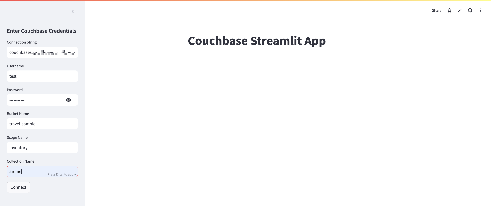
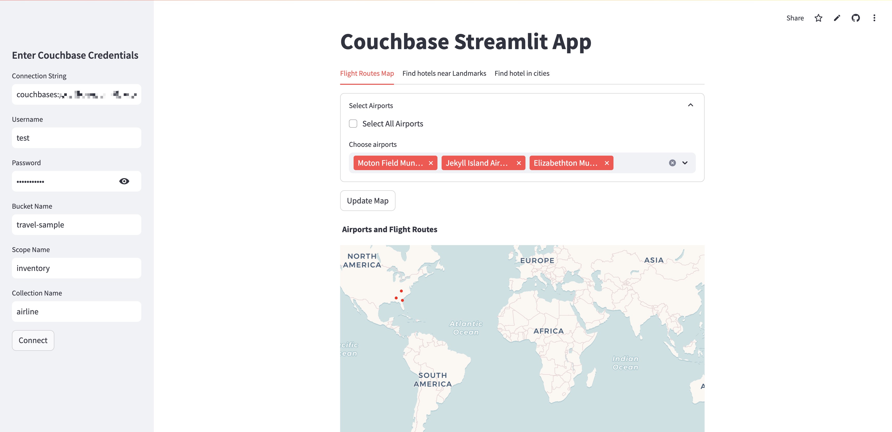
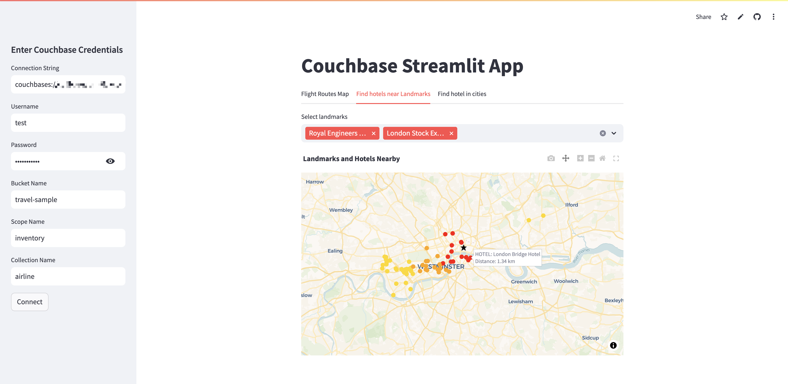
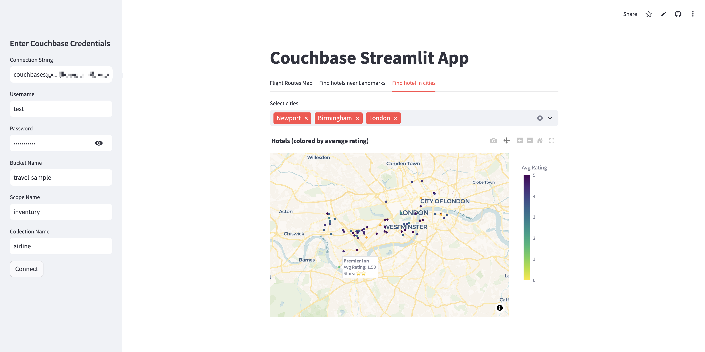

---
# frontmatter
path: "/tutorial-couchbase-streamlit-connector"
title: "Building an Interactive Flight Search App with Streamlit and Couchbase"
short_title: "Flight Search App with Streamlit & Couchbase"
description:
  - Build a fully functional Streamlit application on top of Couchbase.
  - Leverage the travel-sample dataset to search for flights between cities and visualize routes interactively.
  - Learn how to connect to Couchbase, efficiently query flight data, and optimize performance.
content_type: tutorial
filter: sdk
technology:
  - capella
  - query
tags:
  - Streamlit
sdk_language:
  - python
length: 30 Mins
---

# Building an Interactive Flight Search App with Streamlit and Couchbase

## Introduction
This tutorial will guide you through building a fully functional Streamlit application on top of Couchbase. The app will leverage Couchbase's [`travel-sample`](https://docs.couchbase.com/python-sdk/current/ref/travel-app-data-model.html) dataset to enable users to search for flights between cities and visualize routes dynamically on an interactive map. By following this tutorial, you will learn how to:

- Connect a Streamlit app to a Couchbase database
- Query and filter flight data efficiently
- Display flight routes using interactive visualizations
- Optimize performance with indexing and selective data retrieval

By the end of this tutorial, you will have a working flight visualization tool and a deeper understanding of how to integrate Couchbase with Streamlit for interactive data applications.

The final app will look like this hosted Streamlit application: [Couchbase Connector Demo App](https://couchbase-connector-demo-app.streamlit.app/). The original code for this demo is available [here](https://github.com/couchbase-examples/streamlit-quickstart/blob/main/Demo.py).

#### Screenshots of the Final App
<table align="center">
    <tr>
        <td align="center">
            
        </td>
        <td align="center">
            
        </td>
    </tr>
    <tr>
        <td align="center">
            
        </td>
        <td align="center">
            
        </td>
    </tr>
</table>

## Basic Concepts

### Understanding JSON and Document Databases
Couchbase is a NoSQL document database that stores data in JSON format. This allows for flexible and scalable data modeling. JSON (JavaScript Object Notation) is a lightweight data format that is:
- **Human-readable**: Easy to interpret and debug.
- **Flexible**: Supports hierarchical structures.
- **Efficient**: Quick to parse and generate.

Example JSON document:
```json
{
  "id": "user_123",
  "name": "Alice Smith",
  "email": "alice@example.com",
  "age": 21,
  "preferences": {
    "theme": "dark",
    "notifications": true
  }
}
```
Couchbase Uses JSON because:
- **Flexible Schema**: No predefined structure, allowing easy adaptation to changing requirements.
- **Efficient Querying**: Uses SQL-like SQL++ queries for fast data retrieval.
- **Scalability**: Distributed architecture supports large-scale applications.
- **Natural Data Representation**: JSON structure aligns well with modern application objects.

### Couchbase Data Model and Comparison to Relational Databases
Couchbase organizes data into a hierarchical structure:

| Couchbase Concept  | Relational Equivalent  | Description  |
|--------------------|-----------------------|-------------|
| **Bucket**        | Database               | Top-level data storage container. |
| **Scope**         | Schema                 | Logical namespace within a bucket. |
| **Collection**    | Table                  | Group of related JSON documents. |
| **Document**      | Row                    | Individual JSON record. |

### Operation Notes  
- **CRUD Operations**: Create, Read, Update, and Delete operations only work on the specific bucket, scope, and collection specified during connection setup.  
- **Queries**: Can work across any bucket, scope, and collection in the cluster, regardless of the connection settings.  
- **Access Control**: Both CRUD operations and queries are limited by the permissions assigned to the Couchbase user in the cluster. The **Username** and **Password** provided during connection setup must belong to a Couchbase user with the necessary cluster access permissions. 

By understanding these key concepts, you'll be well-prepared to build and optimize applications using Couchbase and Streamlit.

## Dataset Overview
The [`travel-sample`](https://docs.couchbase.com/python-sdk/current/ref/travel-app-data-model.html) dataset in Couchbase consists of multiple scopes and collections related to travel and transportation data. The primary scope used in this application is `inventory`, which contains five collections:

- **airline (190 documents)**: Contains information about airlines, including their name, country, ICAO, IATA codes, and callsigns.
  - **Key fields:** `name`, `country`, `icao`, `iata`, `callsign`, `id`, `type`

- **airport (1,968 documents)**: Stores details of airports worldwide, including names, locations, ICAO and FAA codes, and geographical coordinates.
  - **Key fields:** `airportname`, `city`, `country`, `faa`, `geo` (latitude, longitude, altitude), `icao`, `id`, `type`, `tz`

- **hotel (917 documents)**: Contains information about hotels, including addresses, contact details, pricing, amenities, and reviews.
  - **Key fields:** `name`, `address`, `city`, `country`, `price`, `free_internet`, `free_breakfast`, `pets_ok`, `reviews`, `ratings`, `geo` (latitude, longitude, accuracy)

- **landmark (4,495 documents)**: Includes data on notable landmarks, their locations, descriptions, images, and accessibility details.
  - **Key fields:** `name`, `city`, `country`, `content`, `geo` (latitude, longitude, accuracy), `type`

- **route (24,024 documents)**: Contains airline routes with details about the source and destination airports, airline operators, distances, schedules, and stopovers.
  - **Key fields:** `airline`, `airlineid`, `sourceairport`, `destinationairport`, `distance`, `stops`, `schedule` (day, flight, UTC)

These collections provide the necessary data for flight visualization, enabling efficient search and filtering of routes between airports.

## Application Features

1. **Interactive Map for Airports and Routes**
   - Displays airports on an OpenStreetMap-based interactive map.
   - Allows users to select specific airports and visualize routes between them.
   - Uses Plotly for dynamic visualization of routes.

2. **Landmark and Hotel Visualization**
   - Shows landmarks along with relevant details such as activities, address, and descriptions.
   - Displays hotels near selected landmarks within a specified distance.
   - Uses Geopy to calculate distances between landmarks and hotels.
   - Color-coded markers distinguish landmarks and hotels.

3. **Hotel Listings by City**
   - Users can select multiple cities to view hotels.
   - Displays hotels on an interactive map, color-coded based on average ratings.
   - Includes additional details such as price, amenities, and customer ratings.

4. **Efficient Data Retrieval from Couchbase**
   - Queries optimized to fetch only relevant data for visualization.
   - Uses indexing strategies to enhance query performance.
   - Implements caching with Streamlit's `@st.cache_data` to avoid redundant queries.

5. **User Authentication and Configuration**
   - Sidebar inputs for Couchbase connection credentials.
   - Dynamic connection establishment upon user input.
   - Secure handling of credentials to ensure proper database access.

6. **Seamless User Experience**
   - Intuitive UI elements like dropdowns, checkboxes, and buttons for better interaction.
   - Expandable sections for selecting relevant data.
   - Optimized for performance to ensure smooth interactivity even with large datasets.


## Step-by-Step Guide to Building the App

This section outlines the step-by-step process of building the Streamlit application that integrates with Couchbase for retrieving and visualizing data related to airports, flight routes, landmarks, and hotels.


### Prerequisites
Before setting up the environment, ensure you have the following:

- **Python 3.10 or higher** (check [compatibility](https://docs.couchbase.com/python-sdk/current/project-docs/compatibility.html#python-version-compat) with the Couchbase SDK).  
- A **Couchbase Capella account** ([Docs](https://docs.couchbase.com/cloud/get-started/intro.html)) **or** a local installation (or Docker container) of **Couchbase Server** ([Download](https://www.couchbase.com/downloads)).  
- An **operational cluster** created in a project (Capella) or properly configured on your local machine (Couchbase Server).  
- Ensure proper access control:  
  - For **Couchbase Capella**, configure cluster access permissions and allowlisted IP addresses ([Docs](https://docs.couchbase.com/cloud/get-started/connect.html#prerequisites)).  
  - For **Couchbase Server**, set up appropriate user roles and permissions ([Docs](https://docs.couchbase.com/server/current/manage/manage-security/manage-users-and-roles.html)).  
- Obtain the **connection string** for **Couchbase Capella** or **Couchbase Server** by following the official guide: [Docs](https://docs.couchbase.com/python-sdk/current/hello-world/start-using-sdk.html#connect).  

### Installation and Setup
Create an isolated Python environment, run the following commands:

```sh
python -m venv venv
source venv/bin/activate  # On Windows: venv\Scripts\activate
```
Install the required libraries for this project:
```sh
pip install pandas plotly geopy couchbase-streamlit-connector
```
Run the following command to check if Streamlit is installed correctly:
```sh
streamlit hello
```

If everything is set up correctly, a browser window should open with Streamlit's demo application.

### Implement Data Fetching Functions
To optimize performance, data retrieval functions are cached using `@st.cache_data`, which stores previously fetched data to prevent redundant queries and speed up the app. However, the `_connection` object is intentionally not cached (indicated by the underscore prefix) to ensure a fresh database connection is established each time. Caching the connection could lead to issues with stale or expired sessions, potentially causing failed queries or inconsistent data retrieval. For more details, refer to the official documentation: [Streamlit `st.cache_data`](https://docs.streamlit.io/develop/api-reference/caching-and-state/st.cache_data).

`get_all_airports(_connection)`: Fetches airport details.
```python
@st.cache_data
def get_all_airports(_connection):
    query = """
    SELECT geo.lat, geo.lon, city, country, airportname as name, faa, icao, id
    FROM `travel-sample`.inventory.airport
    WHERE geo.lat IS NOT NULL 
    AND geo.lon IS NOT NULL
    AND faa IS NOT NULL;
    """
    result = _connection.query(query)
    return pd.DataFrame([row for row in result.rows()])
```

`get_routes_for_airports(_connection, selected_airports_df)`: Retrieves routes between selected airports.

This function fetches route information from the `route` collection in the `travel-sample.inventory` dataset based on selected airports. The function first constructs a list of FAA codes from `selected_airports_df`, formatting it as a valid SQL++ query list. It then executes a query to find routes where both the source and destination airports match the selected FAA codes. The results are extracted from the query response and returned as a Pandas DataFrame.

```python
@st.cache_data       
def get_routes_for_airports(_connection, selected_airports_df):    
    airports_faa = "[" # Initialize a string to store FAA codes in a list format
    for i in range(len(selected_airports_df)):
        if i != len(selected_airports_df) - 1:
            airports_faa += f'"{(selected_airports_df.iloc[i])["faa"]}", ' # Append each FAA code with a comma
        else:
            airports_faa += f'"{(selected_airports_df.iloc[i])["faa"]}"' # Append last FAA code without a comma
    airports_faa += "]"
    query = f"""
    SELECT * FROM `travel-sample`.`inventory`.`route`
    WHERE (sourceairport IN {airports_faa} AND destinationairport IN {airports_faa});
    """
    result = _connection.query(query)
    data = []
    for row in result:
        data.append(row["route"])
    return pd.DataFrame(data)
```

`get_all_landmarks(_connection)`: Retrieves landmarks from the Couchbase database.
```python
@st.cache_data
def get_all_landmarks(_connection):
    query = """
        SELECT name, geo.lat, geo.lon, activity, address, city, country, content, hours, price, type
        FROM `travel-sample`.inventory.landmark
        WHERE geo.lat IS NOT MISSING 
        AND geo.lon IS NOT MISSING
    """
    result = _connection.query(query)
    landmarks = []
    for row in result:
        landmark_info = {
            'name': row['name'],
            'lat': row['lat'],
            'lon': row['lon'],
            'activity': row.get('activity', 'Not specified'),
            'address': row.get('address', 'Not specified'),
            'city': row.get('city', 'Not specified'),
            'country': row.get('country', 'Not specified'),
            'content': row.get('content', 'No description available'),
            'hours': row.get('hours', 'Not specified'),
            'price': row.get('price', 'Not specified'),
            'type': row.get('type', 'Not specified')
        }
        landmarks.append(landmark_info)
    return landmarks
```

`get_hotels_near_landmark(_connection, landmark_lat, landmark_lon)`: Finds hotels near a given landmark.

This function retrieves hotel data from the Couchbase `travel-sample.inventory.hotel` collection and filters hotels based on their proximity to a specified landmark. It first executes a query to fetch hotel details, ensuring latitude and longitude values are available. Then, it iterates through the results, calculating the geographical distance between each hotel and the given landmark using the `geodesic` function from the `geopy.distance` module. Hotels within the specified maximum distance (default 10 km) are added to the final list, including relevant details such as price, description, and available amenities.

```python
@st.cache_data
def get_hotels_near_landmark(_connection, landmark_lat, landmark_lon, max_distance_km=10):
    query = """
        SELECT 
            h.name,
            h.geo.lat,
            h.geo.lon,
            h.price,
            h.description,
            h.free_breakfast,
            h.free_internet,
            h.free_parking
        FROM `travel-sample`.inventory.hotel h
        WHERE h.geo.lat IS NOT MISSING 
        AND h.geo.lon IS NOT MISSING
    """
    result = _connection.query(query)
    hotels = []
    for row in result:
        hotel_coords = (row['lat'], row['lon'])
        landmark_coords = (landmark_lat, landmark_lon)
        distance = geodesic(hotel_coords, landmark_coords).kilometers # Calculate distance in km

        if distance <= max_distance_km:
            hotels.append({
                'name': row['name'],
                'lat': row['lat'],
                'lon': row['lon'],
                'distance': distance,
                'price': row['price'],
                'description': row.get('description', 'No description available'),
                'free_breakfast': row.get('free_breakfast', False),
                'free_internet': row.get('free_internet', False),
                'free_parking': row.get('free_parking', False)
            })
    return hotels
```

`get_all_cities(_connection)`: Retrieves a list of cities with hotels.
```python
@st.cache_data
def get_all_cities(_connection):
    query = """
    SELECT DISTINCT city
    FROM `travel-sample`.inventory.hotel
    WHERE geo.lat IS NOT MISSING 
    AND type = "hotel" 
    AND geo.lon IS NOT MISSING
    """
    result = _connection.query(query)
    cities = []
    for row in result:
        cities.append(row["city"])
    return pd.DataFrame(cities, columns=["city"])
```

`get_all_hotels(_connection, cities)`: Fetches hotels in the selected cities.

This function retrieves hotel data from the `travel-sample.inventory.hotel` collection in Couchbase for the given list of cities. It constructs a query string dynamically to filter hotels based on the provided cities, ensuring only those with valid latitude (`geo.lat`) and longitude (`geo.lon`) values are selected. Additionally, it calculates the average overall rating of each hotel by aggregating ratings from its reviews. The function caches its results using Streamlit's `@st.cache_data` decorator to improve efficiency by avoiding redundant database queries.

```python
@st.cache_data
def get_all_hotels(_connection, cities):
    cities_str = "[" # Initialize the string for city names
    for i in range(len(cities)):
        if i != len(cities) - 1:
            cities_str += f'"{cities[i]}", ' # Add city name with a comma
        else:
            cities_str += f'"{cities[i]}"' # Add last city without a comma
    cities_str += "]"
    query = f"""
    SELECT h.*, geo.lat as lat, geo.lon as lon, ARRAY_AVG(ARRAY r.ratings.Overall FOR r IN h.reviews WHEN r.ratings.Overall IS NOT MISSING END) as avg_rating
    FROM `travel-sample`.inventory.hotel h
    WHERE h.geo.lat IS NOT MISSING 
    AND h.type = "hotel" 
    AND h.geo.lon IS NOT MISSING 
    AND h.city IN {cities_str}
    """
    result = _connection.query(query)
    hotels = []
    for row in result:
        hotels.append(row)
    return pd.DataFrame(hotels)
```

### Create Interactive Visualizations

`plot_airports_and_routes(airports_df, routes_df)`: Displays airports and their flight routes.

This function visualizes flight routes between airports using [Plotly](https://plotly.com/python/lines-on-tile-maps/). It first extracts airport coordinates from `airports_df` into a dictionary for quick lookup. Then, it iterates through `routes_df` to collect latitude and longitude pairs for each flight route, ensuring that non-existent airports are skipped. A scatter map plot is created using `Scattermap` to represent routes as blue lines. Additionally, a separate scatter plot of airports is overlaid, with markers color-coded in red and displaying airport details on hover. The final visualization is displayed using `st.plotly_chart`.

```python
def plot_airports_and_routes(airports_df, routes_df):
    fig = go.Figure()
    # Create a dictionary mapping FAA codes to latitude and longitude for quick lookup
    airport_coords = {
        row["faa"]: (row["lat"], row["lon"])
        for _, row in airports_df.iterrows()
        if row["faa"] is not None  # Ensure faa is not null
    }
    lats = []
    lons = []
    # Iterate through routes to fetch airport coordinates and construct flight paths
    for _, row in routes_df.iterrows():
        source_coords = airport_coords.get(row["sourceairport"])
        dest_coords = airport_coords.get(row["destinationairport"])
        if source_coords and dest_coords:
            lats.extend([source_coords[0], dest_coords[0], None])  # None for breaks
            lons.extend([source_coords[1], dest_coords[1], None])

    # Add flight routes as blue lines on the map
    fig.add_trace(go.Scattermap(
        mode="lines",
        lat=lats,
        lon=lons,
        line=dict(width=1, color="blue")
    ))
    
    # Overlay airport locations as red markers with hover details
    airports_markers = px.scatter_map(
        airports_df, 
        lat="lat", 
        lon="lon", 
        hover_name= "name",  # Show airport name on hover
        hover_data= {
            "faa": True,
            "city": True,
            "country": True
        },  # Additional details
        color_discrete_sequence=["red"],  # Color of airport markers
    )
    fig.add_traces(airports_markers.data)

    # Set map style and layout
    fig.update_layout(
        mapbox_style="open-street-map",  
        margin=dict(l=0, r=0, t=50, b=0),  # Remove extra margins
        title="Airports and Flight Routes"
    )
    
    st.plotly_chart(fig, use_container_width=True)
```

`create_landmark_map(landmarks, hotels_near_landmark)`: Shows landmarks along with nearby hotels.

This function visualizes landmarks and nearby hotels on an interactive map using [Plotly](https://plotly.com/python/tile-scatter-maps/). Hotels are color-coded based on their distance from landmarks: red for distances ≤3 km, orange for ≤6 km, and gold for farther hotels. Each hotel is plotted with a marker, and a tooltip displays the name and distance. Landmarks are represented as blue star-shaped markers. The map uses OpenStreetMap styling and is embedded in a Streamlit app for easy visualization.

```python
def create_landmark_map(landmarks, hotels_near_landmark):
    fig = go.Figure()     
    # Plot hotels with color-coded markers based on distance   
    for hotel in hotels_near_landmark:
        color = 'red' if hotel.get('distance') <= 3 else 'orange' if hotel.get('distance') <= 6 else 'gold'
        fig.add_trace(go.Scattermap(
            lat=[hotel.get('lat')],
            lon=[hotel.get('lon')],
            mode='markers',
            marker=dict(size=10, color=color),
            text=(
                f"HOTEL: {hotel.get('name')}<br>Distance: {hotel.get('distance'):.2f} km",
            ),
            hoverinfo='text',
            name=f'Hotel ({color})'
        ))
         
    # Plot landmarks as blue star markers
    for landmark in landmarks:
        fig.add_trace(go.Scattermap(
            lat=[landmark.get('lat', 'N/A')],
            lon=[landmark.get('lon', 'N/A')],
            mode='markers',
            marker=dict(size=10, color='blue', symbol='star'),
            text=(
                f"LANDMARK: {landmark.get('name', 'N/A')}",
            ),
            hoverinfo='text',
            name='Landmark'
        ))
    
    # Configure map layout
    fig.update_layout(
        mapbox_style='open-street-map',
        margin=dict(l=0, r=0, t=50, b=0),
        title='Landmarks and Hotels Nearby',
        showlegend=False,
    )
    
    st.plotly_chart(fig, use_container_width=True)
```

`create_hotel_map(hotels_df)`: Plots hotels, color-coded by their average ratings.
This function visualizes hotel locations on an interactive map using [Plotly](https://plotly.com/python/tile-scatter-maps/) and Streamlit. Hotels are color-coded based on their average ratings, with a continuous color scale for rated hotels and a distinct color (orange) for those without ratings. It ensures that the map remains interactive even when no data is available by adding an invisible marker. The function also converts numeric ratings into a star-based format for better readability in the hover tooltips.
```python
def create_hotel_map(hotels_df):
    
    if hotels_df.empty:
        fig = go.Figure()
        fig.update_layout(
            mapbox_style="open-street-map",
            margin=dict(l=0, r=0, t=50, b=0),
            title="Hotels (colored by average rating)"
        )
        # Add an invisible marker at lat:0 and lon:0
        fig.add_trace(go.Scattermap(
            lat=[0],
            lon=[0],
            mode='markers',
            marker=dict(size=0, opacity=0)
        ))
        st.plotly_chart(fig, use_container_width=True)
        return
    
    if 'avg_rating' not in hotels_df.columns:
        hotels_df['avg_rating'] = np.nan  # Add avg_rating column if it doesn't exist
    hotels_df['avg_rating'] = pd.to_numeric(hotels_df['avg_rating'], errors='coerce')
    
    # Create a column for star ratings
    hotels_df['star_rating'] = hotels_df['avg_rating'].apply(lambda x: '⭐' * int(round(x)) if not np.isnan(x) else 'No rating')

    # Separate hotels with no rating
    no_rating_hotels = hotels_df[hotels_df['avg_rating'].isna()]
    rated_hotels = hotels_df[hotels_df['avg_rating'].notna()]
    
    # Plot hotels with ratings
    fig = px.scatter_map(
        rated_hotels,
        lat="lat",
        lon="lon",
        hover_name="name",
        hover_data={
            "avg_rating": True,
            "star_rating": True
        },
        color="avg_rating",
        color_continuous_scale=px.colors.sequential.Viridis_r,  # Use Blues color scale
        range_color=[0, 5],  # Ratings typically range from 0 to 5
        zoom=1,
        size_max=10
    )
    fig.update_traces(
        hovertemplate="<b>%{hovertext}</b><br>Avg Rating: %{customdata[0]:.2f} <br>Stars: %{customdata[1]}"
    )
    
    # Plot hotels with no ratings in orange
    no_rating_markers = px.scatter_map(
        no_rating_hotels,
        lat="lat",
        lon="lon",
        hover_name="name",
        hover_data={"avg_rating": False},  # Explicitly state no ratings given
        custom_data=["name"],  # Add custom data to use in hover template
        color_discrete_sequence=["orange"],
        size_max=10
    )
    no_rating_markers.update_traces(
        hovertemplate="<b>%{customdata[0]}</b><br>No rating available"
    )
    fig.add_traces(no_rating_markers.data) # Add no-rating hotels to the map
    
    # Set up layout and color bar for ratings
    fig.update_layout(
        mapbox_style="open-street-map",
        margin=dict(l=0, r=0, t=50, b=0),
        title="Hotels (colored by average rating)",
        coloraxis_colorbar=dict(
            title="Avg Rating",
            tickvals=[0, 1, 2, 3, 4, 5],
            ticktext=["0", "1", "2", "3", "4", "5"]
        )
    )
    
    fig.update_layout(
        mapbox_style="open-street-map",
        margin=dict(l=0, r=0, t=50, b=0),
        title="Hotels (colored by average rating)",
        coloraxis_colorbar_title="Avg Rating"
    )
    
    st.plotly_chart(fig, use_container_width=True)
```

### Implement Streamlit Tabs
The application is structured into three tabs:
1. **Airports & Flight Routes**: Users can select airports to display routes between them.

This function, `tab1_visual`, is responsible for displaying a selection interface for airports and visualizing flight routes between them. It first fetches all available airports and identifies a subset of airports involved in predefined routes. Using Streamlit's UI components, users can choose specific airports or select all at once. Upon clicking the "Update Map" button, the selected airports are filtered, relevant routes are retrieved, and both are plotted on a map.

```python
def tab1_visual():
    all_airports = get_all_airports(connection)  # Fetch all available airports
    route_airports = set()
    
    # Define a set of hardcoded routes
    for route in [
        {"sourceairport": "TLV", "destinationairport": "MRS"},
        {"sourceairport": "TLV", "destinationairport": "NCE"},
        {"sourceairport": "TNR", "destinationairport": "CDG"}
    ]:
        route_airports.add(route["sourceairport"])
        route_airports.add(route["destinationairport"])

    # User selection interface for choosing airports
    with st.expander("Select Airports"):
        st.checkbox("Select All Airports", key="select_all")
        container = st.container()
        with container:
            selected_airports = st.multiselect(
                "Choose airports", 
                options=all_airports["name"], 
                default=all_airports["name"] if st.session_state.get("select_all") else []
            )

    # Process selection and update the visualization
    if st.button("Update Map"):
        filtered_airports = all_airports[all_airports["name"].isin(selected_airports)]  # Filter selected airports
        selected_routes = get_routes_for_airports(connection, filtered_airports)  # Retrieve routes for selected airports
        plot_airports_and_routes(filtered_airports, selected_routes)  # Plot the airports and corresponding routes
```

2. **Landmarks & Hotels**: Users select landmarks, and nearby hotels are displayed on a map.

This function, `tab2_visual()`, enables users to select landmarks from a list and visualizes nearby hotels on a map. It first retrieves all available landmarks from the database. If landmarks exist, the first one is pre-selected by default. Users can select multiple landmarks using a multi-select dropdown. The function then filters the selected landmarks and fetches nearby hotels for each chosen landmark using their latitude and longitude. Finally, the selected landmarks and corresponding hotels are passed to `create_landmark_map()` for visualization.

```python
def tab2_visual():
    # Fetch all available landmarks from the database
    landmarks = get_all_landmarks(connection)
    
    # Set a default selection (first landmark) if landmarks exist
    default_landmark = [landmarks[0]['name']] if landmarks else []
    
    # Allow users to select multiple landmarks from the available list
    selected_landmarks = st.multiselect("Select landmarks", [landmark['name'] for landmark in landmarks], default=default_landmark)
    
    # Filter selected landmarks to get their details
    selected_landmarks_info = [landmark for landmark in landmarks if landmark['name'] in selected_landmarks]
    
    hotels_near_landmarks = []
    
    # Retrieve hotels near each selected landmark
    for landmark in selected_landmarks_info:
        hotels_near_landmarks.extend(get_hotels_near_landmark(
            connection, 
            landmark['lat'], 
            landmark['lon']
        ))
    
    # Display the selected landmarks and nearby hotels on a map
    create_landmark_map(selected_landmarks_info, hotels_near_landmarks)
```

3. **Hotels by City**: Users choose cities to see available hotels and their ratings.

This function allows users to select multiple cities from a predefined list, fetches the corresponding hotels from the database, and visualizes them on a map. It ensures that users can explore hotel availability across different locations in an interactive manner.

```python
def tab3_visual():
    # Retrieve the list of all available cities from the database
    all_cities = get_all_cities(connection)["city"].tolist()

    # Allow users to select multiple cities; defaults to Newport, Birmingham, and London
    cities = st.multiselect("Select cities", all_cities, default=["Newport", "Birmingham", "London"])

    # Fetch hotels based on the selected cities
    hotels = get_all_hotels(connection, cities)

    # Display the hotels on a map for visualization
    create_hotel_map(hotels)
```

### Putting It All Together

In the Streamlit sidebar, users need to enter their Couchbase credentials to connect to the database. The connection is established using the `CouchbaseConnector` class.

This code sets up a Streamlit application that connects to a Couchbase database using user-provided credentials. The sidebar collects connection parameters like the connection string, username, password, and collection details. Once the user clicks the "Connect" button, the app attempts to establish a connection and stores it in `st.session_state` for persistence across different interactions. If the connection is successful, the app provides three tabs for data visualization: one for mapping flight routes, another for locating hotels near landmarks, and the last for finding hotels in cities.

```python
st.title("Couchbase Streamlit App")

# Sidebar inputs for Couchbase connection parameters
st.sidebar.header("Enter Couchbase Credentials")
conn_str = st.sidebar.text_input("Connection String", "couchbases://your-cluster-url")
username = st.sidebar.text_input("Username", "Administrator")
password = st.sidebar.text_input("Password", type="password")  # Password input is masked
bucket_name = st.sidebar.text_input("Bucket Name", "travel-sample")
scope_name = st.sidebar.text_input("Scope Name", "inventory")
collection_name = st.sidebar.text_input("Collection Name", "airline")

if st.sidebar.button("Connect"):
    try:
        # Establish connection to Couchbase using the provided credentials
        connection = st.connection(
            "couchbase", 
            type=CouchbaseConnector, 
            CONNSTR=conn_str, 
            USERNAME=username, 
            PASSWORD=password,
            BUCKET_NAME=bucket_name, 
            SCOPE_NAME=scope_name, 
            COLLECTION_NAME=collection_name
        )
        st.session_state["connection"] = connection  # Store connection in session state
        st.sidebar.success("Connected successfully!")  # Display success message
    except Exception as e:
        st.sidebar.error(f"Connection failed: {e}")  # Handle connection errors

# Check if a connection exists before proceeding to visualization
if "connection" in st.session_state:
    connection = st.session_state["connection"]
    tab1, tab2, tab3 = st.tabs(["Flight Routes Map", "Find hotels near Landmarks", "Find hotel in cities"])
    
    # Visualization components for each tab
    with tab1:
        tab1_visual()
    with tab2:
        tab2_visual()
    with tab3:
        tab3_visual()
```

### Run the Application
To start the Streamlit app, run the following command:
```sh
streamlit run app.py
```
This will launch the app in your browser, allowing you to interactively explore Couchbase data with intuitive visualizations.

## Cloud Deployment Using Streamlit Community Cloud

Now that you've built your demo app, it's time to deploy it for free using **Streamlit Community Cloud**!

### Push Your App to GitHub
Ensure your app is stored in a GitHub repository with the following files:
- `app.py` (your main script)
- `requirements.txt` (dependencies)
- Optional `.streamlit/config.toml` for customization

To generate `requirements.txt` use this command in your terminal:
```sh
pip freeze > requirements.txt
```

### Set Up a Streamlit Community Cloud Account
Sign up or log in at [Streamlit Community Cloud](https://share.streamlit.io/), then link your GitHub account.

### Deploy Your App
1. Click **New App** on the Streamlit Community Cloud dashboard.
2. Select your GitHub repository.
3. Specify the branch and main script (`app.py`).
4. Click **Deploy**.

Your app will be live in minutes, and any future updates to the GitHub repo will auto-deploy!

For a detailed guide, check out: [Host Your Streamlit App for Free](https://blog.streamlit.io/host-your-streamlit-app-for-free/).

## Conclusion

In this guide, we explored building a Streamlit app and deploying it on Streamlit Community Cloud for free. From setting up the development environment to hosting your app online, we covered essential steps to get your app live with minimal effort. Streamlit’s simplicity, combined with seamless GitHub integration, makes it a great choice for quickly showcasing your projects.

## Appendix

Here are some helpful resources for learning more about Couchbase and Streamlit:

### **Couchbase Documentation**
- [Couchbase Python SDK Compatibility](https://docs.couchbase.com/python-sdk/current/project-docs/compatibility.html#python-version-compat)  
- [Getting Started with Couchbase Capella](https://docs.couchbase.com/cloud/get-started/intro.html)  
- [Connecting to Couchbase Capella](https://docs.couchbase.com/cloud/get-started/connect.html#prerequisites)  
- [SQL++ Query Language Guide](https://docs.couchbase.com/server/current/n1ql/n1ql-language-reference/index.html)  
- [Couchbase SDKs Overview](https://docs.couchbase.com/home/sdk.html)  

### **Streamlit Documentation**
- [Streamlit Secrets Management](https://docs.streamlit.io/develop/concepts/connections/secrets-management)  
- [Using `st.connection`](https://docs.streamlit.io/develop/api-reference/connections)  
- [Streamlit Components](https://docs.streamlit.io/develop/api-reference)  
