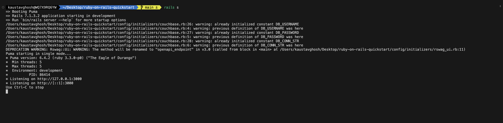
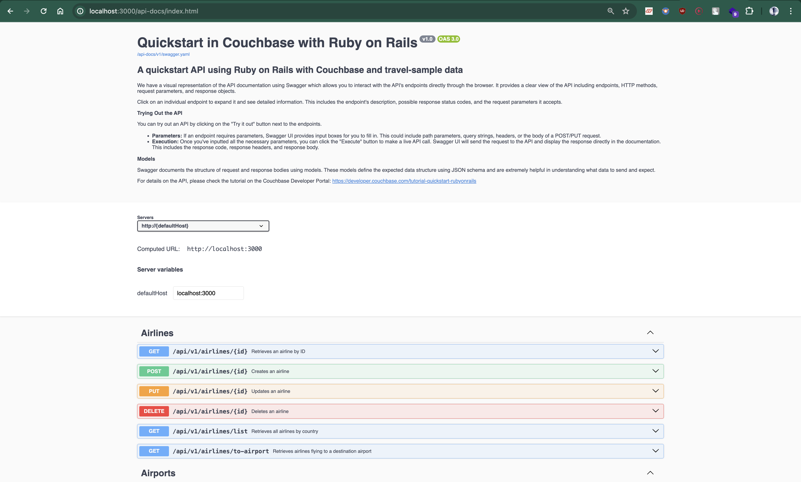

---
# frontmatter
path: "/tutorial-quickstart-ruby-on-rails"
title: Quickstart in Couchbase with Ruby on Rails
short_title: Ruby on Rails
description:
  - Learn to build a REST API in Ruby on Rails and Couchbase
  - See how you can fetch data from Couchbase using SQL++ queries
  - Explore CRUD operations in action with Couchbase
content_type: quickstart
filter: sdk
technology:
  - kv
  - index
  - query
tags:
  - Rails
  - REST API
sdk_language:
  - ruby
length: 30 Mins
---

<!-- [abstract] -->

In this tutorial, you will learn how to connect to a Couchbase Capella cluster to create, read, update, and delete documents and how to write simple parametrized SQL++ queries.

## Prerequisites

To run this prebuilt project, you will need:

- [Couchbase Capella](https://www.couchbase.com/products/capella/) cluster with [travel-sample](https://docs.couchbase.com/ruby-sdk/current/ref/travel-app-data-model.html) bucket loaded.
  - To run this tutorial using a self managed Couchbase cluster, please refer to the [appendix](#running-self-managed-couchbase-cluster).
- [Ruby](https://www.ruby-lang.org/en/documentation/installation/) installed on your machine.
  - Ensure that the Ruby version is [compatible](https://docs.couchbase.com/ruby-sdk/current/project-docs/compatibility.html#ruby-version-compatibility) with the Couchbase SDK.
- Loading Travel Sample Bucket
  If travel-sample is not loaded in your Capella cluster, you can load it by following the instructions for your Capella Cluster:

  - [Load travel-sample bucket in Couchbase Capella](https://docs.couchbase.com/cloud/clusters/data-service/import-data-documents.html#import-sample-data)


### Couchbase Capella Configuration

When running Couchbase using [Capella](https://cloud.couchbase.com/), the following prerequisites need to be met.

- The application requires the travel-sample bucket to be [loaded](https://docs.couchbase.com/cloud/clusters/data-service/import-data-documents.html#import-sample-data) in the cluster from the Capella UI.
- Create the [database credentials](https://docs.couchbase.com/cloud/clusters/manage-database-users.html) to access the travel-sample bucket (Read and Write) used in the application.
- [Allow access](https://docs.couchbase.com/cloud/clusters/allow-ip-address.html) to the Cluster from the IP on which the application is running.

## App Setup

### Cloning Repo

```shell
git clone https://github.com/couchbase-examples/ruby-on-rails-quickstart.git
```

### Install Dependencies

The dependencies for the application are specified in the `Gemfile` file in the source folder. Dependencies can be installed through `bundler` the default package manager for Ruby.

```shell
cd ruby-on-rails-quickstart
gem install bundler
bundle install
```

> Refer to the [instructions in the SDK](https://github.com/couchbase/couchbase-ruby-client#installation) for more info.

### Setup Database Configuration

All configuration for communication with the database is fetched from the environment variables. As a security best practice, this quickstart reads the environment variables from a local file, `dev.env` in the source folder.

Create a copy of `dev.env.example` file & rename it to `dev.env` & add the values for the Couchbase cluster.

```sh
DB_CONN_STR=<connection_string>
DB_USERNAME=<user_with_read_write_permission_to_travel-sample_bucket>
DB_PASSWORD=<password_for_user>
```

> Note: The connection string expects the `couchbases://` or `couchbase://` part.

## Running the Application

### Directly on Local Machine

At this point, we have installed the dependencies, loaded the travel-sample data and configured the application with the credentials. The application is now ready and you can run it.

The application will run on port 3000 of your local machine (http://localhost:3000). You will find the Swagger UI to try the API endpoints.

The Swagger Page will be available at http://localhost:3000/api-docs.

```shell
rails s
```

### Using Docker

If you prefer to run this quick start using Docker, we have provided the Dockerfile which you can use to build the image and run the API as a container.

- Build the Docker image

```sh
docker build -t ruby-on-rails-quickstart .
```

- Run the Docker image

```sh
docker run --env-file dev.env -p 3000:3000 ruby-on-rails-quickstart
```

> Note: The `.env` file has the connection information to connect to your Capella cluster. With the `--env-file` flag, Docker injects those environment variables to the container, overriding any default values defined in the application code.

Once the app is up and running, open http://localhost:3000/api-docs to test the APIs.

### Verifying the Application

Once the application starts, you can see the details of the application on the logs.



The application will run on port 3000 of your local machine (http://localhost:3000). You will find the interactive Swagger documentation of the API if you go to the URL in your browser. Swagger documentation is used in this demo to showcase the different API end points and how they can be invoked. More details on the Swagger documentation can be found in the [appendix](#swagger-documentation).



## Data Model

For this tutorial, we use three collections, `airport`, `airline` and `route` that contain sample airports, airlines and airline routes respectively. The route collection connects the airports and airlines as seen in the figure below. We use these connections in the quickstart to generate airports that are directly connected and airlines connecting to a destination airport. Note that these are just examples to highlight how you can use SQL++ queries to join the collections.


## Code Structure

To begin this tutorial, clone the repo and open it up in the IDE of your choice. Now you can learn about how to create, read, update and delete documents in Couchbase Server.

### Code Layout

```
.
├── app
│   ├── controllers
│   │   ├── api
│   │   │   └── v1
│   │   │       ├── airlines_controller.rb
│   │   │       ├── airports_controller.rb
│   │   │       └── routes_controller.rb
│   │   ├── application_controller.rb
│   │   └── concerns
│   ├── models
│   │   ├── airline.rb
│   │   ├── airport.rb
│   │   ├── application_record.rb
│   │   ├── concerns
│   │   └── route.rb
│   └── views
│       └── layouts
│           ├── application.html.erb
│           ├── mailer.html.erb
│           └── mailer.text.erb
├── config
│   ├── importmap.rb
│   ├── initializers
│   │   ├── couchbase.rb
│   │   ├── rswag_api.rb
│   │   └── rswag_ui.rb
│   ├── routes.rb
├── config.ru
├── db
│   └── seeds.rb
├── dev.env
├── dev.env.example
├── Dockerfile
├── Gemfile
├── Gemfile.lock
├── spec
│   ├── rails_helper.rb
│   ├── requests
│   │   └── api
│   │       └── v1
│   │           ├── airlines_spec.rb
│   │           ├── airports_spec.rb
│   │           └── routes_spec.rb
│   ├── spec_helper.rb
│   └── swagger_helper.rb
├── swagger
│   └── v1
│       └── swagger.yaml
├── test
│   ├── channels
│   │   └── application_cable
│   │       └── connection_test.rb
│   ├── controllers
│   ├── integration
│   │   ├── airlines_spec.rb
│   │   ├── airports_spec.rb
│   │   └── routes_spec.rb
│   ├── models
```

The API endpoints are organized by entity (collection) with separate controller files in the `app/controllers/api/v1/` folder. Each entity has corresponding test files in the `test/integration/` and `spec/requests/api/v1/` folders.

In `routes.rb`, we define the routes for the application including the API routes.

The Couchbase connection and collection references are configured in the `config/initializers/couchbase.rb` file.

In this application, we have created the connection object in `config/initializers/couchbase.rb` and we use this object in all of our APIs. The object is initialized in `config/initializers/couchbase.rb`. We have also stored the reference to our bucket, `travel-sample` and the scope, `inventory` in the connection object.

```rb
require 'couchbase'

# Get environment variables
DB_USERNAME = ENV['DB_USERNAME']
DB_PASSWORD = ENV['DB_PASSWORD']
DB_CONN_STR = ENV['DB_CONN_STR']
DB_BUCKET_NAME = 'travel-sample' # Hardcoded bucket name

# Check if running in CI environment
if ENV['CI']
  # Use environment variables from GitHub Secrets
  options = Couchbase::Cluster::ClusterOptions.new
  options.authenticate(DB_USERNAME, DB_PASSWORD)
  COUCHBASE_CLUSTER = Couchbase::Cluster.connect(DB_CONN_STR, options)
else
  # Load environment variables from dev.env file
  require 'dotenv'
  Dotenv.load('dev.env')

  # Define default values
  DEFAULT_DB_USERNAME = 'Administrator'
  DEFAULT_DB_PASSWORD = 'password'
  DEFAULT_DB_CONN_STR = 'couchbase://localhost'

  # Get environment variables with fallback to default values
  DB_USERNAME = ENV.fetch('DB_USERNAME', DEFAULT_DB_USERNAME)
  DB_PASSWORD = ENV.fetch('DB_PASSWORD', DEFAULT_DB_PASSWORD)
  DB_CONN_STR = ENV.fetch('DB_CONN_STR', DEFAULT_DB_CONN_STR)

  # Connect to the Couchbase cluster
  options = Couchbase::Cluster::ClusterOptions.new
  options.authenticate(DB_USERNAME, DB_PASSWORD)
  COUCHBASE_CLUSTER = Couchbase::Cluster.connect(DB_CONN_STR, options)
end

# Open the bucket
bucket = COUCHBASE_CLUSTER.bucket(DB_BUCKET_NAME)

# Open the default collection
default_collection = bucket.default_collection

# Create scope and collections if they don't exist
begin
  scope = bucket.scope('inventory')
rescue Couchbase::Error::ScopeNotFoundError
  bucket.create_scope('inventory')
  scope = bucket.scope('inventory')
end

%w[airline airport route].each do |collection_name|
  scope.collection(collection_name)
rescue Couchbase::Error::CollectionNotFoundError
  scope.create_collection(collection_name)
end

AIRLINE_COLLECTION = scope.collection('airline')
AIRPORT_COLLECTION = scope.collection('airport')
ROUTE_COLLECTION = scope.collection('route')

```

In the above code, we first get the environment variables for the connection string, username, and password. We then create a connection object using the `Couchbase::Cluster.connect` method. We authenticate the connection using the username and password. We then open the bucket and the default collection. We create a scope and collections if they don't exist. We store the reference to the collections in the connection object.

### Airline Entity

For this tutorial, we will focus on the airline entity to demonstrate CRUD operations and SQL++ queries.

We will be setting up a REST API to manage airline documents.

- [POST Airline](#post-airline) – Create a new airline
- [GET Airline](#get-airline) – Read specified airline
- [PUT Airline](#put-airline) – Update specified airline
- [DELETE Airline](#delete-airline) – Delete airline
- [Airline List](#list-airline) – Get all airlines. Optionally filter the list by country
- [Direct Connections](#direct-connections) - Get a list of airlines directly connected to the specified airport

For CRUD operations, we will use the [Key-Value operations](https://docs.couchbase.com/ruby-sdk/current/howtos/kv-operations.html) that are built into the Couchbase SDK to create, read, update, and delete a document. Every document will need an ID (similar to a primary key in other databases) to save it to the database. This ID is passed in the URL. For other end points, we will use [SQL++](https://docs.couchbase.com/ruby-sdk/current/howtos/n1ql-queries-with-sdk.html) to query for documents. 

### Airline Document Structure

Our airline document will have an airline name, IATA code, ICAO code, callsign, and country. For this demo, we will store all airline information in one document in the `airline` collection in the `travel-sample` bucket.

```json
{
  "name": "40-Mile Air",
  "iata": "Q5",
  "icao": "MLA",
  "callsign": "MILE-AIR",
  "country": "United States"
}
```

### POST Airline 


```rb
# frozen_string_literal: true

module Api
  module V1
    class AirlinesController < ApplicationController
      skip_before_action :verify_authenticity_token, only: %i[create update destroy]
      before_action :set_airline, only: %i[show update destroy]

      ...
      # POST /api/v1/airlines/{id}
      def create
        @airline = Airline.create(params[:id], airline_params)
        if @airline
          render json: @airline, status: :created
        else
          render json: { message: 'Airline already exists' }, status: :conflict
        end
      rescue ArgumentError => e
        render json: { error: 'Invalid request', message: e.message }, status: :bad_request
      rescue Couchbase::Error::DocumentExists => e
        render json: { error: "Airline with ID #{params[:id]} already exists", message: e.message }, status: :conflict
      rescue StandardError => e
        render json: { error: 'Internal server error', message: e.message }, status: :internal_server_error
      end
    end
    ... 

  end
end
```

In the above code, we first create an instance of the `Airline` class using the `create` method. We pass the ID and the airline data to the `create` method. If the airline is created successfully, we return the airline document with a status of 201. If the airline already exists, we return a conflict status of 409. If there are any missing fields in the request, we return a bad request status of 400. If there is any other error, we return an internal server error status of 500.

```rb
# frozen_string_literal: true

class Airline
  attr_accessor :name, :iata, :icao, :callsign, :country

  def initialize(attributes)
    @name = attributes['name']
    @iata = attributes['iata']
    @icao = attributes['icao']
    @callsign = attributes['callsign']
    @country = attributes['country']
  end
  ...

  def self.create(id, attributes)
    required_fields = %w[name iata icao callsign country]
    missing_fields = required_fields - attributes.keys
    extra_fields = attributes.keys - required_fields

    raise ArgumentError, "Missing fields: #{missing_fields.join(', ')}" if missing_fields.any?

    raise ArgumentError, "Extra fields: #{extra_fields.join(', ')}" if extra_fields.any?

    formatted_attributes = {
      'name' => attributes['name'],
      'iata' => attributes['iata'],
      'icao' => attributes['icao'],
      'callsign' => attributes['callsign'],
      'country' => attributes['country']
    }
    AIRLINE_COLLECTION.insert(id, formatted_attributes)
    new(formatted_attributes)
  end

  ... 
end

```

In the above code, we first check if all the required fields are present in the request. If any fields are missing, we raise an ArgumentError with the missing fields. If there are any extra fields in the request, we raise an ArgumentError with the extra fields. We then format the attributes and insert the document into the database using the `insert` method. We then create a new instance of the `Airline` class with the formatted attributes and return it.

### GET Airline

Navigate to the `show` method in the `AirlinesController` class in the `airlines_controller.rb` file. We only need the airline document ID or our key from the user to retrieve a particular airline document using a key-value operation which is passed in the `find` method. The result is converted into a JSON object using the `to_json` method.

```rb
  # GET /api/v1/airlines/{id}
  def show
    if @airline
      render json: @airline, status: :ok
    else
      render json: { error: "Airline with ID #{params[:id]} not found" }, status: :not_found
    end
  rescue Couchbase::Error::DocumentNotFound => e
    render json: { error: "Airline with ID #{params[:id]} not found", message: e.message }, status: :not_found
  rescue StandardError => e
    render json: { error: 'Internal server error', message: e.message }, status: :internal_server_error
  end
```

The `find` method in the `Airline` class is used to fetch the document from the database using the key. If the document is found, we return the document with a status of 200. If the document is not found, we return a not found status of 404. If there is any other error, we return an internal server error status of 500.

```rb
  def self.find(id)
    result = AIRLINE_COLLECTION.get(id)
    new(result.content) if result.success?
  rescue Couchbase::Error::DocumentNotFound
    nil
  end
```

In the `find` method, we use the `get` method to fetch the document from the database using the key. If the document is found, we create a new instance of the `Airline` class with the document content and return it. If the document is not found, we return `nil`.

### PUT Airline

Navigate to the `update` method in the `AirlinesController` class in the `airlines_controller.rb` file. We only need the airline document ID or our key from the user to update a particular airline document using a key-value operation which is passed in the `update` method. The result is converted into a JSON object using the `to_json` method.

```rb
    # PUT /api/v1/airlines/{id}
    def update
      @airline = Airline.new(airline_params).update(params[:id], airline_params)
      render json: @airline, status: :ok
    rescue ArgumentError => e
      render json: { error: 'Invalid request', message: e.message }, status: :bad_request
    rescue StandardError => e
      render json: { error: 'Internal server error', message: e.message }, status: :internal_server_error
    end
```

Inn the above code, we first create an instance of the `Airline` class using the `update` method. We pass the ID and the airline data to the `update` method. If the airline is updated successfully, we return the airline document with a status of 200. If there are any missing fields in the request, we return a bad request status of 400. If there is any other error, we return an internal server error status of 500.

```rb
  def update(id, attributes)
    required_fields = %w[name iata icao callsign country]
    missing_fields = required_fields - attributes.keys
    extra_fields = attributes.keys - required_fields

    raise ArgumentError, "Missing fields: #{missing_fields.join(', ')}" if missing_fields.any?

    raise ArgumentError, "Extra fields: #{extra_fields.join(', ')}" if extra_fields.any?

    formatted_attributes = {
      'name' => attributes['name'],
      'iata' => attributes['iata'],
      'icao' => attributes['icao'],
      'callsign' => attributes['callsign'],
      'country' => attributes['country']
    }
    AIRLINE_COLLECTION.upsert(id, formatted_attributes)
    self.class.new(formatted_attributes)
  end

  def destroy(id)
    AIRLINE_COLLECTION.remove(id)
  end
end
```

In the `update` method, we first check if all the required fields are present in the request. If any fields are missing, we raise an ArgumentError with the missing fields. If there are any extra fields in the request, we raise an ArgumentError with the extra fields. We then format the attributes and update the document in the database using the `upsert` method. We then create a new instance of the `Airline` class with the formatted attributes and return it.

### DELETE Airline

Navigate to the `destroy` method in the `AirlinesController` class in the `airlines_controller.rb` file. We only need the airline document ID or our key from the user to delete a particular airline document using a key-value operation which is passed in the `destroy` method.

```rb
    # DELETE /api/v1/airlines/{id}
      def destroy
        if @airline
          if @airline.destroy(params[:id])
            render json: { message: 'Airline deleted successfully' }, status: :accepted
          else
            render json: { message: 'Failed to delete airline' }, status: :bad_request
          end
        else
          render json: { error: "Airline with ID #{params[:id]} not found" }, status: :not_found
        end
      rescue Couchbase::Error::DocumentNotFound => e
        render json: { error: "Airline with ID #{params[:id]} not found", message: e.message }, status: :not_found
      rescue StandardError => e
        render json: { error: 'Internal server error', message: e.message }, status: :internal_server_error
      end
```

In the above code, we first check if the airline document exists. If the document exists, we call the `destroy` method on the `Airline` class. If the document is deleted successfully, we return a status of 202. If the document is not deleted successfully, we return a bad request status of 400. If the document is not found, we return a not found status of 404. If there is any other error, we return an internal server error status of 500.

```rb
  def destroy(id)
    AIRLINE_COLLECTION.remove(id)
  end
end
```

### List Airlines

Navigate to the `index` method in the `AirlinesController` class in the `airlines_controller.rb` file. We only need the country, limit, and offset values from the user to retrieve a list of airline documents using a SQL++ query. The result is converted into a JSON object using the `to_json` method.

```rb
  # GET /api/v1/airlines/list
  def index
    country = params[:country]
    limit = params[:limit] || 10
    offset = params[:offset] || 0

    @airlines = Airline.all(country, limit, offset)

    if @airlines.empty?
      render json: { message: 'No airlines found' }, status: :ok
    else
      render json: @airlines, status: :ok
    end
  rescue StandardError => e
    render json: { error: 'Internal server error', message: e.message }, status: :internal_server_error
  end
```

In the above code, we first get the values for the country, limit, and offset from the request parameters. We then call the `all` method in the `Airline` class to fetch the list of airlines. If the list is empty, we return a status of 200 with a message. If the list is not empty, we return a status of 200 with the list of airlines. If there is any other error, we return an internal server error status of 500.


```rb
  def self.all(country = nil, limit = 10, offset = 0)
    bucket_name = 'travel-sample'
    scope_name = 'inventory'
    collection_name = 'airline'

    query = country ? "SELECT * FROM `#{bucket_name}`.`#{scope_name}`.`#{collection_name}` WHERE country = $country LIMIT $limit OFFSET $offset" : "SELECT * FROM `#{bucket_name}`.`#{scope_name}`.`#{collection_name}` LIMIT $limit OFFSET $offset"
    options = Couchbase::Cluster::QueryOptions.new
    options.named_parameters(country ? { 'country' => country, 'limit' => limit.to_i,
                                         'offset' => offset.to_i } : { 'limit' => limit.to_i, 'offset' => offset.to_i })

    result = COUCHBASE_CLUSTER.query(query, options)
    result.rows.map { |row| new(row.fetch('airline', {})) }.to_a
  end
```

In the `all` method, we first define the bucket, scope, and collection names. We then build the SQL++ query based on the country parameter. We then create a `QueryOptions` object and set the named parameters based on the country parameter. We then execute the query using the `query` method and iterate over the results to create a list of `Airline` objects and return it.

### Direct Connections

Navigate to the `direct_connections` method in the `AirportController` class in the `airports_controller.rb` file. We only need the airport document ID or our key from the user to retrieve a list of airlines directly connected to the specified airport using a SQL++ query. The result is converted into a JSON object using the `to_json` method.

```rb
def direct_connections
  destination_airport_code = params[:destinationAirportCode]
  limit = params[:limit] || 10
  offset = params[:offset] || 0

  if destination_airport_code.blank?
    render json: { message: 'Destination airport code is required' }, status: :bad_request
  else
    @connections = Airport.direct_connections(destination_airport_code, limit, offset)
    render json: @connections, status: :ok
  end
rescue StandardError => e
  render json: { error: 'Internal server error', message: e.message }, status: :internal_server_error
end
```

## Running Tests

Integration tests are implemented using [RSpec](https://rspec.info/) for all API endpoints. Tests verify operations by calling the API and confirming results in the database.

To run all tests:

```bash
rspec test/integration/
```

## Appendix

### Extending API by Adding New Entity

If you would like to add another entity to the APIs, these are the steps to follow:

- Create the new entity (collection) in the Couchbase bucket. You can create the collection using the [SDK](https://docs.couchbase.com/sdk-api/couchbase-ruby-client/Couchbase/Collection.html#create_collection-instance_method) or via the [Couchbase Server interface](https://docs.couchbase.com/server/current/manage/manage-settings/manage-collections.html).
- Define the routes in a new file in the `api` folder similar to the existing routes like `airline_controller.rb`.
- Add the new routes to the application in `routes.rb`.
- Add the tests for the new routes in a new file in the `test/integration/api/v1` folder similar to `airlines_spec.rb`.
- For Swagger documentation, add the configuration in the `spec/request/api/v1` folder similar to `airlines_spec.rb`.
- Run the command `rake rswag:specs:swaggerize` to generate the Swagger documentation.
- The new entity is now ready to be used in the API.

### Running Self Managed Couchbase Cluster

If you are running this quickstart with a self managed Couchbase cluster, you need to [load](https://docs.couchbase.com/server/current/manage/manage-settings/install-sample-buckets.html) the travel-sample data bucket in your cluster and generate the credentials for the bucket.

- Follow [Couchbase Installation Options](/tutorial-couchbase-installation-options) for installing the latest Couchbase Database Server Instance.

You need to update the connection string and the credentials in the `dev.env` file in the source folder.

> Note: Couchbase Server must be installed and running prior to running the Ruby on Rails App

### Swagger Documentation

Swagger documentation provides a clear view of the API including endpoints, HTTP methods, request parameters, and response objects.

Click on an individual endpoint to expand it and see detailed information. This includes the endpoint's description, possible response status codes, and the request parameters it accepts.

#### Trying Out the API

You can try out an API by clicking on the "Try it out" button next to the endpoints.

- Parameters: If an endpoint requires parameters, Swagger UI provides input boxes for you to fill in. This could include path parameters, query strings, headers, or the body of a POST/PUT request.

- Execution: Once you've inputted all the necessary parameters, you can click the "Execute" button to make a live API call. Swagger UI will send the request to the API and display the response directly in the documentation. This includes the response code, response headers, and response body.

#### Models

Swagger documents the structure of request and response bodies using models. These models define the expected data structure using JSON schema and are extremely helpful in understanding what data to send and expect.
